# Keyflow · Piano Performance & Concert VFX Studio

> Bản tiếng Việt: [README.md](README.md) · This is the English translation of the same document. Every
> screenshot below is rendered by the application itself, so the two files always show the same build.

Keyflow is a Windows desktop application (C# · WPF · .NET 10) for **playing, practising and making
piano videos from MIDI** at concert-production quality. The interface ships **two languages — English
and Tiếng Việt** — switched live inside the app, with no restart (see [Languages](#languages)). The
default stage is a dark recital hall: notes fall in time, an 88-key keyboard is shaded by a shader
that models an Unreal-style model (GGX + softbox + ACES), sparks glow hot and cool down by thermal
radiation, acoustic resonance waves drift, a flame burns at the impact point and the air layers
(acoustic motes, petals, stage lights) can each be switched on separately. That stage is drawn by a
**Direct3D 11 GPU engine** on a thread of its own — 16-bit HDR, multi-level bloom, up to 240 FPS, and it
never holds up MIDI input; the WPF software renderer is only the fallback for when Direct3D cannot start
(see [Stage & visual effects](#stage--visual-effects)).

The pictures below are **rendered by the application itself** in CI (`--snapshot`) and refreshed in
`docs/previews/` automatically — they are not staged artwork:

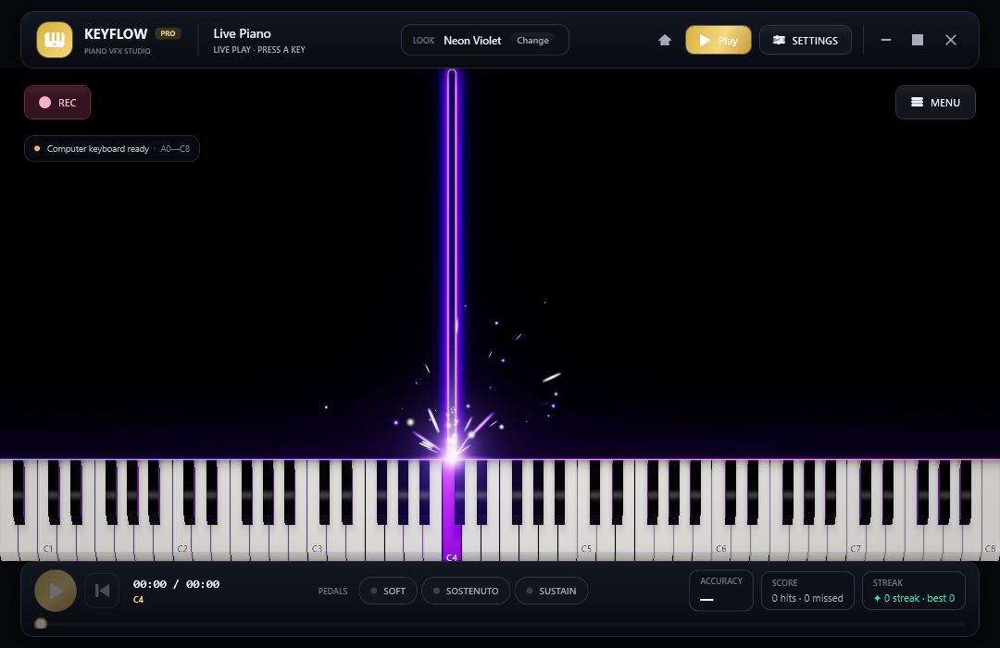

*The live stage, drawn by the Direct3D 11 GPU engine (CI renders it on WARP, Windows' software rasterizer): falling notes, the glowing hit line, sparks, the lit 3D keyboard and the transport bar.*

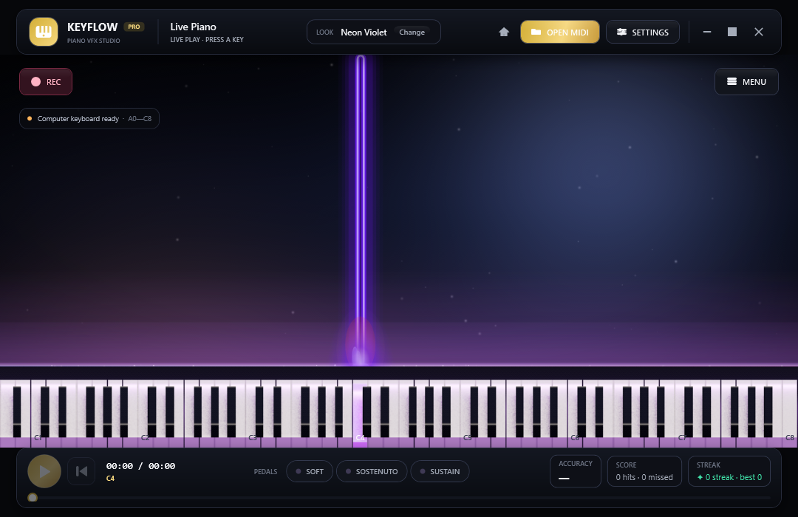

*The same stage with a user-chosen picture behind the keys: the image fills the frame (centre crop, no
stretching) and is dimmed at the default 30/100 so the notes stay readable. The backdrop shown here is
`docs/samples/stage-backdrop.png` — generated by the repository itself with
`tools/make_stage_background.py` so the illustration is both deterministic and free of anybody
else's artwork.*

| Keyboard & shortcuts | Play dialog |
| --- | --- |
| 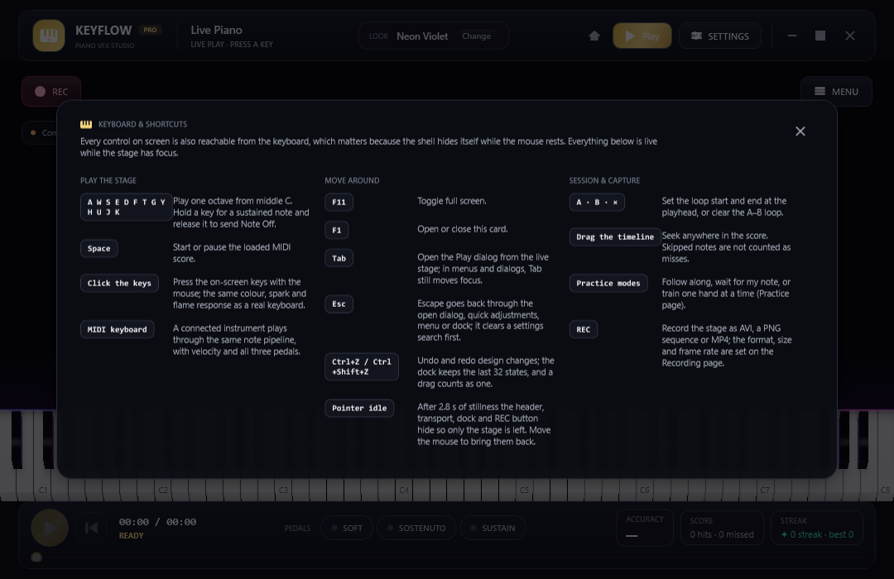 | 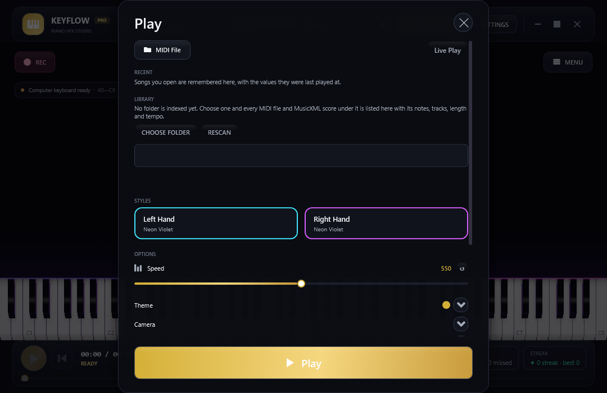 |

| Startup menu (with the language chips) | Design dock (Style) | Design dock (Theme) |
| --- | --- | --- |
| 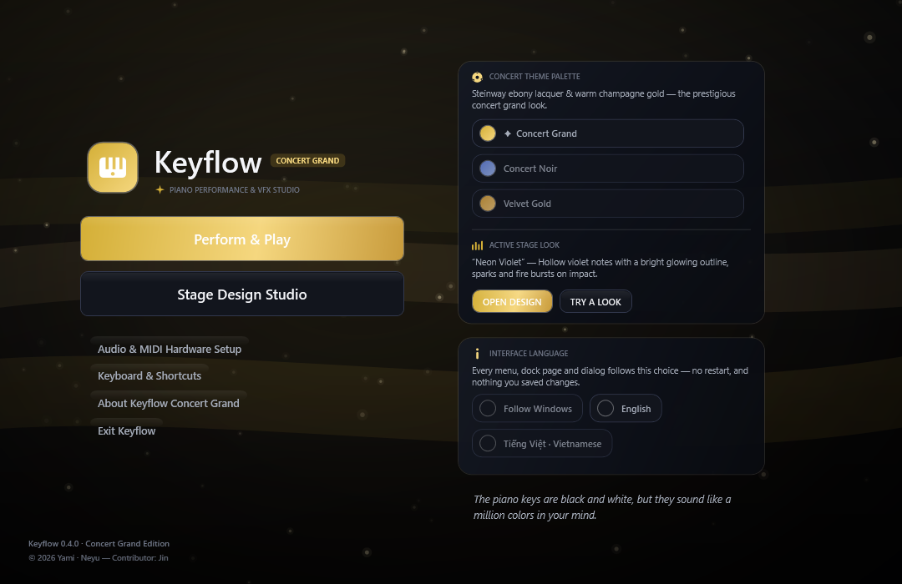 | 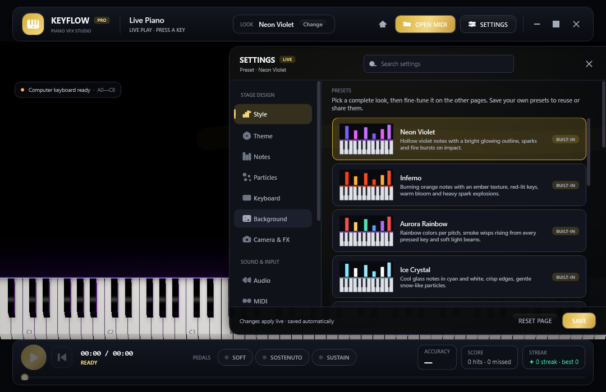 | 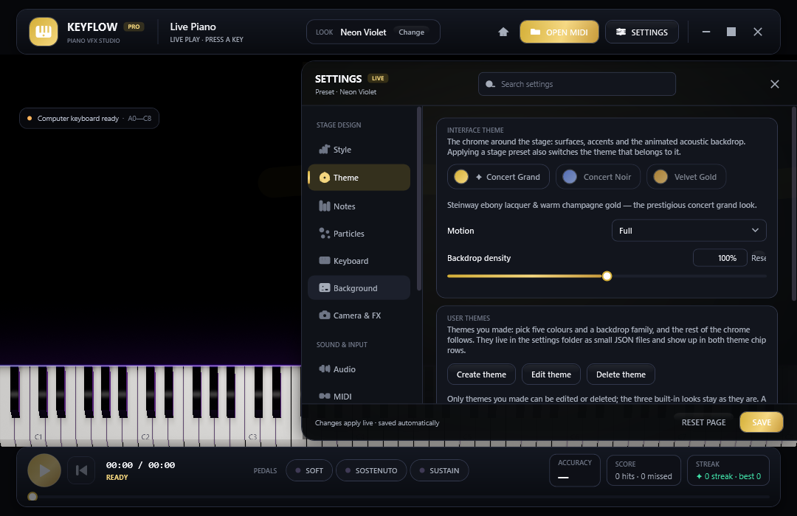 |

> **Every image in the README is rendered by the application** in CI (`--snapshot`). To refresh them
> after a UI change, see [Rendering the interface pictures again](#rendering-the-interface-pictures-again).

## Contents

- [Quick start](#quick-start) · [System requirements](#system-requirements)
- [Installing the tools](#installing-the-tools) · [Getting the source](#getting-the-source) · [Building and running](#building-and-running)
- [First-time setup](#first-time-setup) · [Getting started](#getting-started)
- [Keyboard & shortcuts](#keyboard--shortcuts)
- [Features](#features) · [Languages](#languages) · [Interface map](#interface-map) · [Current limitations](#current-limitations)
- [Rendering the interface pictures again](#rendering-the-interface-pictures-again) · [Packaging and shipping the .exe](#packaging-and-shipping-the-exe)
- [Testing](#testing) · [Technical documentation](#technical-documentation) · [Repository layout](#repository-layout) · [Licence](#licence)

## Quick start

Already know .NET? The whole flow fits in a few PowerShell commands (each step is explained below):

```powershell
winget install --id Git.Git -e; winget install --id GitHub.GitLFS -e; winget install --id Microsoft.DotNet.SDK.10 -e
git lfs install
git clone https://github.com/lxmtuu/PianoPath.git; cd PianoPath; git lfs pull
dotnet run --project .\PianoPath.csproj -c Release    # build, then open the application
.\publish.ps1 -Zip                                    # package publish\win-x64\PianoPath.exe + a ZIP to send around
```

If the machine blocks PowerShell scripts, run `Set-ExecutionPolicy -Scope Process Bypass` before
`.\publish.ps1`.

## System requirements

| Component | Requirement | Notes |
| --- | --- | --- |
| Operating system | Windows 10 (22H2 recommended) or Windows 11, 64-bit | The application uses WPF and WinMM, so it runs on Windows only. |
| To **run a packaged build** | Nothing extra for the self-contained build; the framework-dependent build needs the **.NET 10 Desktop Runtime (x64)** | See [Packaging and shipping the .exe](#packaging-and-shipping-the-exe). |
| To **build from source** | **.NET 10 SDK** (10.0.100 or newer), **Git** and **Git LFS** | The SoundFont `Assets/ConcertGrand.sf2` (~113 MiB) is stored through Git LFS. |
| IDE (optional) | Visual Studio 2026 with the **.NET desktop development** workload, or VS Code + the **C# Dev Kit** extension | .NET 10 needs Visual Studio 2026 (18.0) or newer; VS 2022 can open the project once the .NET 10 SDK is installed but is not fully supported. |
| Disk | ~1.5 GB for the SDK + ~500 MB for sources and build output | A self-contained publish adds ~300 MB. |
| Audio | Any sound card Windows recognises (`waveOut` output) | |
| Graphics | A GPU with **Direct3D 11** (feature level 11_0 or newer, shader model 5.0) | The default stage is the GPU engine: Keyflow tries the graphics card first and only then **WARP**, Windows' software rasterizer (the same shaders, just slower than a real card); the HLSL shaders are compiled at startup with the `d3dcompiler_47.dll` that ships with Windows. If Direct3D cannot start, the WPF renderer takes over and the reason is shown under **General → GRAPHICS ENGINE**. |
| MIDI (optional) | A USB piano/keyboard that Windows recognises | Without one you can still play with the computer keyboard or the on-screen piano. |
| Python (optional) | Python 3.9+ | Only for `tools/check_sources.py` (static checks, no .NET SDK needed). |

## Installing the tools

Open **PowerShell** (no administrator rights needed) and install the tools in order. Skip anything you
already have.

1. **Git and Git LFS**

   ```powershell
   winget install --id Git.Git -e
   winget install --id GitHub.GitLFS -e
   ```

   Close and reopen PowerShell, then enable LFS once for the current Windows account:

   ```powershell
   git lfs install
   ```

   Without winget, download Git from <https://git-scm.com/download/win> and Git LFS from <https://git-lfs.com>.

2. **.NET 10 SDK** (it already includes the runtime needed to run the app)

   ```powershell
   winget install --id Microsoft.DotNet.SDK.10 -e
   ```

   Or download "SDK 10.0.x – Windows x64 Installer" from <https://dotnet.microsoft.com/download/dotnet/10.0>. Reopen PowerShell and check:

   ```powershell
   dotnet --list-sdks      # one line must read 10.0.xxx
   git lfs version         # must print git-lfs/x.y.z
   ```

3. **IDE (optional)**
   - **Visual Studio 2026**: get Community (free) from <https://visualstudio.microsoft.com/>, then tick the **.NET desktop development** workload in the Visual Studio Installer. That workload already brings the .NET 10 SDK.
   - **Visual Studio Code**: install the **C# Dev Kit** extension (Microsoft); it uses the SDK from step 2.

## Getting the source

```powershell
cd $HOME\source            # or any folder; avoid paths with special characters
git clone https://github.com/lxmtuu/PianoPath.git
cd PianoPath
git lfs pull               # downloads the real SoundFont (~113 MiB) if the clone did not
```

Check the SoundFont is the real thing (it must be 118,398,836 bytes ≈ 113 MiB, not 134 bytes):

```powershell
(Get-Item .\Assets\ConcertGrand.sf2).Length
```

If the number is only a few hundred bytes the file is still an **LFS pointer**: run `git lfs install`
again and then `git lfs pull`. The application still opens with the pointer but reports that it could
not load a SoundFont; in that case load another `.sf2` for the session with **LOAD SOUNDFONT** (Audio
page).

Downloading the ZIP from GitHub ("Code → Download ZIP") does **not** include LFS files; use
`git clone`, or download the SoundFont separately and copy it to `Assets\ConcertGrand.sf2`.

## Building and running

### Command line (recommended)

```powershell
dotnet restore .\PianoPath.csproj                        # restore packages (first time)
dotnet build   .\PianoPath.csproj -c Release             # build → bin\Release\net10.0-windows\PianoPath.exe
dotnet run --project .\PianoPath.csproj -c Release       # build (if needed) and run
```

- `dotnet run` without `-c Release` uses the Debug configuration (`bin\Debug\net10.0-windows\PianoPath.exe`), which is slower when drawing many particles.
- You can also run the `.exe` from the `bin\...` folder directly; the `Assets\` folder (SoundFont, attribution) is copied next to it automatically.
- On first launch Windows may ask about the firewall or show SmartScreen, because the file is not code-signed; choose *More info → Run anyway*.

### Command line switches

| Switch | Effect |
| --- | --- |
| `--verify [--verify-log=<file>]` | Run the regression verification suite and exit (exit code `0` = passed). See [Testing](#testing). |
| `--encode-probe=<file.avi>` | Write **three frames** into an uncompressed AVI and exit (exit code `0` = written, `2` = this machine could not). It is the **sample-plumbing probe**: an AVI needs no encoder at all, so `--verify` asks it only when a run produced **no MP4 take** — and always *after* the take, never before it, so a diagnostic that hangs cannot block the very thing it exists to explain. |
| `--encode-take=<file.mp4>` | Write **one** short 64×48 MP4 take and exit, printing each step it took (exit code `0` = the take was written, `2` = this machine cannot write an MP4). It is the child process `--verify` starts to try the encoders: they are native code that can take a whole process down with it, which would cost the run its verdict — out of process it costs a SKIP line instead. |
| `--bench[=<frames>] [--bench-out=<file.json>] [--bench-baseline=<file.json>]` | Run the **perf gate** and exit: it draws the GPU stage through the app's own render loop at **1920×1080**, measures **every frame's own length** for two scenes (the *default look* and the *busiest built-in look*) and writes a JSON report — mean/median/p95/p99/max plus each frame time. Exit code `0` = passed, `2` = no frame could be measured at all (this machine has no Direct3D device, or the render loop stopped), `3` = **over budget** on a machine with a real graphics card (p95 < 8 ms for the default scene, < 16 ms for the heavy one). A machine with only a software rasterizer (WARP — every CI runner) is **never judged against the absolute budgets**: the report still carries every number, and CI compares them **relatively** with the previous run on the same kind of machine (`--bench-baseline` is that run's report). Measures 120 frames by default and writes `%TEMP%\keyflow-bench.json`. See [The frame budget gate](#the-frame-budget-gate---bench). |
| `--show-settings [--settings-tab=style\|theme\|notes\|particles\|keyboard\|background\|camera\|audio\|midi\|practice\|recording\|general]` | Open the settings dock on a given page (`general` = the General page: language, graphics engine, settings profile). |
| `--snapshot <file.png> [--compact] [--play-preview] [--menu]` | Capture the window and exit (`--compact` = 1080×700, `--play-preview` = pre-press a note, `--menu` = open the startup menu). |
| `--gpu` | Kept for older launch scripts: the **Direct3D 11 GPU stage is the default stage** of every run, so this flag changes nothing. A machine without a graphics card uses WARP, Windows' software rasterizer. CI uses it to capture `stage-gpu.png`. |
| `--software` | Draw **one run** with the WPF renderer instead of the GPU engine (the stored settings stay untouched): used for deterministic captures and CI's software column of the preset gallery. |
| `--play-dialog` / `--shortcuts` | Open the Play dialog / the shortcuts card so it can be captured (used together with `--snapshot`). |
| `--lang=<en\|vi>` | Run once in the given language, **overriding** the stored setting — used to capture Vietnamese screenshots or to check a translation without touching `%LOCALAPPDATA%\Keyflow`. |
| `--preset=<name>` / `--play-chord` | Apply a built-in preset for this run only (spaces optional: `--preset=GalaxyVoyage`), and hold a spread chord while capturing so the hold effects that link keys (electric arcs) show. CI uses them to capture `stage-gpu-galaxy.png` and `stage-gpu-storm.png`. |
| `--background-image=<file.png>` | Draw a specific picture behind the keyboard **for this run only**: it does not set the "modified" flag and never auto-saves, so `visual-settings.json` stays untouched. CI uses it to render the background-feature illustration from the generated sample `docs/samples/stage-backdrop.png` (built by `tools/make_stage_background.py`) instead of somebody's screenshot. |
| `--settings-dir=<folder>` | Read/write settings and user presets in another folder (default `%LOCALAPPDATA%\Keyflow`) — handy for a portable build or for capturing a pristine first run. `--verify` always uses a temporary folder, so it **never overwrites your real settings or presets**. |

Example that reproduces the README pictures exactly (twenty-two images — a set per language: this edition
reads `docs/previews/en` and `README.md` reads `docs/previews/vi`, with `--lang` pinning each set):

```powershell
$exe = ".\bin\Release\net10.0-windows\PianoPath.exe"
foreach ($lang in @('en', 'vi')) {
  $set = "docs\previews\$lang"        # each README reads only its own language's pictures
  $dir = "$env:TEMP\keyflow-preview-$lang"   # temporary settings folder: every capture is a pristine first run
  Remove-Item -Recurse -Force $dir -ErrorAction SilentlyContinue   # CI uses a temporary folder per picture
  & $exe --snapshot $set\stage-live.png       --compact --play-preview  --lang=$lang --settings-dir="$dir"
  & $exe --snapshot $set\stage-gpu.png        --compact --play-preview  --lang=$lang --settings-dir="$dir" --gpu
  & $exe --snapshot $set\stage-gpu-galaxy.png --compact --play-preview  --lang=$lang --settings-dir="$dir" --gpu --play-chord --preset=GalaxyVoyage
  & $exe --snapshot $set\stage-gpu-storm.png  --compact --play-preview  --lang=$lang --settings-dir="$dir" --gpu --play-chord --preset=ElectricStorm
  & $exe --snapshot $set\background-image.png --compact --play-preview  --lang=$lang --settings-dir="$dir" --background-image=docs\samples\stage-backdrop.png
  & $exe --snapshot $set\main-menu.png         --compact --menu          --lang=$lang --settings-dir="$dir"
  & $exe --snapshot $set\design-dock.png       --compact --show-settings --lang=$lang --settings-dir="$dir" --settings-tab=style
  & $exe --snapshot $set\theme-dock.png        --compact --show-settings --lang=$lang --settings-dir="$dir" --settings-tab=theme
  & $exe --snapshot $set\play-dialog.png       --compact --play-dialog   --lang=$lang --settings-dir="$dir"
  & $exe --snapshot $set\shortcuts.png         --compact --shortcuts     --lang=$lang --settings-dir="$dir"
  & $exe --snapshot $set\language-dock.png     --compact --show-settings --lang=$lang --settings-dir="$dir" --settings-tab=general
}
```

### Visual Studio 2026

1. **File → Open → Project/Solution**, pick `PianoPath.csproj` (there is no `.sln`; Visual Studio creates a temporary solution).
2. Choose the **Release** or **Debug** configuration in the toolbar, then press **F5** (run with the debugger) or **Ctrl+F5**.
3. To run with switches (for example `--verify`): **Project → PianoPath Properties → Debug → Open debug launch profiles UI → Command line arguments**.

### Visual Studio Code

1. **File → Open Folder** and pick the `PianoPath` folder; C# Dev Kit finds `PianoPath.csproj` itself.
2. Press **F5** → choose **C#** → **PianoPath**; or use the integrated terminal with the `dotnet` commands above.

### Updating to a newer version

```powershell
git pull
git lfs pull
dotnet build .\PianoPath.csproj -c Release
```

## First-time setup

1. **Audio**: Keyflow plays through the default Windows output device (`waveOut`). Change speakers/headphones in Windows *Settings → System → Sound* before opening the app.
2. **SoundFont**: the bundled Yamaha grand loads automatically at startup (it takes a few seconds; the label on the Audio page tells you when it is ready). To use another piano, open **SETTINGS → Audio → LOAD SOUNDFONT** and pick a `.sf2`; choose a preset (bank/program) in the list below it. **HALL REVERB** toggles the room reverb.
3. **MIDI piano**: plug the instrument in before starting the app and Keyflow connects to the first input by itself. Plugged in later? Open **SETTINGS → MIDI → Refresh devices**. The badge above the keyboard switches to `MIDI IN · C4` when a Note On arrives. The same page holds the MIDI output (to play through an external synth), the metronome and the track list.
4. **Graphics**: the stage runs on the GPU from the very first launch, with nothing to switch on. To change the frame rate (60 / 120 / 144 / 240 FPS or unlimited), turn off VSync in the GPU stage window, open that window for a second monitor, or see which engine is drawing, open **SETTINGS → General → GRAPHICS ENGINE**. These are settings of the computer: applying a preset does not change them.
5. **Look**: pick a preset in **SETTINGS → Style** (default *Neon Violet*), pick the concert interface in **SETTINGS → Theme** (Concert Grand / Concert Noir / Velvet Gold — Concert Grand is the default), then fine-tune on the Notes / Particles / Keyboard / Background / Camera & FX pages. Every change applies live and saves itself.
6. **Where settings live**: `%LOCALAPPDATA%\Keyflow\visual-settings.json` (current settings), `%LOCALAPPDATA%\Keyflow\library.json` (the recent songs and the values they were played at), `%LOCALAPPDATA%\Keyflow\history\practice.jsonl` (the practice history) and `%LOCALAPPDATA%\Keyflow\presets\*.json` (user presets) and `%LOCALAPPDATA%\Keyflow\themes\*.json` (themes you made, see *Themes you made* above); move them with `--settings-dir=<folder>`. Delete `visual-settings.json` or press **RESET TO DEFAULT** in the dock to go back to the defaults; copy the `presets` folder to carry presets to another machine (or use IMPORT/EXPORT). Old theme ids (`sakura`, `noir`, `velvet`) are migrated to the current ids when an old file is loaded.
7. **Recording**: the **Recording** page chooses **Format** — *AVI video*, *PNG sequence (32-bit alpha)* (a folder of PNG frames with a transparent channel for Premiere/Resolve/OBS) or *MP4 (H.264 + AAC)* (one file that already carries the sound, nothing to mux), **Resolution** and **Frame rate**; press **REC** in the corner of the stage, pick where it goes, then press it again to stop. For AVI, install an MJPEG codec (for example the K-Lite pack) if you want smaller files — it is optional.

## Getting started

1. The app opens on the **concert menu** (Perform & Play / Quick Adjustments / Stage Design Studio / Audio & MIDI Hardware Setup / Keyboard & Shortcuts / About / Exit). **Quick Adjustments** opens the most-used stage controls directly; **Stage Design Studio** remains the full dock. The **HOME** button on the header returns to the menu at any time.
2. **Live Play**: press a key on the piano, the computer keyboard or a MIDI instrument to show just the notes you play. The Yamaha grand SoundFont loads automatically when the app opens, so computer keys, the on-screen piano and MIDI all sound immediately. The **HALL** button toggles the concert-hall reverb.
3. Click **Play** in the header (or **Perform & Play** on the main menu) to open the session dialog. Choose **MIDI File** to load a `.mid`/`.midi` file or a **MusicXML** score (`.musicxml`, `.xml`, `.mxl` — compressed files are read through `META-INF/container.xml`), or choose **Live Play** to perform right away. For MusicXML, the **hand split is read from the staves** (staff 1 = right hand, staff 2 = left, or one `part` per hand), so nothing is guessed, and that value is remembered for the file in `library.json`. With no score loaded, the compact session action says **Choose a MIDI file**; with a score loaded it says **Start playback** (the adjacent MIDI button can replace that score); while playback is running it says **Return to playback**. The large gold **Live Play** button keeps its direct-performance action. The Left Hand and Right Hand cards open a dedicated preset chooser for that hand, with a custom color option. **QUICK ADJUST** opens common note-style, color, speed, glow and stage-layer controls that stay in sync with the Design dock; **Advanced settings…** opens the full dock. **RECENT** keeps the songs you opened with their note and track counts, tempo and last preset; click a row to reopen the song with its saved values, or **×** to forget it. **LIBRARY** can index a folder, search by name/tag and open a song directly in the dialog.
4. While the score runs the notes travel down and touch the glowing line just above the keys. Play along on the keyboard and get hit/miss feedback.
5. If a MIDI piano was plugged in when the app started, Keyflow connects to the first input it finds. If you plug it in later, open **SETTINGS → MIDI → Refresh devices** and the app selects and connects the new instrument. The blue badge above the keyboard becomes `MIDI IN · C4` when a Note On arrives. In the settings dock (the **SETTINGS** button or `Esc`) you can choose other input/output devices, the practice mode, tempo, tracks, the metronome and the loop points. `Esc` follows the open surface back (Quick Adjust, Play, settings, menu); on the live stage it opens the dock.

Keyflow bundles the YDP Grand Piano SF2 from FreePats, built from a Yamaha Disklavier Pro multisample;
the acoustic-grand preset is selected for you. The engine renders stereo 44.1 kHz, responds to note
on/off and all three MIDI pedals, and includes a switchable hall reverb. You can replace it with your
own `.sf2` SoundFont. MIDI output is an extra audio path when you pick an external MIDI device.

## Keyboard & shortcuts

The in-app **F1** card lists exactly this table (see the picture at the top of the README), so you
never have to open the documentation:

| Group | Key / action | Effect |
| --- | --- | --- |
| Play the stage | `A W S E D F T G Y H U J K` | One octave from middle C (C4); hold a key to sustain the note and release it to send Note Off. |
| Play the stage | `Space` | Start or pause the loaded MIDI score. |
| Play the stage | Click the keys with the mouse | Play the on-screen piano with the full colour, spark and flame response. |
| Play the stage | MIDI keyboard | Velocity, Note On/Off and the three pedals (`CC 64/66/67`) enter the same feedback pipeline. |
| Move around | `F11` | Toggle full screen. |
| Move around | `F1` | Open or close the shortcuts card. |
| Move around | `Tab` | Open the Play dialog from the stage; in menus and dialogs, Tab still moves focus normally. |
| Move around | `Esc` | Go back through the open surface (Quick Adjust → Play → settings → menu → stage); on the stage it opens the dock, clearing settings search first and closing the F1 card first. |
| Move around | `Ctrl+Z` / `Ctrl+Shift+Z` | Undo / redo a change in the design dock. The dock keeps the last **32 states**; one slider drag (or one burst of tweaks) counts as a **single** step, and `Ctrl+Z` never steals the undo of the box you are typing in. |
| Move around | Leave the pointer still for ~2.8 s | The whole interface (header, transport, Menu, REC and the dock if it is open) hides, leaving only the piano, the background and the running notes. Move the mouse to bring back exactly what was hidden. The chrome never hides while you drag a slider, open a drop-down, use the colour picker, read the shortcuts card or type in the settings panel. |
| Session & capture | **A**, **B**, **×** (timeline bar) | Set or clear the A–B loop at the playhead. |
| Session & capture | Drag the timeline | Seek in the score; skipped notes are not counted as misses. |
| Session & capture | Practice page | Follow along, Wait for my note, Right hand only, Left hand only; tempo 50–150%. |
| Session & capture | **REC** | Record the stage to AVI, to a folder of 32-bit PNG frames with alpha, or to an **MP4 with the audio already inside it**, at the format/resolution/fps chosen on the Recording page. |

## Features

### Stage & visual effects

| Group | Details |
| --- | --- |
| Notes | 4 styles (Solid / Neon outline / Glass / Fire with an animated ember texture), 5 colour modes (gradient by pitch with 6 palettes or your own start–end colours, per hand with an adjustable split point, per MIDI track with an 8-colour palette, rainbow by pitch, rainbow over time), width, corner roundness, minimum length, gap, 3D shading, note names printed on the bars, tint, bloom, edge brightness/thickness, leading-edge glow, refraction, shimmer (a moving sheen along each bar), landing glow (a light gathering where a note is about to land — GPU stage), fall speed and **travel direction** (Down: notes fall to the keys and sink below the hit line; Up: notes are born at the key on onset and rise out of the top of the stage — sparks, flames and rings still burst at the key), falling FX (7 trails + pulse + ghosts), hold FX (bar/breath/vibration/electric arc), release FX (6 styles) and the smart modulators (velocity/octave/zone/pedal/tempo/audio). |
| Particles & fire | Incandescent sparks with full physics (gravity, drag, vector field…), plasma wisps rising from held keys (density, speed, height, width, turbulence, glow), per-note flames (intensity, height, warm or note colour, burning while the key is down and dying out afterwards), impact rings, impact waves (Ring/Shockwave/Ripple plus Flash/Lightning/Plasma flashes scaled by hit strength), 5 impact burst styles and 5 morph styles (see `docs/EFFECTS-REDESIGN.md`); on the GPU, the held-key spark stream shares the chosen burst family (embers, water splash, fireworks, confetti or dust), with physics speed independent of song time. |
| Keyboard | 88 keys drawn with a **ray-traced shader**: GGX/Smith/Schlick BRDF, a softbox with real penumbra, contact occlusion inside the key gaps, environment IBL, coloured light thrown back by sounding keys, ACES filmic tonemapping (Off/Fast/Balanced/Cinematic plus key light, shadow, occlusion, gloss, rim, emission, exposure, camera tilt). Classic / Studio 3D / Glass styles, height, black-key length, key labels, lid shadow, red felt strip and press depth. Keys of the MIDI notes that are sounding light up too, not only the keys you press. On the GPU stage the shading sliders above go straight into the HLSL shader and are applied again **on every frame**; the quality picker Off/Fast/Balanced/Cinematic only shapes the software renderer (the fallback, and transparent PNG takes), where the keyboard bakes once and caches and a sounding key only repaints a small tile, which keeps 60 fps. |
| Background | Solid colour / image (PNG, JPEG, BMP, GIF, TIFF + dim 0–100) / Green screen — try it right away with the sample `docs/samples/stage-backdrop.png` or run `--background-image=<file.png>`; aura gradient, stars + shooting stars, guide lanes, vignette, horizon glow, light beams; halo colour and line; on the GPU, six shader-driven backgrounds (Aurora / Nebula / Prism / Ember Haze / Ocean Flow / Retro Grid) with motion amount/speed/tint controls; six animated hit-line styles (Pulse / Sweep / Twin Comets / Spectrum / Electric Arc / Ripple) with pulse intensity/speed controls alongside the halo colour; plus 4 independent ambient layers (Energy/Nature/Light/Cosmic — the Light layer gains Spotlights). |
| GPU stage (default) | The main stage is drawn by a Direct3D 11 engine built on [Vortice.Windows](https://github.com/amerkoleci/Vortice.Windows) — there is no "Renderer" choice anymore: the WPF software renderer is only the automatic fallback when Direct3D cannot start and the path for transparent PNG takes (one run with `--software`): an **independent game loop** on its own thread (60 / 120 / 144 / 240 FPS or unlimited) owns the `ID3D11Device` and `ID3D11DeviceContext`, so a heavy frame costs frame rate and never MIDI latency. Live MIDI input reaches both the synthesizer and the GPU engine **on the MIDI callback thread itself** (notes and pedals in arrival order), so neither the sound nor the burst waits for the WPF dispatcher. HLSL shaders (`Gpu/StageShaders.hlsl`): 3D keys with GGX lighting, shadows, ambient occlusion and coloured light from sounding keys; rounded notes with neon/glass/fire edges; up to 24,000 particles (sparks, wisps, flames, rings, flashes) simulated on the CPU and drawn instanced; everything rendered in **16-bit HDR**, then multi-level bloom and ACES tonemapping. **OPEN GPU STAGE WINDOW** opens an `IDXGISwapChain` window (flip model, optional VSync, F11 full screen) for a second monitor, a projector or OBS. If Direct3D cannot start, the app keeps the software engine and says why. **Every effect family of the software engine runs on the GPU**: falling trails (Glow, Sparkles, Speed lines, Blur, Ribbon, Rainbow, Stream), ghost echoes, hold bar / breathing / vibration / electric arcs between held keys, flat impact waves (Ring, Shockwave, Ripple), Flash / Lightning / Plasma flashes, note morphs (Shatter, Melt, Absorb, Bounce, Star morph), release effects, guide lanes, acoustic motes, the four ambient layers, Pedal Glow and note names on the keys (a glyph atlas rendered once with WPF). **GPU-exclusive on top**: **Note shimmer** (a sheen sweeping along each bar in the note's own colour), **Landing glow** (a soft light gathering on the key a note is about to strike — beauty and a practice aid in one), **Halo light pulses** (in Pulse mode, three halo-colour heads travel the hit line; Tempo sync / Pedal Glow / Audio reactive can swell them), **Shooting stars** (meteors crossing the star field) and the **Spotlights** light layer (three soft stage shafts swaying with the music); shader-driven backgrounds (**Aurora, Nebula, Prism, Ember Haze, Ocean Flow, Retro Grid**) and six animated hit-line styles (**Pulse, Sweep, Twin Comets, Spectrum, Electric Arc, Ripple**) with pulse-intensity/speed controls alongside the halo colour. The GPU held-key spark emitter shares the impact-burst family (**Embers, Water Splash, Fireworks, Confetti, Dust**), while particle physics speed is independent of song time. Neon Violet, Galaxy Voyage, Electric Storm, Concert Gold, Moonlight Sonata, Ice Crystal, Sakura Nocturne, Aurora Rainbow and Sunset Drive enable matching motion for their themes; Classic Roll / Lo-Fi / Green Screen stay calm or clean where appropriate. **GPU recording**: while the GPU stage is on screen, REC has the render thread draw an extra off-screen frame at **exactly the take's size and frame rate** (not an upscaled preview), with the WPF layers (sheet, camera, counter) blended on top; transparent PNG takes stay on the software engine. **Settings** live under **General → GRAPHICS ENGINE**: GPU frame rate (60 / 120 / 144 / 240 FPS / Unlimited, default 144), VSync in the GPU stage window (on by default), the button that opens the window and a status line naming the adapter in use and the shader compile time; they belong to the computer, so applying a preset keeps them, and an old file that names the `Software` engine is moved to the GPU on load. **WPF overlays**: the sheet music, the hand marker, the camera picture, the watermark and the key counter / FPS HUD stay vector layers drawn over the GPU frame. Picture: `docs/previews/en/stage-gpu.png`. |
| Camera & FX | Parallax, zoom, framing, saturation, contrast, bloom. |
| Camera overlay & hand tracking | The **Camera & FX** page carries the **WEBCAM OVERLAY** card: the **Camera overlay** switch draws a live camera or a video file (looping) over the stage as a picture-in-picture — pick the camera from the machine's own list (**REFRESH CAMERAS** reads it again), **USE CAMERA** / **CHOOSE VIDEO…** to change the source, plus **Corner** (four corners), **Size** (15–60% of the stage width), **Opacity**, **Mirror** and **Key tolerance** (0 turns keying off, 100 is the widest) to key pure green — the colour of the **Green Screen** preset — so the backdrop disappears and the player stays. The status line under the rows says which camera or clip is running, or why neither can (no camera, no Media Foundation). Frames are read through Media Foundation (`Camera/`) on their own thread and handed to the stage at 30 fps. The **HAND TRACKING** card just below carries the **Hand tracking** switch and the **Skin sensitivity** slider: the app reads a hand out of the camera frame itself — no model, nothing to download; a pixel is skin by its colour (YCbCr), and the biggest group of touching skin cells is the hand — then counts the fingers held up and **marks the key the hand is over** with a glow on the key, a position dot and one dot per finger. The camera stays open for this layer while the camera picture is hidden, and the status line reports the finger count, the key and how much of the frame the hand covers. It is classic computer vision, so it wants a plain background and reasonable light; with two hands in view only the biggest one is followed. |
| Air layers (optional) | Acoustic motes floating in the concert space (amount, colour), enabled under **Background → ATMOSPHERE → Acoustic motes**; 4 independent ambient layers (Energy/Nature/Light/Cosmic) on the **Background** page — lightning, rain, galaxies, matrix… **Off** by default so the stage stays clean. |
| Performance | Every animation (falling notes, petals, backdrop, panel transitions) runs on **one vsync clock** (`FrameClock`), so nothing judders and no frame is drawn twice; the clock releases itself when the stage is still. Motion level Off/Calm/Full respects the Windows "reduce animations" setting. |

The main stage is the Direct3D 11 GPU engine (the default since this version; the CI picture is rendered on WARP):

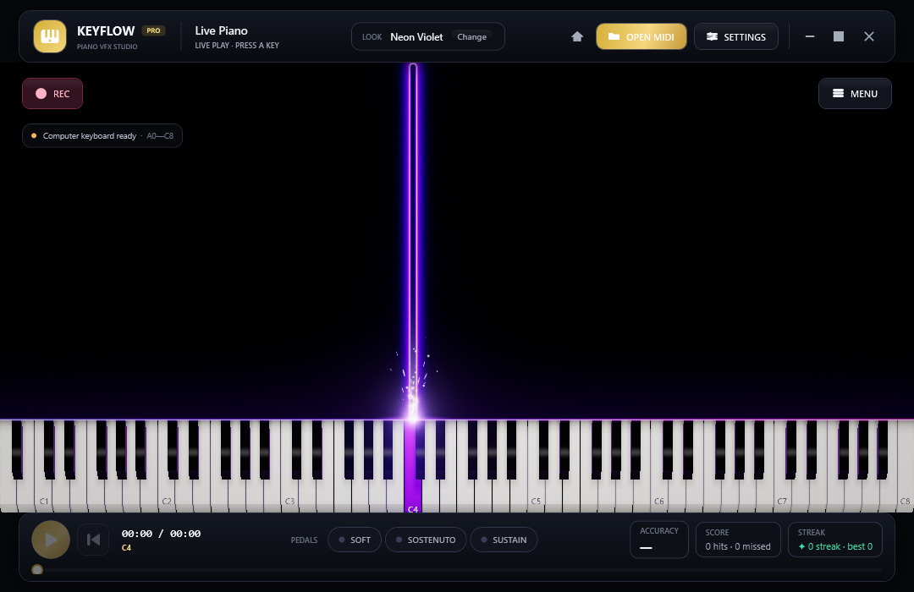

The same engine with two presets that use the effect families: **Galaxy Voyage** (rainbow trails, the Galaxy cosmic layer) and **Electric Storm** (speed-line trails, electric arcs between held keys, the Lightning Storm energy layer):

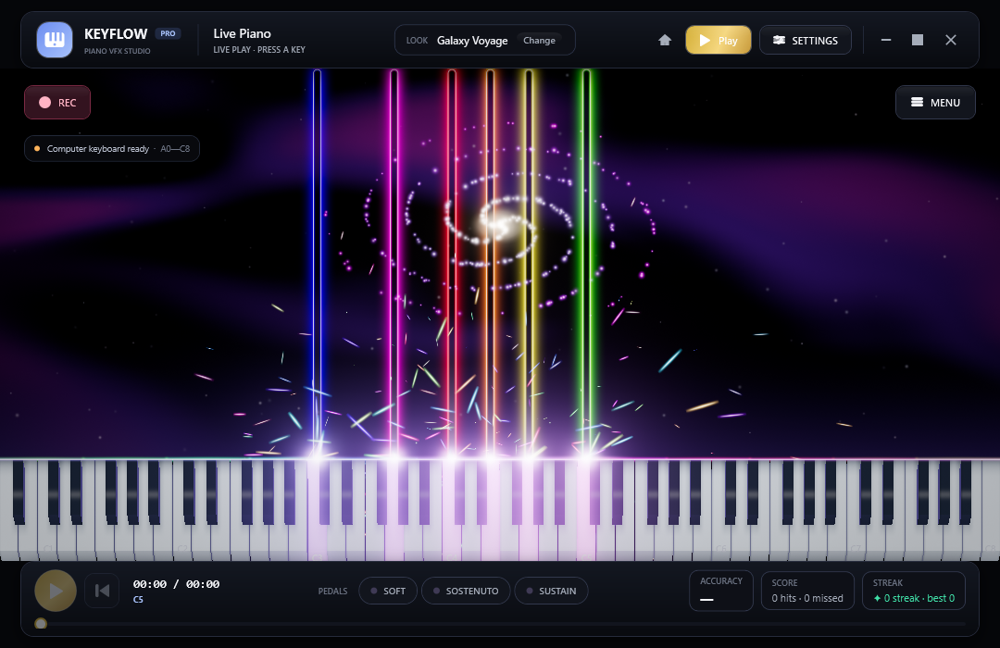
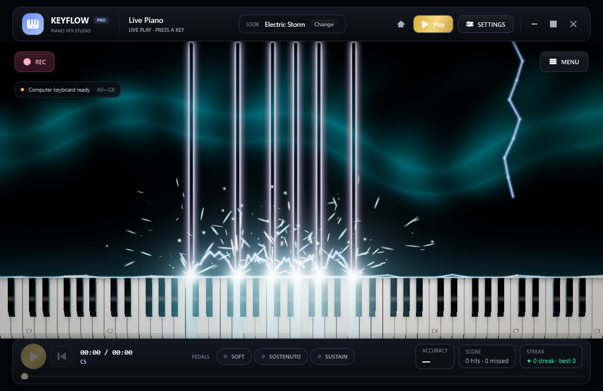

Every built-in preset, drawn by both engines side by side (software | GPU), is in one picture CI rebuilds on every push: [`docs/previews/presets.jpg`](docs/previews/presets.jpg). It is how the GPU engine is checked against the theme of each preset (pressed key colour, horizon, hollow neon tubes, Fire cracks…); `tools/check_sources.py` checks the workflow's preset list against `Stage/VisualPresets.cs`.

### Audio, MIDI & practice

| Group | Details |
| --- | --- |
| SoundFont | Loads the bundled Yamaha grand automatically; loads another `.sf2`, lists bank/program, selects a preset, polyphonic stereo 44.1 kHz PCM output through `waveOut`. |
| Reverb | Real-time stereo hall reverb, on by default, with its own bypass button; the tail keeps ringing after you release the keys. |
| Pedals | All three standard MIDI pedals: una corda/soft (CC 67, lowers gain and softens the tone), sostenuto (CC 66, holds the notes that were down when the pedal was pressed), sustain/damper (CC 64, keeps the sound after the key is released). The on-screen buttons, MIDI input and MIDI output are all wired up; a live note bar only grows while the key is physically held, and the pedal only affects the sound. |
| MIDI input | Computer keyboard, clicking/holding the on-screen keys and WinMM MIDI input; opens the first MIDI input automatically, keeps your choice after refreshing the list, and shows the incoming signal/note. |
| MIDI output | WinMM MIDI output to send Note On/Off to a chosen synthesizer or MIDI device. |
| MIDI scores | Reads **formats 0, 1 and 2** (a format 2 file holds independent patterns, so they play one after the next) and **both time divisions, PPQ and SMPTE** (SMPTE ticks are absolute time, so tempo moves the metronome and not the notes), tempo map, time signature, track names, note duration/velocity (drum channel 10 is ignored), solo/mute and per-track colour, seeking, tempo, A–B loop and a metronome that follows the tempo map (downbeats accented). |
| Practice | Follow along, Wait for my note, Right hand only, Left hand only; the score waits for the right note before moving on. Seeking, changing mode/track or the A–B loop never counts skipped notes as misses; each A–B pass is graded from the start. |
| Scoring | Hit/miss statistics, accuracy, streak and timing feedback on the footer. |

### Interface, presets & recording

| Group | Details |
| --- | --- |
| Three concert interfaces | **Concert Grand** (Steinway ebony & champagne gold — the default), **Concert Noir** (obsidian & platinum), **Velvet Gold** (red mahogany velvet & burnished brass). Changing theme swaps every surface/accent through `DynamicResource` within one frame, with no restart; the animated backdrop (resonance waves, aurora, velvet) belongs to each theme. |
| Themes you made | Theme page → **USER THEMES**: **CREATE / EDIT / DELETE** opens the theme studio — name it, pick a backdrop family (Acoustic/Obsidian/Imperial) and **five colours** (accent, accent companion, glow, surface, mote); the other twenty chrome tokens are **derived** from those five, so a hand-made theme cannot end up with unreadable text or a control darker than its window. A preview strip follows every keystroke. Themes are small JSON files in `%LOCALAPPDATA%\Keyflow\themes\*.json` (hand-editable) and appear next to the three built-in looks in both chip rows. |
| Stage presets | 14 built-in looks: Neon Violet (default), Inferno, Aurora Rainbow, Ice Crystal, Two Hands, Classic Roll, Green Screen, Sakura Nocturne, Concert Gold, Moonlight Sonata, Galaxy Voyage, Electric Storm, Ocean Depths, Retro Arcade — each suggesting a matching interface theme. User presets are stored in `%LOCALAPPDATA%\Keyflow\presets\*.json` with SAVE AS / DELETE / IMPORT / EXPORT; the header shows the preset name and a `*` once you edit it. |
| Preset thumbnails | Every preset in the Style list has a real rendered miniature (dark background, white/black keys, note bars in the preset palette). |
| Song import | **MIDI** (`.mid`, `.midi`) and **MusicXML** (`.musicxml`, `.xml`, `.mxl` — a compressed file is read through its container): instruments, the beats in a bar, the tempo map, meter changes mid-song, chords (`<chord/>`), `backup`/`forward`, part names; the hand split of a score is read straight from `<staff>` (staff 2 = left hand), so nothing is guessed, and it is remembered per file. |
| Menu & dialogs | A concert-style startup menu and a **Play** dialog opened from either the menu or the header Play button; Back returns to its caller, SETTINGS/chevrons open the dock and return to Play, and the dialog groups song selection / RECENT / LIBRARY, keyboard-operable hand cards, playback speed and stage layers. Its primary action changes from choosing MIDI to starting the loaded score, then to returning to an already-running performance without restarting it; an unused library search field stays hidden until there are songs to search. |
| F1 card | The in-app shortcut table, split into three groups (Play the stage / Move around / Session & capture). |
| Undo / redo | Every change in the dock enters a 32-step history: `Ctrl+Z` steps back, `Ctrl+Shift+Z` (or `Ctrl+Y`) steps forward. A snapshot is the JSON of `PianoVisualSettings`, so it goes through the same `CopyFrom`/`Clamp` as setting the values by hand; applying a preset is a marker too, while **importing a profile** starts a fresh history — the imported state becomes the first step, so `Ctrl+Z` cannot step back past it. |
| Settings profile | **IMPORT/EXPORT PROFILE…** on the General page packs three things into one `Keyflow.profile.json`: the stage settings, the interface language and the shell theme. Drop a profile on the window to apply it, drop a `.mid`/`.midi` file to open the song, drop an image to set the stage background. A language this build does not ship falls back to English instead of leaving the UI half-translated. |
| Accessibility | Every glyph-only button (the **A**/**B**/**×** loop buttons, ↺, the window buttons, the Play dialog chevrons) carries an **accessible name for screen readers**, taken from its already-translated tooltip, so it follows the interface language; the generated dock rows (sliders, number boxes, pickers, colour swatches) are named after their own row label too. **Tab** keeps focus inside the dock (`KeyboardNavigation.TabNavigation="Cycle"`) and walks every page in the order its rows are printed; at the compact window size (1080×700) every row stays inside the scroll column and every control inside its own card (`VerifyDockAccessibility`), and when Windows turns on **high contrast** the chrome is painted from the system colours (`SystemColors`) while the theme you chose stays as it is in the settings file, and Windows reports the switch so the window repaints the moment it changes (`SystemParameters.StaticPropertyChanged`). |
| Languages | Two bundled languages: **English** and **Tiếng Việt**, chosen on the General page or with a chip on the startup menu; switching repaints every label, dialog, error message and menu inside the current frame. No English label leaks into Vietnamese: `tools/check_sources.py` proves the two tables hold the same keys and `--verify` switches language on an open window. |
| Recording | REC writes stage frames at the chosen resolution (window/720p/1080p) and 15–60 fps, paced by a real clock: **AVI** as one file, or a **32-bit PNG sequence** into a folder (one `frame-000001.png` per frame, plus `sequence.json` naming the size, rate, frame count and the ffmpeg line that turns the folder back into alpha video). **Transparent background** drops the opaque fills for the sequence — the captured picture is see-through while the piano and its effects stay (turn the Background layer off for the piano alone). **Audio track**: with **Record audio** on (the default, on the Recording page) REC also writes a **16-bit 44.1 kHz stereo WAV** beside the video (inside the frame folder for a PNG sequence) — exactly the PCM blocks the engine renders, including the blocks it renders itself when the machine has no audio output, so the track is always as long as the take — and the dialog after stopping prints its length with the **ffmpeg line** that muxes the two into an MP4. **MP4 (H.264 + AAC)** is written by the **Media Foundation sink writer** that ships with Windows — no extra library and no ffmpeg: the stage's pixels are converted to **NV12** (BT.601) and encoded as H.264 at a bitrate taken from the frame size and rate (2 Mbps floor, 24 Mbps ceiling) while the engine's PCM is encoded as AAC into the same file, every sample stamped with its own place on the recording's clock (`Mp4Recorder.FrameTime`/`AudioTime`). A machine with no H.264 encoder says so in a sentence carrying the HRESULT instead of writing a broken file; a machine that has H.264 but no AAC encoder still records the **picture** and the dialog says why the sound stayed out. Before the first frame is handed over, the take attempt asks the media stack one question — will it hold the **H.264 stream** the take is going to ask for? (`Mf.EncodeSinkProbe`: it opens a writer, offers that very stream description and stops there, writing no frame, so a machine with no encoder says so in one sentence instead of waiting out a take that was never going to be written.) When a run produces no take, a second child then writes three pictures into an **uncompressed AVI through the same sample plumbing** (`Mf.EncodeAviProbe`, `--encode-probe`): an AVI needs no encoder at all, so that verdict tells this machine's file handling and the app's own buffers apart from the codecs — and it runs after the take, never before it. **Hand tracking** reads the camera directly with arithmetic — the skin rule in YCbCr with a sensitivity of its own, a 32×24 grid, the biggest group of touching cells taken as the hand (centre, width and height as shares of the frame), and the **finger count** from the column profile: the palm line is the height the hand holds in most of its columns and a finger is a stretch reaching past the line halfway to the fingertips, so a closed hand counts as none rather than one. The **HAND TRACKING** card on the Camera & FX page holds the switch and a **Skin sensitivity** slider; the camera opens for this layer even while the picture layer is off, and the stage paints a **band over the key the hand is over**, a disc where across the key it really is, and a pip per finger. And because the encoders are **native code that can stop answering** rather than fail, the window opens an MP4 take **on a thread of its own with a ten-second limit** (`Video/HangGuard.cs` + `Mp4Recorder.TryOpen`): a machine that does not answer inside it records an **AVI** instead and is told so, rather than freezing the whole window — which is the kind of machine this verification met on CI, where the media stack wedges inside stamping a sample and **no real MP4 take has yet been produced anywhere** (see `docs/REPO-AUDIT.md`). A machine without a SoundFont records video only and says so. The **Green Screen** preset paints a pure green background for keying in OBS. On a machine without an MJPEG codec the AVI frames are uncompressed RGB and recording stops by itself at the 2 GB limit. |

## Languages

The interface ships two languages — **English** and **Tiếng Việt** — and switches **inside the
running app**, with no restart: every label, tooltip, dialog, drop-down, the F1 shortcut card, the
startup menu and even error messages repaint within the current frame.

| Where | What to do |
| --- | --- |
| **General** page (dock → APP group) | Choose **English**, **Tiếng Việt** or **Follow Windows**. The line underneath says which language is active and where it came from. |
| **Startup menu** | An *INTERFACE LANGUAGE* card with quick chips — the first time you open the app you can switch immediately instead of hunting for the settings page. |
| Command line | `--lang=vi` (or `en`) runs once in that language **without** writing to `visual-settings.json`. CI uses this switch to render the Vietnamese pictures. |
| Dock search | A row matches English *and* translated words: typing `speed` or `tốc độ` finds the same *Fall speed* slider. Beyond its captions, every row also answers to **synonyms** (`tempo` → *Fall speed*, `fps` → *Frame rate*, `brighter` → the brightness sliders) and to the **name of the setting** (`NoteFallSpeed` → `fall`+`speed`), so you do not have to remember the exact wording. Several words are an **AND**: `speed fall` narrows to that one row. The matched part is **painted in the accent colour** inside the caption, and the search box jumps to the first page with a hit. |

The General page in English — every picture in this edition comes from CI with `--lang=en`; the Vietnamese README carries the same subjects with the interface in Vietnamese:
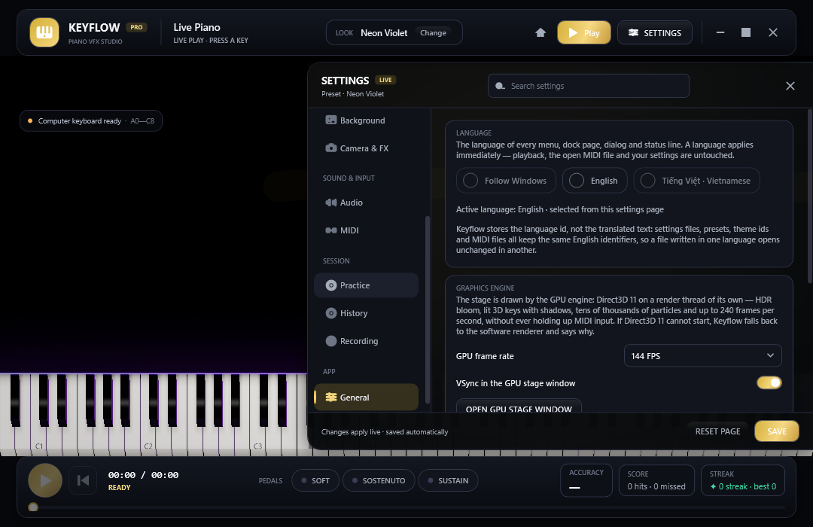

*The language picker, the GRAPHICS ENGINE card (GPU frame rate, VSync and the button that opens the GPU stage
window) and the preset name `Neon Violet` are all in one language here; pick **Tiếng Việt** and every label in
the frame is repainted without a restart. The SETTINGS PROFILE card (export / import) sits just below the picture.*

Three principles:

- **Ids never change, only captions do.** Values in `visual-settings.json`, preset names, theme ids, Windows device names and file names stay English — switching to Vietnamese cannot break a preset or a saved file, and a preset taken to an English machine still reads correctly.
- **A missing translation prints English**, never a blank box. Unknown keys (device names, file names you typed) go to the screen verbatim.
- **Adding a language = adding one table file.** Copy `Localization/Strings.English.cs`, translate the values, add one line to `Languages.All`; the renderer, the XAML and `visual-settings.json` need no changes. `tools/check_sources.py` and `--verify` then prove the new table covers every key of the inventory.

Architecture, translation conventions and the new-language checklist: [`docs/LOCALIZATION.md`](docs/LOCALIZATION.md).

## Interface map

The settings dock has **13 pages arranged in four purpose-driven groups** — the only layout that the
code, the XAML and the verification suite all read from the same place (see `Ui/SettingsPages.cs`):

| Group | Page | Contents |
| --- | --- | --- |
| **STAGE DESIGN** | Style | Built-in/user presets + 13 quick switches for every stage layer (the › button beside a layer jumps to that layer's detail card) + a **GO TO** card (NOTE EFFECTS › / AMBIENT LAYERS › / GRAPHICS ENGINE ›) + the **share code** (COPY CODE / APPLY CODE): the whole look as one line of text you can paste into a chat. A user preset keeps a **192×112 preview of the stage itself**, so an exported or imported preset shows the same look on the other machine; older presets, and presets without a picture, are drawn from their settings. The **community shelf** (the `presets/` folder in the repository, embedded into the build) shares the list with a COMMUNITY badge: it applies like any other look but cannot be deleted or saved over. |
| | Theme | Three concert interfaces, motion level, backdrop density; a **USER THEMES** card (Create / Edit / Delete theme — themes you make from five colours) and a **QUICK LOOKS** card with three buttons: Concert Grand / Concert Gold / Moonlight. |
| | Notes | Colour (gradient/hand/track/rainbow), shape, glow, fall direction and speed, hold FX, smart modulators. |
| | Particles | Spark emitter + physics, plasma wisps, flames, rings, impact waves/flashes, falling trails + ghosts, release effects. |
| | Keyboard | Keyboard style, key labels, red felt, lighting and the **RAY-TRACED SHADING** group. |
| | Background | Colour/image/green screen, atmosphere, guide lanes, halo, 4 ambient layers. |
| | Camera & FX | Parallax, zoom, framing, saturation, contrast, bloom, **camera overlay** (live camera or a clip + green key). |
| **SOUND & INPUT** | Audio | Load a SoundFont, pick the instrument preset, hall reverb. |
| | MIDI | Input/output devices, track list (solo/mute/colour), metronome. |
| **SESSION** | Practice | Practice modes, tempo, A–B loop, and the **auto practice tempo**: a run of misses past the threshold steps the song down five percent at a time, four correct notes in a row give two percent back and never past one hundred. |
| | History | **Practice history**: every run of the open song (when, accuracy, hits/missed, longest streak), the best take of that song, **EXPORT HTML** for the report and **CLEAR HISTORY** to wipe it. |
| | Recording | The **OUTPUT** card (applied when the next recording starts): **Format** (AVI / 32-bit alpha PNG sequence / MP4 H.264 + AAC), **Resolution** (match window / 720p / 1080p), **Frame rate** (15–60), **Record audio** and **Transparent background** (shown for the PNG sequence only). |
| **APP** | General | **Interface language** (English / Tiếng Việt / follow Windows) with a line naming the language that is running; **GRAPHICS ENGINE**: GPU frame rate (60 / 120 / 144 / 240 FPS / Unlimited), VSync in the GPU stage window, the **OPEN GPU STAGE WINDOW** button and an engine status line (the adapter and shader compile time, or the reason the software renderer is drawing); **SETTINGS PROFILE**: **EXPORT / IMPORT PROFILE…**. |

The rest of the interface:

| Area | Contents |
| --- | --- |
| Sheet layer | **Sheet music** (LAYERS card, off by default) draws a grand staff above the piano roll and follows the playhead: every note sits on the staff its **hand split** puts it on, the clefs are 𝄞/𝄢 (or the letters G/F when the installed font has no glyph), the **key signature is inferred from the song itself** (a Krumhansl–Kessler correlation over how long each pitch class sounds; a song that fits no key is written in C major), so the notes are spelled the way that key spells them — F major writes B♭ on the B line rather than A♯ on the A line — and a sign is drawn only where its bar really needs one: a note the signature already alters stays bare, a sharp or a flat holds to the end of its own staff's bar, and a natural takes it back, notes outside the staff get ledger lines, bar lines follow the song's own beat grid (downbeats heavier), a ring marks whatever is sounding and played or missed notes change colour. Short notes are **beamed by beat** the way an engraving beams them: the beat's length comes from the song's own grid, a note short enough grows a **flag** (one, two or three), two neighbours inside the same beat and hand **share a stem** with a beam over it, anything written between them breaks the run, and a hollow note — a half note or longer — never joins one however fast the song looks. Each hand is a voice, so **wherever one hand is silent a rest is written on that hand's own staff**, in the shape that lasts as long as the silence does (counted in beats of the song's grid: sixteenth, eighth, quarter, half, whole), and a silence that carries on across the other hand's notes is written as **one** rest rather than one per note. The sheet's whole working-out — accidentals, beams and rests (`SheetLayer.Plan`) — is **kept between frames** and only built again when the song, its grid, the hand split or the key changes, so drawing sixty frames a second does not redo it. A note **carried across a bar line** — the same pitch starting exactly where the previous one stopped — is written with a **tie**: a curve joining the two heads, drawn away from the stems, and the tied note is **never signed again**, because the accidental travels with the tie and everything after it in the new bar is written as if the sign had been put there. A **chord is one column of heads**: the notes written at one moment in one hand are a single event, with one head per pitch but **one stem for the whole column** (running from the far head through the middle, with the shortest note's flags), and a beam walks through chords as if they were single notes. `SheetLayer.Chords`/`Streams` also read the song as **two streams**, one per hand, each event a group of notes in pitch order, kept in the plan — the groundwork for marking hands on the roll. **Where the line changes hands** it is written out: a note of one hand stopping exactly where a note of the other starts — within the air a tie tolerates — is **one line handed over**, so the two heads are joined by **a curve across the gap between the staves** (`SheetLayer.Slurs`/`Slur`), bowing the way the line travels so it hugs that gap instead of cutting through either staff. Two notes an octave or more apart are a bass line and a tune rather than a hand-off, and **a chord does not change hands**: a block of notes is a new chord, not a line carrying on. It is still a note reader rather than a full engraving: no layered rests. |
| Library of a folder | The Play dialog has a **LIBRARY** section: **CHOOSE FOLDER** indexes a folder (each MIDI/MusicXML file is read by the app's own reader for its notes, tracks, length and tempo), **RESCAN** reads it again (only the files that changed), a search box filters by title, file name or tag, and every row opens the song, states its facts and carries its **tags** (`+ TAG…` to add, click a tag to remove). The folder is **watched**, so adding, editing or deleting a file updates the list; the index and its tags live in `library-index.json`, and a damaged file reads as an empty library instead of failing. |
| Audio track | The Recording page carries **Record audio**: a take also leaves a 16-bit stereo WAV next to the video (`take.wav`, or `audio.wav` in the PNG frame folder) written from the very blocks the engine renders — the tap exists only while recording, so ordinary playing pays nothing for it — and the line under the button tells the truth about this machine (**SoundFont loaded** → the take will have a WAV; **none** → the recording will have no audio). With **MP4** the same samples go straight into the file as AAC, so there is nothing left to mux; an AVI still gets the `ffmpeg -i video.avi -i take.wav -c:v copy -c:a aac take.mp4` line in the dialog. |
| Ghost & chart | The History page carries **PRACTICE CHART** (one bar per day over the last fourteen days, as tall as that day's accuracy, days without practice still on the axis, the line below naming the runs and the window's average) and **GHOST OF THIS SONG** (every dot is a graded note of a take: across by its place in the song, up by its pitch, cyan landed and red was missed; the best take and the latest one share their axes so they can be read against each other; a song never played prints why instead of an empty box). |
| Header | Logo + brand, the open score, the **LOOK** chip (current preset + a Change button), HOME, **Play** (opens songs, Live Play and quick setup), SETTINGS, minimise/full screen/exit. |
| Stage | Notes, effects, keyboard, device badges, the REC button, the MENU button. |
| Footer | Play/Pause, back to start, time + sounding note, three pedals, ACCURACY / SCORE / STREAK, the seek bar + progress. |
| Settings dock | A **four-group** navigation column + a search box that filters every page (jumping to the first page with a hit; matching English *and* translated words, so `speed` and `tốc độ` find the same slider), each parameter with a slider + number box (units, decimal commas, note names such as `C4` are accepted) + a reset button, dependent rows that hide/show themselves, SAVE / RESET PAGE, and auto-save after 0.65 s. |

## Current limitations

- The default SoundFont is FreePats' YDP Grand Piano, built from a Yamaha Disklavier Pro multisample. See `Assets/ATTRIBUTION.txt` for the authors, source and CC BY 3.0 licence. The SF2 file is about 113 MiB.
- The built-in audio engine reads uncompressed SoundFont 2 (`.sf2`). `.sf3` is not supported; some advanced SF2 parts such as modulators, instrument filters and the reverb/chorus effects are not fully reproduced. The sound can therefore differ from dedicated SoundFont synthesizers, depending on the file.
- The hand split point defaults to C4 = MIDI 60 (Notes → Hand split point) and is shared by the per-hand colours and the one-hand practice modes. With **Infer hand split from the song** on, opening a MIDI file picks the split from how its notes are spread over the keyboard (two clusters weighted by sounding time, accepted only when at least five empty semitones separate the hands and each carries ten percent of the sounding time, then settled at middle C inside the gap) and **remembers it for that song**, so reopening never changes it; a one-hand song keeps the split you chose.
- MIDI **formats 0/1/2 and both time divisions, PPQ and SMPTE, read**; what the import side still lacks is advanced MusicXML (slurs, repeats, voices joined into beats) — plain MusicXML reads, `.mxl` included, the hand split comes from the staves, and a **staff layer is drawn on the stage** — switch **Sheet music** on in the LAYERS card; that staff places notes by pitch, infers the song's key signature, beams its short notes by beat, rests the hand that is silent, ties notes carried across a bar line, joins a chord into one column of heads and draws the curve of a line changing hands; the **practice history** records each run (when, accuracy, hits/missed, longest streak) **together with every graded note** (its place in the song, its pitch, whether it landed, capped at 256 notes per run), so the History page draws a **fourteen-day chart** and the **ghost of the open song** — best take above, latest below, cyan for a hit and red for a miss — and the exported HTML carries the day table as well. The **song library** now has two halves: the **RECENT** list (`library.json`, the twelve newest songs with their metadata) and a **library of a folder** — pick a folder and every MIDI file and MusicXML score under it (three levels deep, 500 files) is indexed with its notes, tracks, length and tempo, with a search box (matching file names, titles and **tags**) and a **folder watcher** that keeps the list current when you add or edit a file; the index lives in `library-index.json` and only re-reads the files that changed.
- A physical MIDI input needs an instrument/device that Windows recognises. Without one, use the computer keyboard or the on-screen piano.
- The Windows-only build uses WinMM.
- **MP4 (H.264 + AAC)** is written directly and carries its audio, but it needs Windows' own encoders: a machine with no H.264 encoder cannot write this format at all, and one without an AAC encoder records the picture only (the dialog says which). An AVI still carries the **picture** with its audio in a WAV beside it to mux with ffmpeg, and a machine without an MJPEG codec writes uncompressed RGB, so that file grows faster. There is no direct **WebM/VP9** writer yet — the **32-bit PNG sequence with alpha** is there for post-production, and its `sequence.json` carries the ffmpeg line that builds alpha WebM from it.
- A **camera overlay** is built in (page **Camera & FX** → **Camera overlay**): a live camera or a looping video file drawn over the stage in any corner, with mirroring, opacity and a green key. **Hand tracking** (page **Camera & FX** → **HAND TRACKING**) is classic computer vision, not a machine-learning model: with two hands in view, or a backdrop close to skin colour, only the biggest hand is followed, and the finger count is only trustworthy when the hand is large enough in the frame. For the Piano VFX look that cuts the player out of the background, film against a green screen and key it with the camera overlay, or use the **Green Screen** preset and composite in OBS. A 3D perspective camera is not supported; the stage is a flat piano roll with slight parallax.
- The default stage is the Direct3D 11 GPU engine (HLSL shaders, keyboard shading on every frame), so the shading cost sits on the GPU. The **software renderer** (a multithreaded CPU shader, one run with `--software`) is only the fallback for when Direct3D cannot start and the path that draws transparent PNG takes: there the first bake at the Cinematic level can cost a few dozen milliseconds on a slow machine; Fast/Off and the bake cache exist to reduce that. A machine with no compatible GPU uses WARP, Windows' software rasterizer: the same shaders, just slower than a real card.
- On the GPU stage the sheet music, the hand marker, the camera picture, the watermark and the key counter / FPS HUD are still WPF vector layers drawn over the GPU frame. There is no particle compute shader, depth of field, velocity-buffer motion blur or camera keyframing yet (see `docs/ROADMAP.md`).

## Rendering the interface pictures again

The pictures in the README (and in `docs/previews/en/`) are rendered by the application, not staged.

**Automatic:** on every push to `main` or a working branch (`arena/**`), the `build.yml` workflow
builds the app and then re-renders **two sets of pictures** — every subject in the workflow's `$shots` list, once per language — with the very `PianoPath.exe` that just passed
`--verify`. Each set pins its own `--lang` — `docs/previews/en/` for this edition, `docs/previews/vi/` for
`README.md` — so the captions always match the language of the README that shows them whatever the runner's
display language is, and every picture gets a settings folder of its own, so it is always a pristine first
run. The subjects are: the live stage, the GPU stage, two GPU presets (Galaxy Voyage and Electric Storm),
the background image, the startup menu, the Style dock, the Theme dock, the Play dialog, the shortcuts card
and the General page. A separate step of the same workflow renders the **preset gallery**
`docs/previews/presets.jpg` (every built-in preset drawn twice, software | GPU, in one JPEG shared by both
READMEs). Finally the workflow **commits them straight into the branch**
(`Refresh the README previews from CI [skip ci]`), so after a UI change there is nothing else to do: the
README pictures match that commit. If the branch only accepts pull requests (a repository rule the
workflow's own token cannot bypass) the push is declined; the step then only warns (`Previews not committed`)
instead of turning the build red, and the new pictures are in the `keyflow-previews` artifact of that very
run — download them and commit them by hand. The artifact holds both PNG sets and the `presets.jpg` gallery:
```powershell
gh run list --workflow build.yml --limit 5          # find the newest run
gh run download <run-id> -n keyflow-previews -D docs/previews
```

**Manual — render locally:** run the `--snapshot` commands in
[Command line switches](#command-line-switches). Captures freeze the interface animations so the
result is deterministic across machines.

To make the README show one more subject, add a line to `$shots` in `build.yml`, then point the README at
`docs/previews/en/<name>.png` (and `docs/previews/vi/<name>.png` for the Vietnamese edition).
`tools/check_sources.py` lets a README run one commit ahead of a picture, because the commit that renders it
catches up, but it fails when the README points at an image that does not exist and is not named in `$shots`
either, so pictures and documentation cannot drift apart silently.

The screenshots are rendered **deterministically**: two renders of the same code must agree byte for byte, or the drift check cannot tell "the interface changed" from "the machine was a little slower". The GPU stage in each picture is built **synchronously** (a fresh simulation, exactly 480 steps of 1/60 s, drawn by `GpuRenderLoop.RenderParked` on the warm device of the parked render thread, with `RenderOnce` as the fallback) instead of taking the frame of the free-running render thread, because that frame depends on the simulation's clock even when the scene is still: the last pass mixes in dither noise that follows it. The real render thread is parked before anything is pressed, the menu backdrop obeys the chrome lock, and every animator is put back at frame zero. `--verify` holds the property (`VerifyDeterministicPreview` for the WPF stage, `VerifyDeterministicGpuFrame` for the GPU frame), the build renders three pictures a second time and warns if they differ, and every picture leaves a `sha=…` line in the `Preview capture (en)` / `(vi)` annotation. The full story, three failed fixes included, is in `docs/REPO-AUDIT.md` §6.13.

## Packaging and shipping the .exe

A build inside `bin\` only runs on a machine with the .NET SDK installed and consists of many files.
To send it to somebody — or to publish a release — **publish** it. There are two kinds:

| Kind | Quick command | Size | What the target machine needs | When to use it |
| --- | --- | --- | --- | --- |
| **Self-contained** (recommended) | `.\publish.ps1` | `PianoPath.exe` ~150–190 MB + 113 MiB SoundFont | Nothing | Public releases, machines that may not have .NET |
| **Framework-dependent** | `.\publish.ps1 -Mode FrameworkDependent` | `PianoPath.exe` ~1–2 MB + 113 MiB SoundFont | [.NET 10 Desktop Runtime (x64)](https://dotnet.microsoft.com/download/dotnet/10.0) | Internal use, many machines already have .NET, smaller package |

Both kinds produce **a single `.exe`** (`PublishSingleFile`) next to an `Assets\` folder holding the
SoundFont and the attribution file. WPF supports neither trimming nor Native AOT, so those options are
not used.

### Option 1 · the `publish.ps1` script (one command)

```powershell
cd PianoPath
Set-ExecutionPolicy -Scope Process Bypass      # for the current PowerShell session only, if scripts are blocked
.\publish.ps1                                  # self-contained, win-x64 → .\publish\win-x64\PianoPath.exe
.\publish.ps1 -Zip                             # also writes .\publish\Keyflow-<version>-win-x64.zip to send around
.\publish.ps1 -Mode FrameworkDependent -Zip    # smaller build → .\publish\win-x64-fd\ and ...-win-x64-fd.zip
.\publish.ps1 -Runtime win-arm64               # Windows on ARM (Surface Pro X, Snapdragon X)
.\publish.ps1 -Clean                           # delete bin/, obj/ and the target folder before publishing
```

The script checks the SDK version, **refuses to publish while `Assets\ConcertGrand.sf2` is still an LFS
pointer** (so a silent piano is never shipped; pass `-AllowLfsPointer` to do it on purpose), runs
`dotnet publish` with the parameters below and prints the resulting paths and sizes.

### Option 2 · the `dotnet publish` command by hand

```powershell
# Self-contained, single .exe, no .NET needed on the target machine
dotnet publish .\PianoPath.csproj -c Release -r win-x64 --self-contained true `
  -p:PublishSingleFile=true -p:IncludeNativeLibrariesForSelfExtract=true `
  -p:PublishReadyToRun=true -p:DebugType=None -p:SatelliteResourceLanguages=en `
  -o .\publish\win-x64

# Framework-dependent, small single .exe, target machine needs the .NET 10 Desktop Runtime
dotnet publish .\PianoPath.csproj -c Release -r win-x64 --self-contained false `
  -p:PublishSingleFile=true -p:IncludeNativeLibrariesForSelfExtract=true `
  -p:DebugType=None -p:SatelliteResourceLanguages=en `
  -o .\publish\win-x64-fd
```

What the parameters mean: `-r win-x64` picks the architecture (use `win-arm64` for ARM);
`PublishSingleFile` packs every DLL into one `.exe`; `IncludeNativeLibrariesForSelfExtract` packs the
native WPF DLLs too (required for single-file WPF; they are extracted to `%TEMP%\.net\PianoPath\` on
first launch); `PublishReadyToRun` pre-compiles for a faster start; `DebugType=None` drops the `.pdb`;
`SatelliteResourceLanguages=en` drops the WPF language folders.

### Option 3 · Visual Studio 2026

1. Right-click the **PianoPath → Publish…** project.
2. Pick the existing **win-x64-self-contained** or **win-x64-framework-dependent** profile (in `Properties\PublishProfiles\`) and press **Publish**.
3. The result lands in `publish\win-x64\` or `publish\win-x64-fd\` inside the project folder. The profiles already enable single-file and ReadyToRun and disable trimming; change them under **Show all settings**.

### Result and how to distribute it

```
publish\win-x64\
├── PianoPath.exe              ← the single executable
└── Assets\
    ├── ConcertGrand.sf2       ← SoundFont, must always stay next to the .exe in the Assets folder
    └── ATTRIBUTION.txt        ← credits FreePats (CC BY 3.0); keep it when redistributing
```

- **Sending a ZIP**: compress the whole folder (`.\publish.ps1 -Zip` or `Compress-Archive -Path .\publish\win-x64\* -DestinationPath Keyflow-win-x64.zip`). The recipient unzips it and runs `PianoPath.exe`; never separate the `.exe` from the `Assets\` folder.
- **The `.exe` installer (optional)**: install [Inno Setup 6.3+](https://jrsoftware.org/isinfo.php), publish the self-contained build and run `iscc .\installer\Keyflow.iss` (or open the file in the Inno Setup Compiler and press F9). The result is `installer\Output\Keyflow-Setup-<version>.exe`, which creates Start Menu/Desktop shortcuts and an uninstall entry. Override the version with `iscc /DAppVersion=0.4.0 .\installer\Keyflow.iss`. The installer ships English and Vietnamese wizard text: it picks the language from Windows, and the Vietnamese wording is a *partial* file (`installer\Languages\Vietnamese.isl`) that overrides the messages this wizard actually shows while the rest falls back to `Default.isl`. Run `pwsh tools/build_installer.ps1` instead of calling `iscc` by hand when you want CI to check the translation — add `-Stub` if you have not published yet; the script fails the moment ISCC warns about anything but the expected "this message stays English" notice of a partial translation.
- **Version number**: edit `<Version>` in `PianoPath.csproj` before publishing; the script and the installer read that value.
- **SmartScreen**: the file is not code-signed, so Windows shows "Windows protected your PC" on first launch; choose *More info → Run anyway*. Removing the warning needs a code-signing certificate, for example: `signtool sign /fd SHA256 /tr http://timestamp.digicert.com /td SHA256 /a .\publish\win-x64\PianoPath.exe`.
- **Antivirus** sometimes scans a single-file self-contained build slowly on first launch; that is normal for .NET packages that unpack themselves.

### Checking a published build

```powershell
$log = "$env:TEMP\keyflow-verification.log"
$p = Start-Process .\publish\win-x64\PianoPath.exe -ArgumentList "--verify","--verify-log=$log" -PassThru -Wait
Get-Content $log; "Exit code: $($p.ExitCode)"      # 0 = passed
Start-Process .\publish\win-x64\PianoPath.exe       # then just run it
```

Try it on a clean machine (or a virtual machine) without .NET to be sure the self-contained build runs
and the framework-dependent one reports the runtime it needs.

### Automatic releases on GitHub

Two workflows live in `.github/workflows/`:

| Workflow | Trigger | Contents |
| --- | --- | --- |
| `build.yml` | push to `main`/`arena/**`, every pull request | **job `static` on `ubuntu-latest`** runs the static checks (`tools/check_sources.py`, ~10 s) → **job `test` on `ubuntu-latest`** (the `tests/PianoPath.Tests` xUnit project, running **beside** the Windows branch) and **job `build` on `windows-latest`** (scheduled only once `static` is green): Release build → `--verify` (**a FAIL turns the build red**) → **compile the installer** against a stub `publish\win-x64` (any unexpected ISCC warning turns the build red) → render the 22 README images (11 subjects × 2 languages) and the preset gallery `presets.jpg`, upload the `keyflow-previews` artifact (both PNG sets and `presets.jpg`), **report preview drift** (`Report preview drift`: the two render steps have just overwritten `docs/previews` with this build's own pictures, so `git status` on that folder is the comparison itself — any file that differs is named in a warning, including on pull requests where the commit step is skipped) and commit the new pictures into the branch being built (skipped for pull requests; on a branch that only takes pull requests it just warns and the pictures stay in the artifact). |
| `release.yml` | tag `v*` or **Run workflow** | Checkout with LFS, publish both kinds, smoke-test the published build, compile the `.exe` installer from that same publish folder, upload both ZIPs plus the installer as artifacts and (for a tag) attach them to the GitHub Release with generated notes. |

```powershell
git tag v0.4.0
git push origin v0.4.0
```

Every `release.yml` run downloads ~113 MiB from Git LFS and counts against the account's LFS bandwidth,
so only run it when releasing. `build.yml` does not download LFS at all (the checks that need the
SoundFont report `SKIP` by themselves).

### Common publishing problems

| Symptom | Cause / fix |
| --- | --- |
| `publish.ps1` reports the SoundFont is only a few hundred bytes | LFS was not fetched: `git lfs install` then `git lfs pull`. |
| `NETSDK1045: The current .NET SDK does not support targeting .NET 10.0` | Install the .NET 10 SDK, or an older SDK is being preferred by `global.json`; check `dotnet --list-sdks`. |
| The target machine says "To run this application, you must install .NET Desktop Runtime" | It is the framework-dependent build; install the .NET 10 Desktop Runtime x64 or use the self-contained build. |
| The app opens but stays silent and the Audio page cannot load a SoundFont | The `Assets\` folder is not next to the `.exe`, or the file is an LFS pointer. |
| The Audio page shows `NO AUDIO DEVICE` although the SoundFont loaded | Windows could not open the output device (`waveOut error 2`): no sound card, or another application holds it in exclusive mode. Everything else works, it just does not make a sound. |
| `PublishTrimmed`/`PublishAot` errors, or the app crashes at start | WPF supports neither; drop both options. |
| Publishing `win-x86` fails with a runtime-pack error | Only `win-x64` and `win-arm64` are used; 32-bit builds are not tested. |

## Testing

The integrated verification suite lives in `Diagnostics/VerificationSuite.cs` and runs inside the
application itself (it needs Windows, because it starts real WPF windows):

```powershell
dotnet run --project .\PianoPath.csproj -- --verify
# optional: --verify-log=C:\some\path\result.log (defaults to %TEMP%\keyflow-verification.log)
```

The log is written **as the run goes**, so a process that is taken down inside a native call still leaves the
line naming what it was doing. The suite writes a real MP4 take too, and it has a **child process** do that
writing (see `--encode-take`): a media stack that dies — or never comes back — inside its encoders then
costs the run a SKIP line instead of its verdict. That line names the step the machine stopped at, a
working encoder takes well under a second for a take this small, and a child still inside one after a
minute is let go of. The same child asks that media stack, before the first frame, whether it will hold the
take's H.264 stream at all, so a machine with no encoder is named in one sentence instead of waited out;
and only when a run produces no take does a **second** child write three uncompressed pictures into an AVI
(`--encode-probe`) — a file that needs no encoder anywhere — to say whether the machine and the app's
buffers can write at all. That probe gets twenty seconds and runs after the take: a diagnostic may not
stand in front of the thing it exists to explain.

Exit code `0` means passed, `1` means a failure; the log lists every PASS/FAIL item. The suite creates
a small MIDI file, SoundFont SF2 and AVI in a temporary folder; it checks the MIDI parser (multiple
tracks, tempo map, beat grid, track names, drum channel skipped, **the beats of a bar grouped by its signature
(`Meter.Of`): a simple meter beats on the written beat-type (4/4 four quarters, 3/4 three, 2/2 two halves,
3/8 three eighths) while a compound one — six, nine or twelve — is felt in threes (6/8 two dotted quarters,
9/8 three, 12/8 four, 6/4 two dotted halves, 7/8 still seven), the grid of a 6/8 file falling on the dotted
quarter with `BeatsPerBar` counting the felt beats so the bar lines still land once a bar**, **format 2 patterns played end to
end over one running beat grid**, **an SMPTE division read as absolute time with the beat grid
following the tempo map**, an unknown format and an unusable division refused, broken files), preset/zone/sample
decoding and SF2 generator semantics (instrument overrides, preset accumulation), looping through the
release stage, polyphony limits, audio signal and Note Off, sustain/sostenuto/soft, saving and
clamping effect settings, built-in and user presets (save, import, export, delete, broken file), **the
dock catalogue: 13 pages in 4 groups matching between the catalogue, the XAML and the group
captions**, **live language switching on an open window (`VerifyLanguageSwitching`): the two tables
must hold the same keys, translated labels must repaint when the language changes, and the dock search
must find a row by its Vietnamese caption**, **old theme ids (`sakura`/`noir`/`velvet`) migrating to
the canonical id when a saved file is loaded**, theme chips, the petal layer, impact wave/flash,
falling/hold/release FX, the 4 ambient layers, the smart modulators, the 7 theme combinations, per
hand/track colour modes, dependent rows, search, applying presets, **the F1 shortcuts card opening and
closing**, **MusicXML import (`VerifyMusicXmlImport`): divisions and tempo become seconds, **a 6/8 measure beating twice on dotted quarters at its own tempo without moving a note**,
chord members share an onset, backup and forward move the cursor, a tempo change moves everything after it, part names and simultaneous parts, the hand split read from `<staff>` (57 between G3 and C4) and from the part a note sits in, no split invented for overlapping or one-handed scores, `.mxl` read through `META-INF/container.xml` (and without a container), a score loaded from disk through the same entry point the app uses, and refusals for non-XML text, a foreign root, a time-wise score and a note-less file**, **the sheet layer (`VerifySheetLayer`): written pitch in scientific notation with black keys on the line of the letter below them (C4 = step 28, B4 = 35, F#4 = 31), the hand split choosing the staff (middle C one ledger line below the treble staff, G2 on the bottom line of the bass one), a higher key never written lower and a semitone moving at most one step, ledger lines only where a note leaves the staff, long notes hollow without stems and short ones stemmed away from the middle of the staff, the playhead a quarter of the window in, the clef chosen by the installed font, note colours for sounding, played and missed notes, **the key of the song (`MusicKey.Infer`) from how long each pitch class sounds (a D major scale gives two sharps, F then C; F major one flat, B; E♭ major three, B–E–A; a minor scale takes the signature of the major key three semitones above its tonic; an empty or chromatic one keeps C major), where a signature's letters sit (F♯ on the top line of the treble staff, C♯ in its third space, the bass staff repeating them two steps lower), spelling that follows the key (F major writes B♭ on the B line while C major writes A♯ on the A line), the signs a bar really needs (a note the signature alters stays bare, a sign holds to the end of its bar, a natural takes it back, the two staves keeping separate bars, a note before the first downbeat belonging to open time), the key worked out **once per song** rather than once per frame, **beams and flags (`Beams`/`Flags`/`BeatSeconds`): the beat is the middle gap of the song's own grid (with a half-second stand-in when the grid has none), a quarter note carries no flag while an eighth, a sixteenth and anything shorter carry one, two and three, two flagged neighbours in the same beat and hand share one beam whose stems lean with the first note and whose lines follow the shortest note, four eighths over two beats make two runs rather than one, and what breaks a run: a quarter note written between them, a note of the other hand, a note in the next beat, a chord written at one moment, a half note in a slow song; and a rendered band where the beam really carries more ink than two separate flags**, **rests (`Rests`/`Rest`): each hand is a voice, so where one is silent the other's staff carries a rest — a melody rests the left hand for as long as it plays, two hands taking turns rest each on its own staff, a chord the hand then stops playing pushes the rest to after the chord, one silence that runs across the other hand's notes stays one rest, and nothing played writes no rests; the shape is counted in beats (sixteenth, eighth, quarter, half, whole, anything longer still a whole rest, a live take a quarter rest) and written with the musical glyph when the font has it and the shape's initial when it does not; `Plan` gathers the accidentals, beams and rests into one working-out, **kept between frames** and rebuilt only when the song, its grid, the hand split or the key changes; and a drawing with the rests taken out of its plan carries less ink by exactly the rest**, **ties (`Ties`/`TieUnder`): a note starting exactly where the same pitch left off becomes a tie (a gap, an overlap, a different pitch, the other hand or another note in between all mean a new note), three notes in a row make two ties, a chord carried on is tied pitch by pitch; the tied note is written unsigned and its accidental is remembered for the rest of the new bar (an F♮ tied across keeps the F♯ after it needing its sharp); the curve leans away from the stems, and a rendered pair carries the curve's ink and loses exactly that ink when the ties are taken out of its plan**, **chords (`Chords`/`Streams`): three notes written at once in one hand are one group with the melody note after them its own, two hands are never one group, single notes are groups of one, a hand's stream is one event per written moment with its notes in pitch order (two hands playing together stay two streams), a beam walks through a chord (a chord of eighths with an eighth after it is one run, two chords in a beat share one beam, a chord on its own is never a beam across itself), and a rendered column of three heads costs one stem — handing the plan the same notes as three separate groups makes it carry more ink**, and a rendered band showing the signature putting ink between the clef and the music**, and the stage itself drawing the staves from its own notes and beat grid through the dock toggle**, **the camera overlay (`VerifyCameraOverlay` + `VerifyCameraOverlayDock`): the rectangle for all four corners (right aspect, never taller than 80% of the stage, an unknown corner falling back to the bottom left, a zero-sized stage giving an empty rectangle rather than a negative one), bottom-up and mirrored frames, every pixel leaving `CopyFrame` opaque, the green key by tolerance (0 off, 100 widest, grey/white/blue surviving because green has to dominate), the opacity factor, the cameras the machine reports, the answer for a video file that is not there, and **a frame read back from the AVI clip the app itself just recorded**; on the dock side: the switch, two pickers and three sliders present, a picked corner stored as the English id, out-of-range values clamped, the frame drawn through `PumpCameraFrame` (red in, red out; green in, see-through out) and **the stage painting it inside the rectangle of the chosen corner, read back from the rendered stage****, **the PNG sequence with alpha (`VerifyPngSequenceRecorder`): every frame is an 8-bit RGBA PNG of the recording size with the alpha preserved (clear outside, opaque inside), a repeated frame is written as many times as it is repeated, the manifest names the pattern and the ffmpeg line, an impossible size, rate or frame size is refused, and a live capture really drops the background while keeping the piano**, **themes you made (`VerifyUserShellThemes`): five seed colours derive all twenty tokens with dark surfaces, an accent that stands out and the surface layers in the right order, a surface outside the readable band is clamped, a hand-edited file is repaired while a corrupt one is skipped, the id is a stable slug of the name, a theme saved in the settings folder **resolves through `ShellThemes.Find` and paints the live chrome**, both chip rows offer it, pointing the settings folder back removes it, and the studio refuses to save a nameless theme or a colour that is not hex**, **the community shelf (`VerifyCommunityPresets`): every file in `presets/` is a complete envelope preset — it names every setting of `PianoVisualSettings` and nothing else, its values are already final (loading it twice changes nothing), its name matches its file, shadows no built-in and no other shelf entry, a broken file or a repeated name is skipped instead of emptying the shelf, the list marks the entries COMMUNITY, applying one carries its theme along, and a shelf name is refused when saving over it**, **preset pictures (`VerifyPresetThumbnails`): the stage really renders at 192×112, a saved or exported preset carries the picture and reads it back, a file written before the envelope still loads as a preset without one, and a picture that is not a PNG of the right size is refused instead of breaking the list**, **look share codes (`VerifyPresetShareCodes` + `VerifyPresetSharing`): gzip + base64url text behind a version prefix, an exact round trip that **drops the sender's background image path** (a look that used an image falls back to its colour), a code a chat client wrapped still reads, and empty, foreign, other-version, oversized or damaged codes refused with the reason printed in the dock without touching the current settings**, **the recording's audio track (`VerifyRecordingAudioTrack`): the 44-byte WAV header byte for byte (PCM, two channels, 44.1 kHz), a block that ends inside a frame keeping the whole frame, silence and a block larger than the writer's buffer, the two sizes that are only known at the end patched on close, samples written little-endian in order, a file that cannot be opened and a closed writer that keeps receiving blocks, where the track lands for an AVI and for a PNG folder, and **the engine rendering exactly eight blocks into the writer** with no audio device present and stopping when the tap is removed**, **the library of a folder (`VerifySongFolderLibrary`): a scan that finds exactly the readable songs below the folder (broken files and non-songs left out, subfolders included), facts read from the files themselves, a second scan reusing the entries of unchanged files while re-reading an edited one and keeping its tags, RESCAN re-reading everything, tags trimmed, lower-cased, length-capped and limited to eight per song, search matching titles, file names and tags word by word, an index that reads back and a damaged one that is simply forgotten, the Play dialog printing the same list with its search box and tag chips, and a watcher that notices a song added to the folder**, **the practice ghost and the chart (`VerifyPracticeGhostAndChart`): a bar per day as tall as that day's accuracy with a floor so a day with one short take still shows, the fourteen-day window ending today, days without a run kept as zero rows and runs older than the window left out of the chart while the file keeps them, the window's average counting every graded note once, the ghost's pitch axis drawn from the notes of the take itself and at least an octave wide, every note placed where it was played and where it sits in pitch, the app collecting notes as it grades them and writing them with the run when the transport stops, the ghost forgotten when the score restarts, the cap of 256 notes per take, an exact read back, and a line written before the ghost existed still loading**, **the practice history (`VerifyPracticeHistory`): one JSON line per run in the run folder's
`history/practice.jsonl`, newest first and capped, a damaged line skipped, the best take per song, a
UTF-8 BOM HTML report with the runs and a per-song summary, and a real take recorded exactly once when
the transport stops**, **hand-split inference (`VerifyHandSplitInference` + `VerifyHandSplitInferenceOnSong`): clustering by sounding time with a middle-C tie-break, one-hand songs and stray short notes overlapping hands and gaps under five semitones leaving the chosen split alone, and the switch writing the inferred value through the dock slider into the song's remembered entry (`SplitInferred`), which is reused instead of measured again**, **the auto practice tempo (`VerifyPracticeTempo`): off by default, a run of misses past the
threshold steps the song down five percent at a time to a floor of fifty, four correct notes in a row
give two percent back up to one hundred, and a real missed key while the song plays reaches the same
curve**, **the song library (`VerifySongLibrary`): the index lives in the settings folder of the run,
keeps the newest twelve songs first (the Play dialog shows the first five rows), reopening a song
restores hand split, fall speed and tempo through the very sliders and rewrites exactly one row for it,
a damaged file reads as empty, and forgotten or vanished files are dropped**, **accessibility (`VerifyAccessibility`): every glyph-only control has a translatable
name, Tab stays inside the dock, and the high-contrast palette follows `SystemColors` — repainting as
soon as Windows reports the switch — without overwriting the chosen theme**, **the dock at the compact size (`VerifyDockAccessibility`): on all 13
pages at 1080×700 every row stays inside the scroll column and every control inside its own card,
and Tab walks a page in the order its rows are printed**, AVI frame recording, opening/closing a real MIDI input if one exists, decoding WinMM
`MIM_DATA` into a falling WPF note, MIDI output, chrome auto-hide/show with the mouse and Escape, note
length while a key is held, practice modes, loop, seek, tempo, WPF rendering and the stage running on
the shared frame clock. Only a physical MIDI key actually firing events must be confirmed with a real
instrument.

The shader suite has two parts of its own: `VerifyShaderPipeline` (no WPF layout needed) checks the
sRGB/ACES/GGX maths, deterministic jitter, **the bake cache signature** (an unrelated slider must not
cause a re-bake), that the baked background is opaque and really spreads light, that black-key columns
are darker than ivory columns, and that a sounding key's overlay tile covers exactly that key and then
fades; `VerifyShadedStage` toggles `ShadingQuality` in the dock and asserts that the real stage changes
between the vector keyboard and the shader keyboard while the bake is reused across frames.

The Direct3D 11 engine has a part of its own, `VerifyGpuStage` (`Diagnostics/VerificationSuite.Gpu.cs`), and it needs no real graphics card: the test frame is drawn on WARP, which every CI runner has. It checks: the **settings** (a fresh install defaults to `RenderBackend = Gpu`; an old file that names `Software` is moved to the GPU on load; an unknown engine name or frame rate falls back to the default; applying a preset keeps the engine, the FPS and VSync because they belong to the computer); the **look** (`GpuLook` carries the exact note colours, the keyboard proportion, the slider values of Note shimmer / Halo light pulses / Shooting stars / Landing glow and the Spotlights choice); the **thread bridge** (`GpuStageFeed` hands the render thread the running song, the held keys and a clock extrapolated by never more than 50 ms; hits and live notes queue without loss and a clear request is taken exactly once); the **embedded shaders** (all 12 HLSL entry points); **one real frame** of 640×360 drawn on WARP and read back for measuring (the keyboard must be lit along the bottom, stand out from the dark stage above it, and the picture must hold many colours rather than one flat fill); the **effect families** (the look carries the ambient, trail, key-label, flash, arc and petal settings; Galaxy, guide lanes and petals put hundreds of shapes behind the notes; the 1024×768 glyph atlas holds real ink; and the sky of the GPU frame brightens when the galaxy layer is on); and finally **recording** (`GpuRecordingTap`: the render loop alone, with no window and no preview, still hands over exact-size 320×180 frames with the keyboard in them).

### The frame budget gate (`--bench`)

A frame budget must not be a feeling, so the app measures it:

```powershell
.\bin\Release\net10.0-windows\PianoPath.exe --bench=240 --bench-out=$env:TEMP\keyflow-bench.json
(Get-Content $env:TEMP\keyflow-bench.json -Raw | ConvertFrom-Json).scenes | Select-Object scene, frames, particles, @{n='p95';e={$_.stats.p95Ms}}
```

`--bench` **opens no window**: it runs the stage's own `GpuRenderLoop` (the same loop, the same simulation, the same frame read-back into WPF) at 1920×1080, plays a song
through it, and writes **every frame's own length** into a JSON report. Two scenes are measured, each with its own budget (`Diagnostics/FrameBudget.cs`):

| Scene | Look | p95 budget |
| --- | --- | --- |
| `default` | the settings of a first run | 8 ms |
| `heavy` | the busiest built-in preset — *Galaxy Voyage*: galaxy, stars, shooting stars, rainbow trails, fireworks | 16 ms |

Those two numbers belong to the **GPU path**. The roadmap used to say "p95 < 8 ms in *Classic Roll*, < 16 ms in *Cinematic*" — two different kinds of thing (a preset and a
keyboard shading level) from the old WPF stage, so they were rewritten as **one look at one size**, keeping both numbers.

**Which machines the budgets bind.** Only a machine with a real graphics card: over budget, the exit code is `3`. A CI runner has no card, so the stage is drawn by **WARP** and
is *not* held to the absolute budgets — Windows even presents its software adapter as a "hardware" one, so the app reads the adapter **name** and not only the WARP flag
(`FrameBudget.IsSoftwareAdapter`), and a name it cannot read counts as software. There the number still means something **relatively**: CI keeps the previous run's report in the
Actions cache and compares this run's p95 with it on the same kind of machine; half again as slow prints `WARN perf:` with the exact difference. Every run's report is published as
the `keyflow-bench-report` artifact, and because it lives in the cache rather than in the repository, a measured number never becomes a commit.

Both the measurement and the comparison carry a layer of verification: `VerifyFrameBudget` in `--verify` checks the budget table, the percentile arithmetic, the adapter rule, the
JSON reading back, and **one real measurement** of 24 frames at 320×180 through the very path `--bench` takes; the pure half (percentiles, budgets, the relative comparison, the
JSON) lives in `tests/PianoPath.Tests`, so it runs on Linux, where there is no Direct3D.

### The test suite that runs on any machine (`tests/PianoPath.Tests`)

`--verify` needs Windows because it starts real WPF. The parts that do **not** need a window — the MIDI parser, the MusicXML parser, hand-split inference, the meter table, the WAV writer and the string table — now live in an xUnit project on plain `net10.0`, which runs on Linux/macOS and one test at a time:

```powershell
dotnet test tests/PianoPath.Tests --configuration Release
dotnet test tests/PianoPath.Tests --filter MeterTests        # one class
dotnet test tests/PianoPath.Tests --filter "FullyQualifiedName~Format2"   # one test
```

CI runs it in the **`test`** job on `ubuntu-latest`, **beside** the Windows job (both only wait for `static`), so a broken MIDI read goes red in about a minute instead of waiting for a Windows runner.

The project **links the source files** instead of referencing `PianoPath.csproj`, so every `internal` type of the app is usable without `InternalsVisibleTo` and no library has been split out yet. That imposes one rule: **every file listed under `<Compile Include>` in `tests/PianoPath.Tests/PianoPath.Tests.csproj` must compile without WPF, `System.Drawing`, Vortice or WinMM** — adding a file that drags WPF along turns the Linux job red, and that is the signal working, not a defect.

Making that possible took one seam: `Loc` was split into two `partial` halves — `Localization/Loc.cs` is the string table and the look-ups (pure computation), `Localization/Localizer.cs` is the half that writes live labels onto WPF elements. They meet through a **partial method**, so a build that does not link the WPF half has the call **removed by the compiler** instead of needing WindowsBase.

Not in this suite yet: SoundFont (its test `.sf2` builder is a block of helpers of its own, still in `VerifySoundFontEngine`), plus the settings JSON, the settings profile, the song library and the practice history — the last four all bottom out at `PianoVisualSettingsStore` → `ShellThemes`, whose `ShellTheme` record is declared in `System.Windows.Media.Color` (see `docs/ROADMAP.md` §4 item 2).

### Static checks (run anywhere, even without the .NET SDK)

```powershell
python tools/check_sources.py          # C# syntax, XML + XAML resources, dock catalogue, theme tokens, string tables, README links/images, installer translation
python tools/shader_preview.py 780 180 0.6   # Python port of the shader, writes pictures to tools/out/ (not committed)
pwsh tools/build_installer.ps1 -Stub   # compile installer\Keyflow.iss against a stub publish folder (needs Inno Setup)
```

`check_sources.py` verifies: bracket/quote balance of every C# file; XML validity and every
`StaticResource`/`DynamicResource` in the XAML; every `FindName`/`FindResource` and every XAML event
handler really exists in C#; **the page catalogue in `Ui/SettingsPages.cs` matches the tab strip in
`Ui/MainWindow.xaml` exactly — every caption, in order, with the right group label**; **every theme
token published by `ShellThemeManager` has a default in `App.xaml`**; **every image and internal link
in `README.md` and `README.en.md` exists, every table-of-contents anchor resolves and each edition links
to the other**, **every
command-line switch the app reads is documented in both README command-line tables and vice versa,
and every switch/path `build.yml` passes to `PianoPath.exe` really exists**, **the community shelf: every file in `presets/` names exactly the settings of
`PianoVisualSettings`, its file name matches `PresetName` and shadows no built-in, and the committed
file still equals what `tools/make_presets.py` writes**, **the sample picture in `docs/samples` still
matches the script that generates it**, **the installer: every message in
`installer\Languages\Vietnamese.isl` exists in Inno Setup's own `Default.isl` (in the right
`[Messages]`/`[CustomMessages]` section), keeps every placeholder, is stored with a UTF-8 BOM, and the
`[Languages]`/`[LangOptions]` declaration is the shape the compiler insists on**, and **the string
tables**: every language
translates exactly the keys of the inventory, placeholders and line breaks survive, and every literal
the sources can print (including marked XAML strings, page names, themes, presets and the shortcut
card) is a key of the inventory. CI runs this script before the Windows build.

The `--verify` log uses four prefixes: `PASS` (checked and passed), `FAIL` (a defect, exit code `1`),
`SKIP` (the environment cannot run that check) and `NOTE` (environment information). The suite skips
instead of failing when hardware is missing: if `Assets\ConcertGrand.sf2` is still an LFS pointer
(a clone without `git lfs pull`, or a CI checkout with `lfs: false`) the bundled-piano items are
`SKIP`ped and the app is verified in silent mode instead; if Windows cannot open an audio device
(`waveOut error 2`) or a MIDI output port, the engine still loads the SoundFont and runs silently, and
the result is a `NOTE`, not a `FAIL`.

## Technical documentation

| Document | Contents |
| --- | --- |
| [`README.md`](README.md) | The Vietnamese original of this document: the same pictures and the same command-line table, checked side by side by `tools/check_sources.py`, so neither edition can drift. |
| `docs/UI-SHADER-REVIEW.md` | Review of the interface and of the Unreal-style keyboard shading upgrade: shading model, camera, bake cache, how it verifies itself. |
| `docs/SETTINGS-WIRING-AUDIT.md` | The table matching **every** settings control with the code that consumes it — proof that no setting is "dead". |
| `docs/LOCALIZATION.md` | The localization architecture: keys are source text, one table file per language, live labels, Vietnamese conventions, adding a new language and the three verification layers. |
| `docs/ROADMAP.md` | Where the project goes next (P0→P3), estimated sizes and the things deliberately not done. |
| `docs/DOCK-NAVIGATION-AUDIT.md` | The review of how features are arranged: why the dock is grouped by purpose (three groups when it was written, four now — see the note at its top), the page catalogue as the single source of truth, the F1 card and the README picture pipeline, plus the checks that keep them aligned. |
| `docs/EFFECTS-REDESIGN.md` | The design of the effects system: the 87 effects arranged by the four phases of a note (falling, impact, hold, release), the ambient layers, the modulators and the combo themes, plus a phase-by-phase roadmap — finish each step completely before starting the next; the table in code lives in `Stage/Effects/EffectCatalog.cs`. |
| `docs/REPO-AUDIT.md` | The results of the whole-repository audit (2026‑09): the three-layer method (static checks, `--verify`, CI pictures), what was fixed with its proof, and the limits that remain. |

## Repository layout

- `App.xaml`: default theme and every control template (button, switch, slider, combo, textbox, scrollbar, navigation tab, preset list) — all colours read through `DynamicResource`, so a theme swap is instant. `App.xaml.cs`: startup and every command-line switch (`--verify`, `--snapshot`, `--show-settings`, `--play-dialog`, `--shortcuts`, `--lang`, `--background-image`, `--gpu` / `--software`, `--preset` / `--play-chord`, `--settings-dir`, `--encode-probe` / `--encode-take`, `--bench` — see [Command line switches](#command-line-switches)).
- `Ui/`: `MainWindow.xaml` (header / stage + dock / transport footer / concert menu / Play dialog / shortcuts card), `MainWindow.xaml.cs` (playback, scoring, MIDI, chrome hiding and video recording), `MainWindow.Settings.cs` (generated settings pages, search, presets, track list), `MainWindow.Menu.cs` (main menu + Play dialog + theme chips), `MainWindow.Shortcuts.cs` (the F1 card), `SettingsPages.cs` (**the 13-page / 4-group catalogue**, attached property printing the group label), `MainWindow.Language.cs` (live language switching, rebuilding the surfaces whose text is composed), `DeviceOption.cs` (device id separated from the translated caption), `FrameClock.cs` (the shared vsync frame clock), `ChromeMotion.cs` (shared easing/entrance), `ColorPickerWindow.cs`, `TextPromptWindow.cs`, `MainWindow.Practice.cs` (the practice slow-down curve: after a run of misses the song steps down, after a run of correct notes it steps back up to the normal speed) and `ThemeStudioWindow.cs` (the theme studio: name a theme, pick its backdrop family and its five seed colours, watch the derived chrome update as you type).
- `Theme/`: `ShellTheme.cs` (the three interfaces + palettes + legacy ids + `ShellThemeManager`) `ChromeBackdrop.cs` (the animated backdrop for the menu and the dock), `UserShellTheme.cs` (a theme the user made: five seed colours and a backdrop family, with the full twenty-token palette **derived** from them, so a hand-made theme cannot end up with an unreadable border or a control darker than its window) and `UserThemeStore.cs` (one JSON file per theme in the settings folder, next to the user presets; the id is derived from the name, so a file renamed by hand simply arrives under a new id).
- `Stage/SheetLayer.cs`: the staff layer — pure geometry (`Step`, `Place`, `LedgerLines`, `NoteX`, `SignatureStep`, `Beams`/`Flags` for the beaming, `Rests`/`Rest` for the rests, `Ties` for the ties, `Slurs` for where the line changes hands and `Chords`/`Streams` for chords and the per-hand streams) for where every note and every accidental sign is written on the grand staff, and drawing code that only turns those numbers into lines, note heads, two clefs and the signature.
- `Stage/MusicKey.cs`: the key of a song — the Krumhansl–Kessler correlation over sounding pitch classes, the signature that key implies, how it spells a pitch (`Spell`) and the accidental plan of each bar.
- `Stage/`: `PianoVisualSettings.cs` (the JSON settings stored in LocalAppData, with migrations), `VisualPresets.cs` (built-in presets + the user preset store; a preset file is a `Version/Thumbnail/Settings` envelope, and a bare settings JSON from an older build still loads), `PianoStage.cs` (background/vignette/beams, notes in 4 styles and 5 colour modes, sparks, wisps, flames, rings/shockwaves/ripples, impact flashes, falling trails, hold bar/arc, release effects, 4 ambient layers, petals, vector or shader keyboard) and `PianoStage.Gpu.cs` (the bridge to the GPU engine: forwards every change of the stage into `GpuStageFeed`, shows the frame the render thread reads back instead of the layers it would draw itself, and builds the glyph atlas for note names).
- `Stage/Shading/`: the Unreal-style keyboard shading — `ShaderMath.cs` (GGX/Smith/Schlick, ACES, sRGB, dither), `PianoShaderScene.cs` (scene + camera + cache key), `PianoKeyboardRenderer.cs` (soft ray-traced shadow, contact AO, IBL, coloured per-note light, overlay tiles).
- `Gpu/`: the Direct3D 11 graphics engine — `StageShaders.hlsl` (every shader, embedded in the build), `GpuLook.cs` (immutable snapshot of the settings), `GpuStageFeed.cs` (UI thread → render thread bridge, song-clock extrapolation), `GpuStageSimulation.cs` (particles, trails, keys) with its two extensions `GpuStageSimulation.Ambient.cs` (guide lanes, petals, the four ambient layers, the trails behind notes) and `GpuStageSimulation.Effects.cs` (impact waves/flashes, morphs, release effects, electric arcs, note names on the keys), `GpuStageRenderer.cs` (device, HDR pipeline, bloom), `GpuRenderLoop.cs` (game loop, swap chain, frame read-back for the embedded stage, and per-frame timing samples for `--bench`), `GpuRecordingTap.cs` (the off-screen frame at the take's exact size and rate), `SwapChainHost.cs`; `Ui/GpuStageWindow.cs` and `Ui/MainWindow.Gpu.cs` wire it into the interface.
- `Stage/Effects/EffectCatalog.cs`: the effects catalogue — the single source for the stage's 87 effects, arranged by the four phases of a note (falling, impact, hold, release), the ambient layers, the modulators and seven combo themes; every effect carries a status of `Available` or `Planned`, and only `Available` effects appear in the UI. The full design is in `docs/EFFECTS-REDESIGN.md`.
- `Profile/SettingsProfile.cs`: the settings profile — `Keyflow.profile.json` packs the stage settings, the interface language and the shell theme into one file (import/export on the General page, and it also accepts a file dropped onto the window); it rejects foreign JSON, and a language that is not in the build falls back to `en`.
- `Audio/`: `PianoAudioEngine.cs` (`waveOut` PCM output, playback thread and hall reverb, plus the **tap** that hands each rendered block to a recording), `WavWriter.cs` (streaming 16-bit PCM WAVE writer that patches its sizes on close) and `SoundFontSynthesizer.cs` (reads `.sf2` sample zones to the SF2 specification).
- `Camera/`: `MediaFoundation.cs` (the part of Media Foundation the overlay needs, declared by hand — `mfplat.dll`/`mf.dll`/`mfreadwrite.dll`, with the vtable order documented where it matters), `CameraFrameReader.cs` (enumerates the cameras, opens a camera or a video file as an RGB32 source reader, reads frames on its own thread, and turns every failure into a sentence) and `CameraOverlay.cs` (pure arithmetic: where the picture sits per corner, bottom-up and mirrored frames, the green key by tolerance, the opacity factor), `HandTracker.cs` (hand tracking — pure arithmetic on pixels, no model: it reads a frame on a 32×24 grid, finds skin in YCbCr with a chroma window set by the **Skin sensitivity** slider, takes the biggest group of touching skin cells as the hand, counts fingers from the column profile and turns the horizontal position into a key of the stage) and `MediaFoundation.Encode.cs` (the COM declarations of the MP4 sink writer, in exactly the vtable order).
- `Midi/`: `Meter.cs` (a simple meter beats on its written beat-type, a compound 6/8–12/8 one in threes, and a bar's beats come back with it), `MidiFileReader.cs` (Standard MIDI File, formats 0/1/2 with a PPQ or an SMPTE division → notes, tempo map, beat grid, track names), `MusicXmlReader.cs` (MusicXML/MXL → notes, beat grid, part names and the **hand split the staves state**) and `HandSplit.cs` (inferring a split from pitches for MIDI files), plus `MidiDeviceService.cs` (WinMM devices).
- `Midi/HandSplit.cs`: hand-split inference for a song (two clusters by sounding time, middle C in a wide gap, one-hand songs left alone).
- `Stage/PresetThumbnail.cs`: the preview stored inside a preset file (renders the stage at 192×112, refuses anything that is not a PNG of that size).
- `Stage/VisualPresetShare.cs`: the look share code (gzip + base64url, no background image path, hard size limits) and `Ui/MainWindow.Sharing.cs` (the COPY CODE / APPLY CODE buttons on the Style page).
- `Practice/PracticeHistory.cs`: the practice history (one JSON line per run with the notes it graded, newest first, the best take per song, the per-day buckets behind the chart, the HTML report) and `Ui/MainWindow.History.cs` (the dock's **History** page: the run list, the fourteen-day chart and the two ghost rows). `Practice/PracticeChart.cs` holds the pure geometry of the chart and the ghost.
- `Library/SongLibrary.cs`: the recent-songs index (`library.json` in the settings folder) — newest first, at most twelve, keyed by path; `Ui/MainWindow.Library.cs` builds the Play dialog's RECENT list and its **LIBRARY** section (folder, search, tags) and restores the stored values through the sliders.
- `Library/SongFolderIndex.cs` + `Library/SongFolderWatcher.cs`: the library of a folder — three levels and 500 files at most, every file read by the app's own readers, a cache keyed by size and write time (`library-index.json`, with the tags), search over titles, file names and tags, and a watcher that only reports "something changed" so the window rescans on its own thread.
- `Video/AviVideoRecorder.cs`: AVI frame writing through Windows Video for Windows.
- `Video/Mp4Recorder.cs`: writes **MP4 (H.264 + AAC)** through the Media Foundation sink writer — the video comes from the stage's BGRA frames (converted to NV12 by `Video/Nv12Frame.cs`), the audio from the engine's own PCM through the `Audio/IAudioTrack.cs` contract.
- `Video/IFrameRecorder.cs`: the contract both recorders implement (size, frame rate, frame count, bytes written, `HasAlpha`), so the recording session in `Ui/MainWindow.xaml.cs` does not care which format is running.
- `Video/PngSequenceRecorder.cs`: writes a folder of 32-bit PNG frames (`frame-000001.png`) plus `sequence.json` describing the size, rate, frame count and the ffmpeg command that rebuilds an alpha video.
- `Diagnostics/VerificationSuite.cs`: the regression suite run by `--verify`, with self-made fixtures; `Diagnostics/VerificationSuite.Gpu.cs` holds `VerifyGpuStage`, the checks of the GPU engine. `Diagnostics/Mp4TakeAttempt.cs` writes one short MP4 take and says what it was doing, step by step, while `Diagnostics/EncodeProbeAttempt.cs` writes three pictures into an AVI through the take's own sample step with no encoder involved — it answers the question a failed take leaves open: a machine that cannot finish something that needs no codec has trouble in its own media stack. `Diagnostics/FrameBudget.cs` holds the pure half of the **perf gate** (the per-scene p95 budgets, the nearest-rank percentiles, the rule for which machines a budget binds, the JSON report and the relative comparison — it runs anywhere and is linked into `tests/PianoPath.Tests`), and `Diagnostics/FrameBenchmark.cs` is the half that runs the real `GpuRenderLoop` for `--bench`.
- `presets/`: the community shelf — one full preset per file, written by `tools/make_presets.py` and embedded into the build by `PianoPath.csproj` (read by `Stage/CommunityPresets.cs`), so adding a look is adding a JSON file.
- `tools/`: `check_sources.py` (static checks for syntax/XAML/dock catalogue/theme tokens/README/command line, runs anywhere), `make_presets.py` (writes `presets/*.json` from the defaults `PianoVisualSettings` declares), `shader_preview.py` (Python port of the shader for previewing, writes to `tools/out/`, not committed) and `make_stage_background.py` (generates the sample backdrop `docs/samples/stage-backdrop.png`), `add_string.py` (adds one string key with its Vietnamese translation to both `Localization/` tables, in ordinal order), `inno_messages.py` (generates the list of valid Inno Setup message names, `installer/Languages/messages.txt`) and `build_installer.ps1` (compiles the installer; both workflows call it).
- `Localization/`: `Localizer.cs` (languages, table lookup, live labels, XAML markers) and `Strings.English.cs` / `Strings.Vietnamese.cs` (inventory + translation; adding a language means adding one such file).
- `docs/previews/`: the interface pictures rendered by the application in CI — `en/` for this edition, `vi/` for `README.md` (11 pictures each), plus `presets.jpg` (the gallery of 14 presets × software | GPU engine, shared by both editions); the workflow owns all of it, so do not hand-commit other images into these folders.
- `docs/samples/`: the sample backdrop the repository generates for itself (`tools/make_stage_background.py`), used by the background-feature screenshot and by anybody who wants to try the feature without hunting for a picture online.
- `publish.ps1`: the publish/packaging script (self-contained or framework-dependent, ZIP); `Properties/PublishProfiles/*.pubxml`: Visual Studio publish profiles; `Properties/AssemblyInfo.cs`: WPF's `ThemeInfo` attribute (where theme resource dictionaries are looked up); `installer/Keyflow.iss`: the Inno Setup script that builds the installer; `installer/Languages/`: the partial Vietnamese wizard text (`Vietnamese.isl`) and the list of valid message names (`messages.txt`).
- `.github/workflows/`: `build.yml` (a `static` job on Ubuntu for the source checks, then a `build` job on Windows: Release build, `--verify`, **the frame budget measured with `--bench` and compared with the previous run from the cache**, a trial installer build, rendering the 22 README pictures and the preset gallery, then committing them back to the branch when it accepts the push) and `release.yml` (publish + attach the ZIPs to the GitHub Release when a `v*` tag is pushed).

## Licence

The source code is released under the MIT licence (see `LICENSE`). The bundled SoundFont belongs to
FreePats under the CC BY 3.0 licence (see `Assets/ATTRIBUTION.txt`).

Copyright belongs to the authors **Yami** and **Neyu**; **Jin** contributes to the project.
