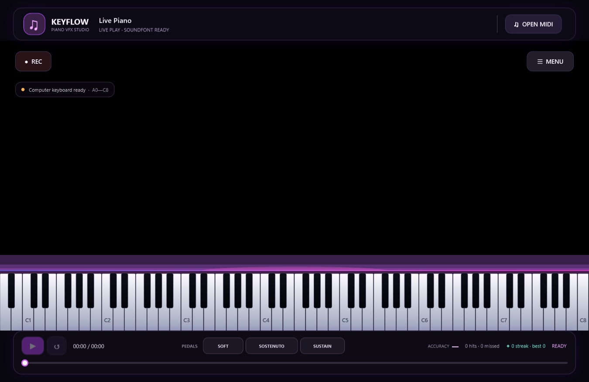

# Keyflow · Piano VFX Studio

Keyflow là ứng dụng desktop Windows viết bằng C# và WPF để học đàn và làm video piano theo MIDI. Sân khấu đen mặc định có nốt neon rỗng rơi theo thời gian, bàn phím 88 phím phát sáng theo màu nốt, tia lửa, vòng sóng và lửa tại điểm nốt chạm phím. Bảng cài đặt chia thành 10 trang (Style, Notes, Particles, Keyboard, Background, Camera & FX, Audio, MIDI, Practice, Recording) với hệ preset có sẵn (Neon Violet, Inferno, Aurora Rainbow, Ice Crystal, Two Hands, Classic Roll, Green Screen) và preset người dùng lưu/nhập/xuất JSON. Giao diện lấy cảm hứng từ các MIDI visualizer như Piano VFX, Keysight và Embers nhưng đây là ứng dụng riêng, không phải bản sao.



## Bắt đầu nhanh

Đã quen với .NET? Toàn bộ quy trình gói gọn trong vài lệnh PowerShell (chi tiết từng bước ở các mục bên dưới):

```powershell
winget install --id Git.Git -e; winget install --id GitHub.GitLFS -e; winget install --id Microsoft.DotNet.SDK.10 -e
git lfs install
git clone https://github.com/lxmtuu/PianoPath.git; cd PianoPath; git lfs pull
dotnet run --project .\PianoPath.csproj -c Release    # biên dịch rồi mở ứng dụng
.\publish.ps1 -Zip                                    # đóng gói publish\win-x64\PianoPath.exe + file ZIP để gửi đi
```

Nếu máy chặn script PowerShell, chạy `Set-ExecutionPolicy -Scope Process Bypass` trước `.\publish.ps1`.

## Mục lục

- [Bắt đầu nhanh](#bắt-đầu-nhanh) · [Yêu cầu hệ thống](#yêu-cầu-hệ-thống)
- [Cài đặt công cụ](#cài-đặt-công-cụ)
- [Tải mã nguồn](#tải-mã-nguồn)
- [Biên dịch và chạy](#biên-dịch-và-chạy)
- [Thiết lập lần đầu](#thiết-lập-lần-đầu)
- [Bắt đầu sử dụng](#bắt-đầu-sử-dụng)
- [Chức năng hiện có](#chức-năng-hiện-có) · [Giới hạn hiện tại](#giới-hạn-hiện-tại)
- [Đóng gói và xuất file .exe](#đóng-gói-và-xuất-file-exe)
- [Kiểm thử](#kiểm-thử) · [Cấu trúc chính](#cấu-trúc-chính) · [Giấy phép](#giấy-phép)

## Yêu cầu hệ thống

| Thành phần | Yêu cầu | Ghi chú |
| --- | --- | --- |
| Hệ điều hành | Windows 10 (khuyến nghị 22H2) hoặc Windows 11, 64-bit | Ứng dụng dùng WPF và WinMM nên chỉ chạy trên Windows. |
| Để **chạy bản đã đóng gói** | Không cần cài gì thêm với bản self-contained; bản framework-dependent cần **.NET 10 Desktop Runtime (x64)** | Xem [Đóng gói và xuất file .exe](#đóng-gói-và-xuất-file-exe). |
| Để **biên dịch từ mã nguồn** | **.NET 10 SDK** (10.0.100 trở lên), **Git** và **Git LFS** | SoundFont `Assets/ConcertGrand.sf2` (~113 MiB) được lưu bằng Git LFS. |
| IDE (tuỳ chọn) | Visual Studio 2026 với workload **.NET desktop development**, hoặc VS Code + extension **C# Dev Kit** | .NET 10 cần Visual Studio 2026 (18.0) trở lên; VS 2022 chỉ mở được dự án khi đã cài .NET 10 SDK và không hỗ trợ đầy đủ. |
| Ổ đĩa | ~1,5 GB cho SDK + ~500 MB cho mã nguồn và bản build | Bản publish self-contained chiếm thêm ~300 MB. |
| Âm thanh | Card âm thanh bất kỳ được Windows nhận (đầu ra `waveOut`) | |
| MIDI (tuỳ chọn) | Đàn/thiết bị MIDI USB được Windows nhận diện | Không có đàn vẫn chơi được bằng bàn phím máy tính hoặc piano ảo. |

## Cài đặt công cụ

Mở **PowerShell** (không cần quyền admin) và cài lần lượt. Nếu đã có sẵn công cụ nào thì bỏ qua bước đó.

1. **Git và Git LFS**

   ```powershell
   winget install --id Git.Git -e
   winget install --id GitHub.GitLFS -e
   ```

   Đóng và mở lại PowerShell rồi kích hoạt LFS một lần cho tài khoản Windows hiện tại:

   ```powershell
   git lfs install
   ```

   Không dùng winget thì tải Git tại <https://git-scm.com/download/win> và Git LFS tại <https://git-lfs.com>.

2. **.NET 10 SDK** (đã bao gồm runtime để chạy ứng dụng)

   ```powershell
   winget install --id Microsoft.DotNet.SDK.10 -e
   ```

   Hoặc tải bộ cài "SDK 10.0.x – Windows x64 Installer" tại <https://dotnet.microsoft.com/download/dotnet/10.0>. Mở lại PowerShell rồi kiểm tra:

   ```powershell
   dotnet --list-sdks      # phải có một dòng 10.0.xxx
   git lfs version         # phải in ra git-lfs/x.y.z
   ```

3. **IDE (tuỳ chọn)**
   - **Visual Studio 2026**: tải Community (miễn phí) tại <https://visualstudio.microsoft.com/>, trong Visual Studio Installer tích workload **.NET desktop development**. Workload này đã kèm .NET 10 SDK.
   - **Visual Studio Code**: cài extension **C# Dev Kit** (Microsoft); extension tự dùng SDK đã cài ở bước 2.

## Tải mã nguồn

```powershell
cd $HOME\source            # hoặc thư mục bất kỳ; tránh đường dẫn có ký tự đặc biệt
git clone https://github.com/lxmtuu/PianoPath.git
cd PianoPath
git lfs pull               # tải SoundFont thật (~113 MiB) nếu clone chưa tự tải
```

Kiểm tra SoundFont đã đúng chưa (phải là 118 398 836 byte ≈ 113 MiB, không phải 134 byte):

```powershell
(Get-Item .\Assets\ConcertGrand.sf2).Length
```

Nếu con số chỉ vài trăm byte thì file mới là **con trỏ LFS**: chạy lại `git lfs install` rồi `git lfs pull`. Ứng dụng vẫn mở được với con trỏ LFS nhưng sẽ báo không nạp được SoundFont; khi đó có thể nạp tạm một tệp `.sf2` khác bằng **LOAD SOUNDFONT** (trang Audio).

Tải ZIP từ GitHub ("Code → Download ZIP") **không** kèm file LFS; hãy dùng `git clone` hoặc tải riêng SoundFont rồi chép vào `Assets\ConcertGrand.sf2`.

## Biên dịch và chạy

### Dòng lệnh (khuyến nghị)

```powershell
dotnet restore .\PianoPath.csproj                        # tải gói (lần đầu)
dotnet build   .\PianoPath.csproj -c Release             # biên dịch → bin\Release\net10.0-windows\PianoPath.exe
dotnet run --project .\PianoPath.csproj -c Release       # biên dịch (nếu cần) và chạy
```

- `dotnet run` không có `-c Release` sẽ dùng cấu hình Debug (`bin\Debug\net10.0-windows\PianoPath.exe`), chậm hơn khi vẽ nhiều hạt.
- Có thể chạy trực tiếp file `.exe` trong thư mục `bin\...`; thư mục `Assets\` (SoundFont, attribution) đã được chép kèm tự động.
- Lần chạy đầu Windows có thể hỏi quyền tường lửa hoặc SmartScreen vì file chưa ký số; chọn *More info → Run anyway*.

### Visual Studio 2026

1. **File → Open → Project/Solution**, chọn `PianoPath.csproj` (không có file `.sln`, Visual Studio tự tạo solution tạm).
2. Chọn cấu hình **Release** hoặc **Debug** trên thanh công cụ, nhấn **F5** (chạy kèm debugger) hoặc **Ctrl+F5**.
3. Muốn chạy với tham số (ví dụ `--verify`): **Project → PianoPath Properties → Debug → Open debug launch profiles UI → Command line arguments**.

### Visual Studio Code

1. **File → Open Folder** chọn thư mục `PianoPath`; C# Dev Kit tự nhận `PianoPath.csproj`.
2. Nhấn **F5** → chọn **C#** → **PianoPath**; hoặc dùng terminal tích hợp với các lệnh `dotnet` ở trên.

### Cập nhật phiên bản mới

```powershell
git pull
git lfs pull
dotnet build .\PianoPath.csproj -c Release
```

## Thiết lập lần đầu

1. **Âm thanh**: Keyflow phát qua thiết bị đầu ra mặc định của Windows (`waveOut`). Đổi loa/tai nghe trong *Settings → System → Sound* của Windows trước khi mở ứng dụng.
2. **SoundFont**: grand piano Yamaha đi kèm được nạp tự động khi mở (mất vài giây, nhãn trên trang Audio báo khi xong). Muốn dùng piano khác, mở **SETTINGS → Audio → LOAD SOUNDFONT** và chọn tệp `.sf2`; chọn preset (bank/program) trong danh sách bên dưới. Nút **HALL REVERB** bật/tắt tiếng vang.
3. **Đàn MIDI**: cắm đàn trước khi mở ứng dụng thì Keyflow tự kết nối ngõ vào đầu tiên. Cắm sau thì mở **SETTINGS → MIDI → Refresh devices**. Nhãn thiết bị phía trên bàn phím chuyển sang `MIDI IN · C4` khi nhận Note On. Cùng trang có ngõ ra MIDI (nếu muốn phát qua synth ngoài), metronome và danh sách track.
4. **Giao diện**: chọn preset ở **SETTINGS → Style** (mặc định *Neon Violet*), sau đó tinh chỉnh ở các trang Notes / Particles / Keyboard / Background / Camera & FX. Mọi thay đổi áp dụng ngay và tự lưu.
5. **Vị trí lưu cấu hình**: `%LOCALAPPDATA%\Keyflow\visual-settings.json` (cài đặt hiện tại) và `%LOCALAPPDATA%\Keyflow\presets\*.json` (preset người dùng). Xoá file `visual-settings.json` hoặc bấm **RESET TO DEFAULT** trong dock để về mặc định; sao chép thư mục `presets` để mang preset sang máy khác (hoặc dùng IMPORT/EXPORT).
6. **Ghi hình**: trang **Recording** chọn độ phân giải/fps; bấm **REC** ở góc sân khấu, chọn nơi lưu tệp AVI rồi bấm lại để dừng. Cài một codec MJPEG (ví dụ gói K-Lite) nếu muốn tệp nhỏ hơn, không bắt buộc.

## Bắt đầu sử dụng

1. Ứng dụng khởi động ở **Live Play**, không tự mở hoặc phát bài mẫu. Nhấn một phím trên piano, bàn phím máy tính hoặc đàn MIDI để chỉ hiện nốt vừa chơi.
2. SoundFont grand Yamaha được nạp tự động khi ứng dụng mở; nốt phím máy tính, piano ảo và MIDI sẽ phát tiếng ngay. Nút **HALL** bật/tắt tiếng vang phòng hòa nhạc. Dùng **LOAD SOUNDFONT** nếu muốn đổi sang tệp `.sf2` khác.
3. Chọn **OPEN MIDI** để mở bài `.mid` hoặc `.midi`. Việc nhấn phím không bắt đầu bài; bấm Play hoặc Space mới chạy các nốt trong MIDI theo playhead.
4. Khi bài chạy, nốt đi xuống và chạm đường sáng ngay trên phím đàn. Nhấn phím đàn để chơi cùng và nhận phản hồi đúng/sai.
5. Nếu đã cắm đàn MIDI khi mở ứng dụng, Keyflow tự kết nối ngõ vào đầu tiên tìm thấy. Khi cắm sau, mở **SETTINGS → MIDI → Refresh devices**; ứng dụng tự chọn và kết nối đàn mới. Nhãn xanh phía trên bàn phím đổi thành `MIDI IN · C4` khi nhận Note On. Trong dock cài đặt (nút **SETTINGS** hoặc phím `Esc`) chọn thiết bị vào/ra khác, chế độ tập, tempo, track, metronome và điểm đầu/cuối vòng lặp.

Keyflow đi kèm YDP Grand Piano SF2 từ FreePats, dùng multisample Yamaha Disklavier Pro; preset grand acoustic được chọn sẵn. Engine phát stereo 44.1 kHz, phản hồi nốt nhấn/nhả và ba pedal MIDI, cùng hall reverb có thể bật/tắt. Có thể thay bằng SoundFont `.sf2` riêng. MIDI output là đường âm thanh bổ sung nếu chọn thiết bị MIDI ngoài.

### Điều khiển

- `A W S E D F T G Y H U J K`: nốt trắng/đen từ quãng giữa; nhấn giữ để duy trì nốt, thả ra để gửi Note Off.
- `Space`: phát/tạm dừng; `F11`: bật/tắt toàn màn hình; `Esc`: mở/đóng dock cài đặt bất kể thanh công cụ đang ẩn hay hiện (nếu đang gõ trong ô tìm kiếm, `Esc` xóa nội dung tìm trước).
- Không di chuột khoảng 2,8 giây thì toàn bộ giao diện (thanh công cụ trên/dưới, Menu, REC và cả dock cài đặt nếu đang mở) tự ẩn, chỉ còn đàn, nền và nốt đang chạy. Di chuyển chuột để hiện lại đúng những gì vừa ẩn. Giao diện không tự ẩn khi đang kéo slider, mở danh sách chọn hoặc đang mở bảng chọn màu; gõ phím trong bảng cài đặt cũng được tính là đang thao tác.
- REC lưu hình ảnh sân khấu thành AVI (độ phân giải theo cửa sổ/720p/1080p và 15–60 fps chọn trong trang Recording, canh theo đồng hồ thật); đường tiếng không được trộn vào tệp. Preset **Green Screen** tô nền xanh lá thuần để key trong OBS. Máy không có codec MJPEG thì ghi RGB không nén và tự dừng khi chạm giới hạn 2 GB của định dạng AVI.
- **OPEN MIDI**: nhập bài Standard MIDI format 0/1.
- Thanh thời gian: tua bài; **A**, **B**, **×**: đặt/xóa vòng lặp.
- Chế độ tập: Follow along, Wait for my note, Right hand only, Left hand only.
- Tempo: 50–150%; chọn track để solo, hoặc tắt tiếng/đổi màu từng track trong trang MIDI.

## Chức năng hiện có

- Giao diện WPF trình diễn toàn màn hình với theme tối dùng chung (`App.xaml`): header (bài đang mở, preset đang dùng, OPEN MIDI, SETTINGS, thu nhỏ/toàn màn hình/thoát), footer transport (Play, quay lại, thời gian, pedal, accuracy/score/streak, thanh tua) và dock cài đặt toàn chiều cao bên phải. Toàn bộ menu, thanh công cụ, REC và dock ẩn khi chuột đứng yên, hiện lại khi di chuột; Esc mở/đóng dock.
- Dock cài đặt có 10 trang với điều hướng bên trái, ô tìm kiếm lọc mọi trang, mỗi thông số có slider + ô nhập số (chấp nhận đơn vị, dấu phẩy, tên nốt như `C4` cho điểm chia tay) + nút reset; các hàng phụ thuộc tự ẩn/hiện theo lựa chọn (ví dụ màu tay trái/phải chỉ hiện ở chế độ Left / right hand). Mọi thay đổi áp dụng tức thì, tự lưu sau 0,65 s và có nút SAVE / RESET PAGE.
- **Style**: preset có sẵn Neon Violet (mặc định, nốt neon rỗng viền sáng + lửa), Inferno (nốt lửa cháy có vân ember, phím đỏ, bloom ấm), Aurora Rainbow (màu cầu vồng theo cao độ + wisps khói bốc lên), Ice Crystal (nốt kính lạnh), Two Hands (xanh tay trái / hồng tay phải), Classic Roll (piano roll đặc, nhẹ máy), Green Screen (nền xanh chroma key). Preset người dùng lưu trong `%LOCALAPPDATA%\Keyflow\presets\*.json`, có SAVE AS / DELETE / IMPORT / EXPORT; header hiển thị tên preset và dấu `*` khi đã chỉnh sửa.
- **Notes**: chế độ màu Gradient theo cao độ (6 palette hoặc màu đầu/cuối tùy chỉnh), theo tay (điểm chia tuỳ chỉnh), theo track MIDI (bảng 8 màu), cầu vồng theo cao độ hoặc đổi màu theo thời gian; kiểu nốt Solid / Neon outline / Glass / Fire (vân cháy animation bằng opacity mask nhiễu); độ rộng, bo góc, độ dài tối thiểu, khe hở giữa nốt, đổ bóng 3D, tên nốt in trên thanh, tint, bloom, độ sáng và độ dày viền, glow cạnh trước, khúc xạ, tốc độ rơi.
- **Particles**: tia lửa (emitter + physics: gravity, drag, vector field…), wisps plasma bốc lên từ phím đang giữ (mật độ, tốc độ, chiều cao, độ rộng, nhiễu loạn, glow), lửa (cường độ, chiều cao, màu ấm hoặc theo nốt, cháy tiếp khi giữ phím rồi tắt dần) và vòng sóng va chạm.
- **Keyboard**: kiểu Classic / Studio 3D / Glass, chiều cao, độ dài phím đen, nhãn phím (không/C/tất cả), bóng nắp đàn, dải nỉ đỏ; phím sáng theo màu nốt hoặc màu cố định, cường độ, bán kính hào quang lan lên trên, độ lún khi nhấn. Phím của nốt MIDI đang phát cũng sáng, không chỉ phím người chơi nhấn.
- **Background**: nền màu đặc / ảnh (PNG, JPEG, BMP, GIF, TIFF + làm tối) / Green screen; aura gradient, sao (mật độ), guide lanes, vignette, horizon glow, cường độ light beam; đường halo và màu halo. **Camera & FX**: parallax, zoom, khung hình, saturation, contrast, bloom. **Recording**: độ phân giải, fps, thông tin tệp đầu ra.
- Phím máy tính, click/giữ phím ảo và WinMM MIDI input; tự mở MIDI input đầu tiên, giữ lựa chọn sau khi làm mới danh sách, hiển thị tín hiệu/nốt MIDI nhận được; velocity và Note On/Off đi vào cùng luồng phản hồi.
- Ba pedal MIDI tiêu chuẩn: una corda/soft (CC 67, giảm gain và làm dịu âm), sostenuto (CC 66, giữ những nốt đang được nhấn khi pedal xuống), sustain/damper (CC 64, giữ tiếng sau khi nhả phím). Nút trên màn hình, pedal MIDI vào SoundFont, và MIDI output đều được kết nối; độ dài thanh nốt live chỉ tăng trong lúc phím được giữ, còn pedal chỉ tác động lên tiếng đàn.
- Tự nạp SoundFont Yamaha grand đi kèm; cho phép nạp SoundFont `.sf2` khác, liệt kê bank/program, chọn preset, đa âm và phát PCM stereo 44.1 kHz qua Windows `waveOut`.
- Hall reverb stereo chạy thời gian thực, bật mặc định, có nút bypass độc lập; reverb vẫn vang sau khi nhả phím.
- WinMM MIDI output để gửi Note On/Off tới synthesizer hoặc thiết bị MIDI đã chọn.
- Đọc MIDI format 0/1, tempo map, nhịp (time signature), tên track, thời lượng/velocity nốt (bỏ qua kênh trống 10), solo/mute và đổi màu từng track, tua, tempo, loop A–B, metronome theo tempo map của bài (nhấn mạnh phách đầu ô nhịp), chờ nốt và luyện riêng từng tay.
- Tua, đổi chế độ/track hoặc lặp A–B không tính các nốt đã bỏ qua là miss; mỗi vòng lặp A–B được chấm lại từ đầu.
- Thống kê hit/miss, accuracy, streak và phản hồi đúng thời điểm.

## Giới hạn hiện tại

- SoundFont mặc định là YDP Grand Piano của FreePats, xây từ multisample Yamaha Disklavier Pro. Xem `Assets/ATTRIBUTION.txt` để biết tác giả, nguồn và giấy phép CC BY 3.0. File SF2 khoảng 113 MiB.

- Âm thanh nội bộ đọc SoundFont 2 (`.sf2`) không nén. `.sf3` chưa được hỗ trợ; một số phần SF2 nâng cao như modulators, bộ lọc nhạc cụ và hiệu ứng reverb/chorus chưa được tái tạo đầy đủ. Âm thanh vì vậy có thể khác các synthesizer SoundFont chuyên dụng, tùy tệp.
- Bài MIDI định dạng 2, SMPTE time division, MusicXML, sheet music, quản lý thư viện bài và lưu lịch sử luyện tập chưa có.
- Phân tách tay dùng một điểm chia cố định (mặc định C4 = MIDI 60, đổi được trong Notes → Hand split point, dùng chung cho màu theo tay và chế độ tập từng tay); ứng dụng không suy luận cách chia tay từ bản nhạc.
- MIDI input vật lý cần đàn/thiết bị tương thích được Windows nhận diện. Nếu chưa cắm thiết bị, dùng bàn phím máy tính hoặc piano ảo.
- Dùng WinMM nên phiên bản này dành cho Windows.
- Video REC là AVI hình ảnh sân khấu, chưa trộn âm thanh đàn; máy không có codec MJPEG thì tệp dùng RGB không nén và dung lượng sẽ tăng nhanh hơn. Chưa xuất MP4 trực tiếp.
- Chưa có lớp phủ webcam/bàn tay như trong một số video Piano VFX; hãy dùng preset Green Screen và ghép trong OBS. Góc nhìn phối cảnh 3D (perspective) chưa hỗ trợ; sân khấu là piano roll phẳng với parallax nhẹ.

## Đóng gói và xuất file .exe

Bản build trong `bin\` chỉ chạy trên máy đã cài .NET SDK và gồm nhiều tệp. Để gửi cho người khác hoặc phát hành, hãy **publish**. Có hai kiểu:

| Kiểu | Lệnh nhanh | Kích thước | Máy đích cần gì | Nên dùng khi |
| --- | --- | --- | --- | --- |
| **Self-contained** (khuyến nghị) | `.\publish.ps1` | `PianoPath.exe` ~150–190 MB + SoundFont 113 MiB | Không cần cài gì | Phát hành công khai, máy người dùng không rõ có .NET hay không |
| **Framework-dependent** | `.\publish.ps1 -Mode FrameworkDependent` | `PianoPath.exe` ~1–2 MB + SoundFont 113 MiB | [.NET 10 Desktop Runtime (x64)](https://dotnet.microsoft.com/download/dotnet/10.0) | Nội bộ, nhiều máy đã có .NET, muốn gói nhỏ |

Cả hai kiểu đều xuất **một file `.exe` duy nhất** (`PublishSingleFile`) cùng thư mục `Assets\` chứa SoundFont và tệp attribution đặt cạnh. WPF không hỗ trợ trimming và Native AOT nên các tuỳ chọn đó không được dùng.

### Cách 1 · Script `publish.ps1` (một lệnh)

```powershell
cd PianoPath
Set-ExecutionPolicy -Scope Process Bypass      # chỉ cho phiên PowerShell hiện tại, nếu máy chặn script
.\publish.ps1                                  # self-contained, win-x64 → .\publish\win-x64\PianoPath.exe
.\publish.ps1 -Zip                             # thêm .\publish\Keyflow-<phiên bản>-win-x64.zip để gửi đi
.\publish.ps1 -Mode FrameworkDependent -Zip    # bản nhỏ → .\publish\win-x64-fd\ và ...-win-x64-fd.zip
.\publish.ps1 -Runtime win-arm64               # Windows on ARM (Surface Pro X, Snapdragon X)
.\publish.ps1 -Clean                           # xoá bin/, obj/ và thư mục đích trước khi publish
```

Script kiểm tra phiên bản SDK, **từ chối publish nếu `Assets\ConcertGrand.sf2` vẫn là con trỏ LFS** (tránh phát hành bản không có tiếng đàn; thêm `-AllowLfsPointer` nếu cố ý), chạy `dotnet publish` với các tham số bên dưới rồi in đường dẫn và dung lượng kết quả.

### Cách 2 · Lệnh `dotnet publish` thủ công

```powershell
# Self-contained, một file .exe, không cần cài .NET trên máy đích
dotnet publish .\PianoPath.csproj -c Release -r win-x64 --self-contained true `
  -p:PublishSingleFile=true -p:IncludeNativeLibrariesForSelfExtract=true `
  -p:PublishReadyToRun=true -p:DebugType=None -p:SatelliteResourceLanguages=en `
  -o .\publish\win-x64

# Framework-dependent, một file .exe nhỏ, máy đích cần .NET 10 Desktop Runtime
dotnet publish .\PianoPath.csproj -c Release -r win-x64 --self-contained false `
  -p:PublishSingleFile=true -p:IncludeNativeLibrariesForSelfExtract=true `
  -p:DebugType=None -p:SatelliteResourceLanguages=en `
  -o .\publish\win-x64-fd
```

Ý nghĩa các tham số: `-r win-x64` chọn kiến trúc (thay bằng `win-arm64` cho ARM); `PublishSingleFile` gộp mọi DLL vào một `.exe`; `IncludeNativeLibrariesForSelfExtract` gộp cả DLL native của WPF (bắt buộc cho single-file WPF, chúng được giải nén vào `%TEMP%\.net\PianoPath\` ở lần chạy đầu); `PublishReadyToRun` biên dịch sẵn để khởi động nhanh hơn; `DebugType=None` bỏ file `.pdb`; `SatelliteResourceLanguages=en` bỏ các thư mục ngôn ngữ của WPF.

### Cách 3 · Visual Studio 2026

1. Chuột phải dự án **PianoPath → Publish…**.
2. Chọn hồ sơ có sẵn **win-x64-self-contained** hoặc **win-x64-framework-dependent** (trong `Properties\PublishProfiles\`), bấm **Publish**.
3. Kết quả nằm ở `publish\win-x64\` hoặc `publish\win-x64-fd\` trong thư mục dự án. Hồ sơ đã bật single-file, ReadyToRun và tắt trimming; có thể sửa trong **Show all settings**.

### Kết quả và cách phân phối

```
publish\win-x64\
├── PianoPath.exe              ← file chạy duy nhất
└── Assets\
    ├── ConcertGrand.sf2       ← SoundFont, phải luôn nằm cạnh .exe trong thư mục Assets
    └── ATTRIBUTION.txt        ← ghi công FreePats (CC BY 3.0), giữ kèm khi phân phối
```

- **Gửi dạng ZIP**: nén cả thư mục (`.\publish.ps1 -Zip` hoặc `Compress-Archive -Path .\publish\win-x64\* -DestinationPath Keyflow-win-x64.zip`). Người nhận giải nén rồi chạy `PianoPath.exe`; không được tách `.exe` khỏi thư mục `Assets\`.
- **Bộ cài `.exe` (tuỳ chọn)**: cài [Inno Setup 6.3+](https://jrsoftware.org/isinfo.php), publish bản self-contained rồi chạy `iscc .\installer\Keyflow.iss` (hoặc mở file trong Inno Setup Compiler và nhấn F9). Kết quả: `installer\Output\Keyflow-Setup-<phiên bản>.exe` tạo shortcut Start Menu/Desktop và mục gỡ cài đặt. Đổi phiên bản bằng `iscc /DAppVersion=0.3.0 .\installer\Keyflow.iss`.
- **Đổi số phiên bản**: sửa `<Version>` trong `PianoPath.csproj` trước khi publish; script và bộ cài đọc giá trị này.
- **SmartScreen**: file chưa ký số nên Windows hiện "Windows protected your PC" ở lần chạy đầu; chọn *More info → Run anyway*. Muốn bỏ cảnh báo cần chứng chỉ ký mã, ví dụ: `signtool sign /fd SHA256 /tr http://timestamp.digicert.com /td SHA256 /a .\publish\win-x64\PianoPath.exe`.
- **Phần mềm diệt virus** đôi khi quét lâu file single-file self-contained ở lần chạy đầu; đây là hành vi bình thường với các gói .NET tự giải nén.

### Kiểm tra bản đã publish

```powershell
$log = "$env:TEMP\keyflow-verification.log"
$p = Start-Process .\publish\win-x64\PianoPath.exe -ArgumentList "--verify","--verify-log=$log" -PassThru -Wait
Get-Content $log; "Exit code: $($p.ExitCode)"      # 0 = đạt
Start-Process .\publish\win-x64\PianoPath.exe       # chạy thử bình thường
```

Nên thử trên một máy sạch (hoặc máy ảo) chưa cài .NET để chắc bản self-contained chạy được và bản framework-dependent báo đúng thông báo cần cài runtime.

### Phát hành tự động trên GitHub

Workflow `.github/workflows/release.yml` chạy khi đẩy tag dạng `v*` hoặc bấm **Run workflow** trong tab Actions: checkout kèm LFS, chạy `publish.ps1` cho cả hai kiểu, chạy `--verify` với bản vừa publish, tải hai file ZIP lên làm artifact và (với tag) đính kèm vào GitHub Release cùng ghi chú phát hành tự động.

```powershell
git tag v0.3.0
git push origin v0.3.0
```

Mỗi lần chạy workflow tải ~113 MiB từ Git LFS và tính vào hạn mức băng thông LFS của tài khoản, vì vậy chỉ nên chạy khi phát hành. Workflow `build.yml` thông thường không tải LFS.

### Lỗi thường gặp khi publish

| Hiện tượng | Nguyên nhân / cách xử lý |
| --- | --- |
| `publish.ps1` báo SoundFont chỉ vài trăm byte | Chưa tải LFS: `git lfs install` rồi `git lfs pull`. |
| `NETSDK1045: The current .NET SDK does not support targeting .NET 10.0` | Cài .NET 10 SDK, hoặc SDK cũ đang được ưu tiên bởi `global.json`; kiểm tra `dotnet --list-sdks`. |
| Máy đích báo "To run this application, you must install .NET Desktop Runtime" | Bản framework-dependent; cài .NET 10 Desktop Runtime x64 hoặc dùng bản self-contained. |
| Mở ứng dụng nhưng không có tiếng, trang Audio báo không nạp được SoundFont | Thư mục `Assets\` không nằm cạnh `.exe`, hoặc tệp là con trỏ LFS. |
| Trang Audio báo `NO AUDIO DEVICE` dù SoundFont đã nạp | Windows không mở được thiết bị phát (`waveOut error 2`): máy chưa có card âm thanh, hoặc thiết bị đang bị ứng dụng khác giữ ở chế độ độc quyền. Ứng dụng vẫn chạy đầy đủ, chỉ không phát tiếng. |
| `PublishTrimmed`/`PublishAot` báo lỗi hoặc ứng dụng crash khi mở | WPF không hỗ trợ; bỏ hai tuỳ chọn này. |
| Publish `win-x86` báo lỗi runtime pack | Chỉ dùng `win-x64` hoặc `win-arm64`; các bản 32-bit không được kiểm thử. |

## Kiểm thử

Bộ xác minh tích hợp nằm trong `VerificationSuite.cs` và chạy ngay bằng chính ứng dụng (cần Windows vì khởi động WPF thật):

```powershell
dotnet run --project .\PianoPath.csproj -- --verify
# tùy chọn: --verify-log=C:\duong-dan\ket-qua.log (mặc định %TEMP%\keyflow-verification.log)
```

Mã thoát `0` là đạt, `1` là có lỗi; nhật ký ghi từng mục PASS/FAIL. Bộ kiểm thử tạo tệp MIDI, SoundFont SF2 và AVI nhỏ trong thư mục tạm; kiểm tra parser MIDI (đa track, tempo map, lưới phách, tên track, bỏ kênh trống, tệp hỏng), giải mã preset/zone/sample và ngữ nghĩa generator SF2 (instrument ghi đè, preset cộng dồn), loop qua giai đoạn release, giới hạn đa âm, tín hiệu âm thanh và Note Off, sustain/sostenuto/soft, lưu và clamp cấu hình hiệu ứng, preset có sẵn/preset người dùng (lưu, nhập, xuất, xóa, tệp hỏng), dock cài đặt (10 trang, chế độ màu theo tay/track, hàng phụ thuộc, tìm kiếm, áp preset), ghi AVI frame, đóng/mở MIDI input thật nếu có, giải mã WinMM `MIM_DATA` tới nốt rơi WPF, MIDI output, tự ẩn/hiện giao diện theo chuột và Esc, độ dài nốt khi giữ phím, chế độ tập, loop, tua, tempo và render WPF. Chỉ xác nhận được phím đàn vật lý phát sự kiện khi nhấn một phím MIDI thực tế.

CI (`build.yml`) chạy đúng bộ kiểm thử này sau mỗi lần build và **coi `FAIL` là lỗi build**; toàn bộ nhật ký được dán vào job summary. Vì runner không có Git LFS, card âm thanh hay cổng MIDI thật, các mục tương ứng sẽ ra `SKIP`/`NOTE` chứ không làm đỏ build.

Nhật ký dùng bốn tiền tố: `PASS` (đã kiểm tra và đạt), `FAIL` (có lỗi, mã thoát `1`), `SKIP` (điều kiện môi trường không cho phép kiểm tra) và `NOTE` (thông tin môi trường). Bộ kiểm thử tự bỏ qua thay vì báo lỗi khi máy thiếu phần cứng: nếu `Assets\ConcertGrand.sf2` vẫn là con trỏ Git LFS (clone chưa `git lfs pull`, hoặc CI checkout với `lfs: false`) thì các mục piano đi kèm bị `SKIP` và ứng dụng được xác minh ở chế độ im lặng; nếu Windows không mở được thiết bị âm thanh (`waveOut error 2`) hoặc một cổng MIDI output không mở được, engine vẫn nạp SoundFont và chạy im lặng, kết quả ghi `NOTE` chứ không `FAIL`.

Các tham số dòng lệnh khác: `--show-settings [--settings-tab=style|notes|particles|keyboard|background|camera|audio|midi|practice|recording]` mở sẵn dock cài đặt, `--snapshot <file.png> [--compact] [--play-preview]` chụp màn hình rồi thoát (dùng để tạo `preview.png`/`settings-preview.png`).

## Cấu trúc chính

- `App.xaml`: theme tối dùng chung (button, switch, slider, combo, textbox, scrollbar, tab điều hướng, danh sách preset).
- `MainWindow.xaml`: bố cục header / sân khấu + dock cài đặt / footer transport và các trang tĩnh (Audio, MIDI, Practice, Recording).
- `MainWindow.xaml.cs`: điều phối playback, chấm điểm, MIDI, chế độ luyện, ẩn/hiện giao diện và ghi video; `MainWindow.Settings.cs`: sinh các trang cài đặt (card, slider + ô nhập, switch, combo, màu), tìm kiếm, preset, danh sách track, tuỳ chọn ghi hình.
- `PianoVisualSettings.cs`: thông số sân khấu lưu JSON trong LocalAppData (có migration); `VisualPresets.cs`: preset có sẵn và kho preset người dùng; `TextPromptWindow.cs`: hộp thoại đặt tên preset; `AviVideoRecorder.cs`: ghi frame AVI bằng Windows Video for Windows.
- `PianoStage.cs`: vẽ nền/vignette/beam, nốt theo 4 kiểu và 5 chế độ màu, tia lửa, wisps, lửa, vòng sóng, bàn phím 3 kiểu với ánh sáng phím.
- `PianoAudioEngine.cs`: đầu ra PCM `waveOut`, luồng phát và hall reverb.
- `SoundFontSynthesizer.cs`: đọc vùng mẫu `.sf2` (generator theo đặc tả SF2) và kết xuất tiếng theo MIDI note.
- `MidiFileReader.cs`: đọc Standard MIDI File thành nốt, tempo map, lưới phách và tên track; `MidiDeviceService.cs`: kết nối thiết bị WinMM.
- `ColorPickerWindow.cs`: bảng chọn màu HSV/HEX.
- `VerificationSuite.cs`: bộ kiểm tra hồi quy chạy bằng `--verify`, fixtures tự tạo.
- `publish.ps1`: script publish/đóng gói (self-contained hoặc framework-dependent, ZIP); `Properties/PublishProfiles/*.pubxml`: hồ sơ Publish cho Visual Studio; `installer/Keyflow.iss`: script Inno Setup tạo bộ cài.
- `.github/workflows/build.yml`: CI trên `windows-latest` — restore, build Release rồi chạy `--verify` (bước kiểm thử **làm hỏng build nếu FAIL**); `.github/workflows/release.yml`: publish và đính kèm ZIP vào GitHub Release khi đẩy tag `v*`, kèm smoke test bản đã đóng gói.

## Giấy phép

Mã nguồn phát hành theo giấy phép MIT (xem `LICENSE`). SoundFont đi kèm thuộc FreePats, giấy phép CC BY 3.0 (xem `Assets/ATTRIBUTION.txt`).
