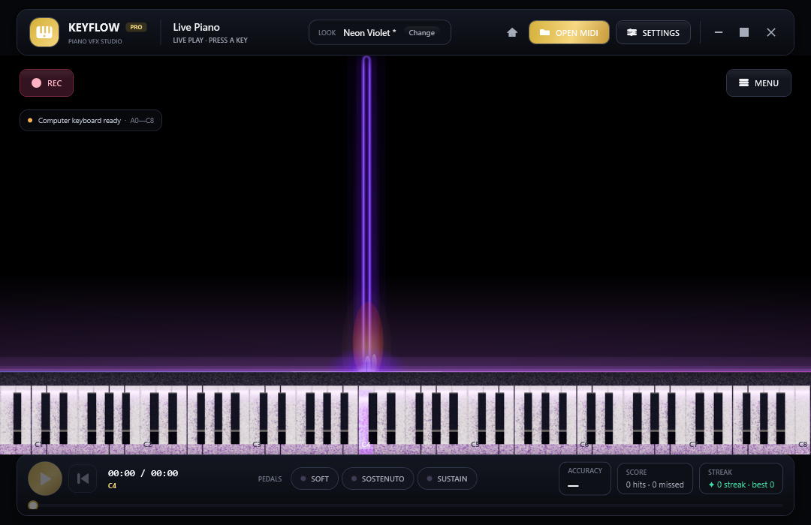
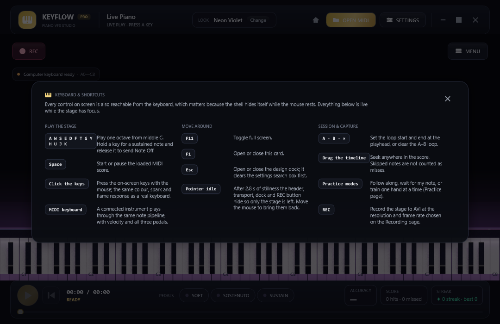
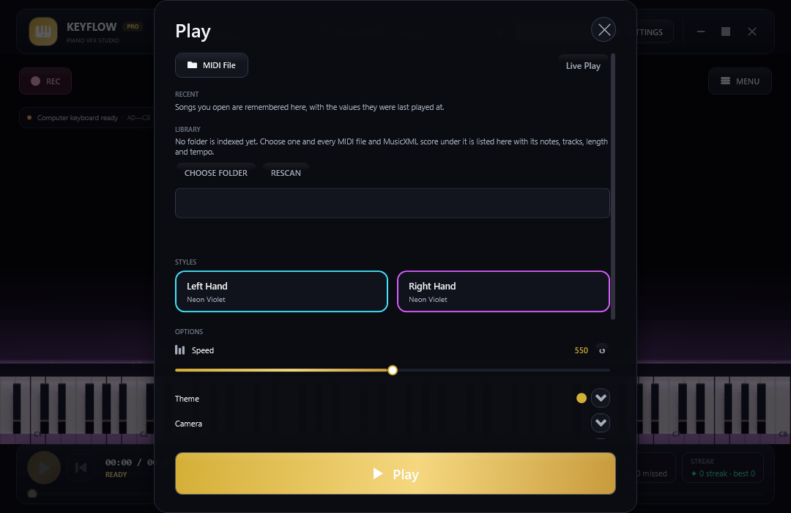
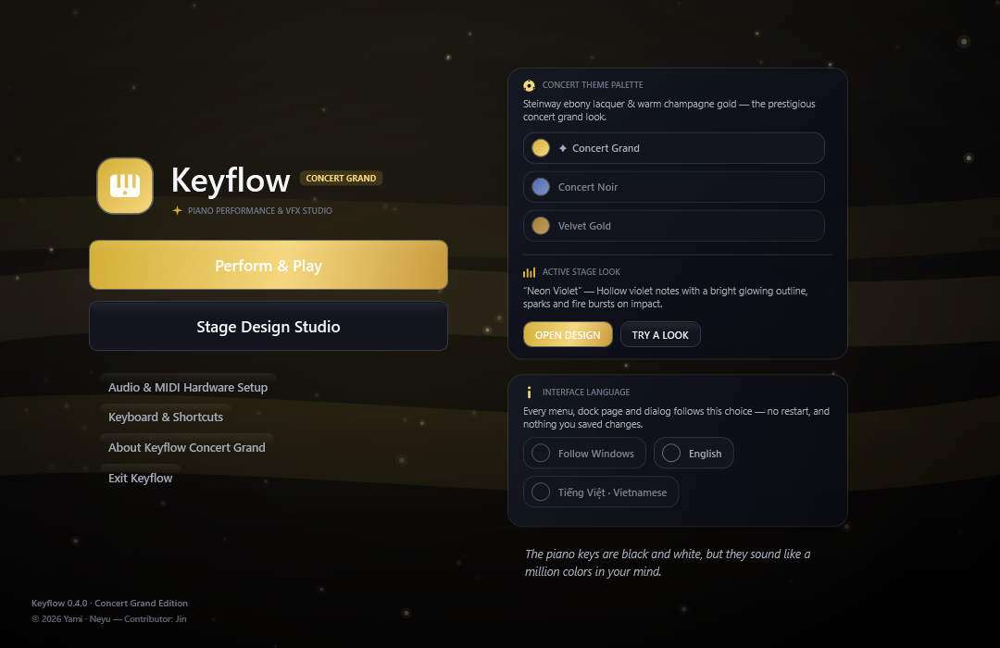
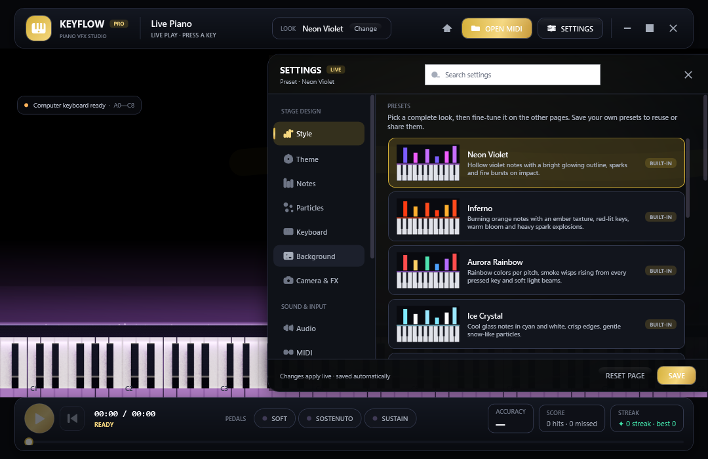
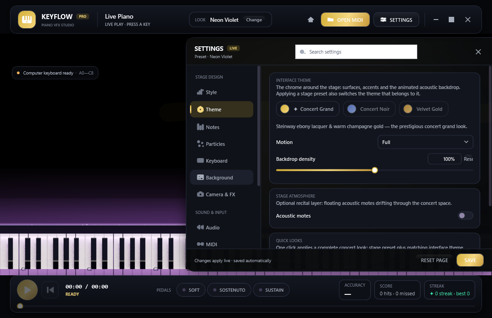
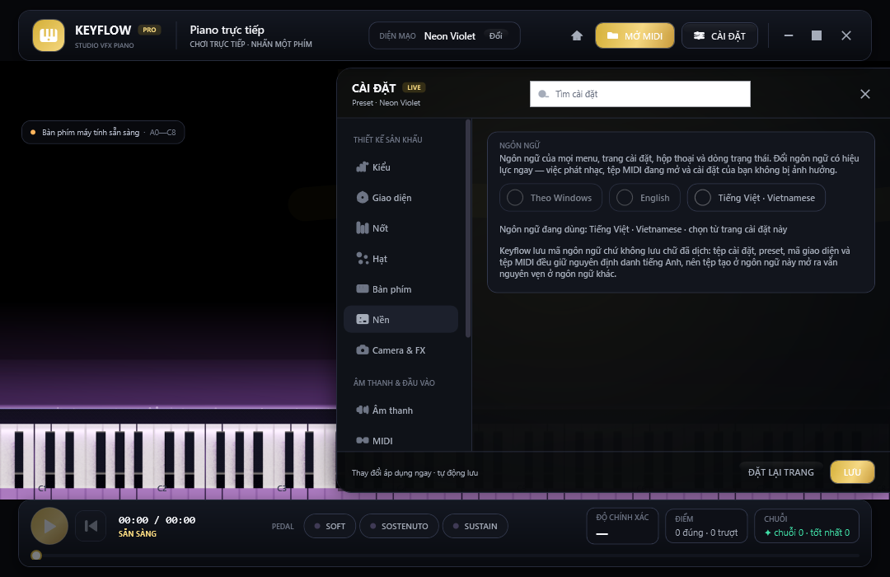

# Keyflow · Piano Performance & Concert VFX Studio

Keyflow là ứng dụng desktop Windows (C# · WPF · .NET 10) để **chơi đàn, luyện tập và làm video piano theo MIDI** với chất lượng trình diễn hoà nhạc. Giao diện có **hai ngôn ngữ — English và Tiếng Việt** — đổi ngay trong ứng dụng, không cần khởi động lại (xem [Đa ngôn ngữ](#đa-ngôn-ngữ)). Sân khấu mặc định là một hội trường tối: nốt rơi theo thời gian, bàn phím 88 phím đổ bóng bằng shader mô phỏng mô hình Unreal (GGX + softbox + ACES), tia lửa nóng sáng nguội dần theo bức xạ nhiệt, sóng cộng hưởng âm học, lửa tại điểm phím gõ và các lớp không khí (bụi acoustic, cánh hoa, đèn sân khấu) có thể bật riêng.

Ảnh dưới đây do **chính ứng dụng render** trong CI (`--snapshot`) và được cập nhật tự động trong `docs/previews/` — không phải ảnh dàn dựng:



*Sân khấu live: nốt rơi, đường chạm phát sáng, bàn phím ray-traced và transport dưới cùng.*

| Bàn phím & phím tắt | Hộp thoại Play |
| --- | --- |
|  |  |

| Menu khởi động (thẻ giao diện có cả chọn ngôn ngữ) | Dock thiết kế (Style) | Dock thiết kế (Theme) |
| --- | --- | --- |
|  |  |  |

> **Ảnh trong README do chính ứng dụng render** trong CI (`--snapshot`). Muốn làm mới sau khi sửa
> giao diện: xem [Tạo lại ảnh giao diện](#tạo-lại-ảnh-giao-diện).

## Mục lục

- [Bắt đầu nhanh](#bắt-đầu-nhanh) · [Yêu cầu hệ thống](#yêu-cầu-hệ-thống)
- [Cài đặt công cụ](#cài-đặt-công-cụ) · [Tải mã nguồn](#tải-mã-nguồn) · [Biên dịch và chạy](#biên-dịch-và-chạy)
- [Thiết lập lần đầu](#thiết-lập-lần-đầu) · [Bắt đầu sử dụng](#bắt-đầu-sử-dụng)
- [Bàn phím & thao tác nhanh](#bàn-phím--thao-tác-nhanh)
- [Chức năng](#chức-năng) · [Đa ngôn ngữ](#đa-ngôn-ngữ) · [Bản đồ giao diện](#bản-đồ-giao-diện) · [Giới hạn hiện tại](#giới-hạn-hiện-tại)
- [Tạo lại ảnh giao diện](#tạo-lại-ảnh-giao-diện) · [Đóng gói và xuất file .exe](#đóng-gói-và-xuất-file-exe)
- [Kiểm thử](#kiểm-thử) · [Tài liệu kỹ thuật](#tài-liệu-kỹ-thuật) · [Cấu trúc chính](#cấu-trúc-chính) · [Giấy phép](#giấy-phép)

## Bắt đầu nhanh

Đã quen với .NET? Toàn bộ quy trình gói gọn trong vài lệnh PowerShell (chi tiết từng bước ở các mục bên dưới):

```powershell
winget install --id Git.Git -e; winget install --id GitHub.GitLFS -e; winget install --id Microsoft.DotNet.SDK.10 -e
git lfs install
git clone https://github.com/lxmtuu/PianoPath.git; cd PianoPath; git lfs pull
dotnet run --project .\PianoPath.csproj -c Release    # biên dịch rồi mở ứng dụng
.\publish.ps1 -Zip                                    # đóng gói publish\win-x64\PianoPath.exe + file ZIP để gửi đi
```

Nếu máy chặn script PowerShell, chạy `Set-ExecutionPolicy -Scope Process Bypass` trước `.\publish.ps1`.

## Yêu cầu hệ thống

| Thành phần | Yêu cầu | Ghi chú |
| --- | --- | --- |
| Hệ điều hành | Windows 10 (khuyến nghị 22H2) hoặc Windows 11, 64-bit | Ứng dụng dùng WPF và WinMM nên chỉ chạy trên Windows. |
| Để **chạy bản đã đóng gói** | Không cần cài gì thêm với bản self-contained; bản framework-dependent cần **.NET 10 Desktop Runtime (x64)** | Xem [Đóng gói và xuất file .exe](#đóng-gói-và-xuất-file-exe). |
| Để **biên dịch từ mã nguồn** | **.NET 10 SDK** (10.0.100 trở lên), **Git** và **Git LFS** | SoundFont `Assets/ConcertGrand.sf2` (~113 MiB) được lưu bằng Git LFS. |
| IDE (tuỳ chọn) | Visual Studio 2026 với workload **.NET desktop development**, hoặc VS Code + extension **C# Dev Kit** | .NET 10 cần Visual Studio 2026 (18.0) trở lên; VS 2022 chỉ mở được dự án khi đã cài .NET 10 SDK và không hỗ trợ đầy đủ. |
| Ổ đĩa | ~1,5 GB cho SDK + ~500 MB cho mã nguồn và bản build | Bản publish self-contained chiếm thêm ~300 MB. |
| Âm thanh | Card âm thanh bất kỳ được Windows nhận (đầu ra `waveOut`) | |
| MIDI (tuỳ chọn) | Đàn/thiết bị MIDI USB được Windows nhận diện | Không có đàn vẫn chơi được bằng bàn phím máy tính hoặc piano ảo. |
| Python (tuỳ chọn) | Python 3.9+ | Chỉ dùng cho `tools/check_sources.py` (kiểm tra tĩnh, không cần .NET SDK). |

## Cài đặt công cụ

Mở **PowerShell** (không cần quyền admin) và cài lần lượt. Nếu đã có sẵn công cụ nào thì bỏ qua bước đó.

1. **Git và Git LFS**

   ```powershell
   winget install --id Git.Git -e
   winget install --id GitHub.GitLFS -e
   ```

   Đóng và mở lại PowerShell rồi kích hoạt LFS một lần cho tài khoản Windows hiện tại:

   ```powershell
   git lfs install
   ```

   Không dùng winget thì tải Git tại <https://git-scm.com/download/win> và Git LFS tại <https://git-lfs.com>.

2. **.NET 10 SDK** (đã bao gồm runtime để chạy ứng dụng)

   ```powershell
   winget install --id Microsoft.DotNet.SDK.10 -e
   ```

   Hoặc tải bộ cài "SDK 10.0.x – Windows x64 Installer" tại <https://dotnet.microsoft.com/download/dotnet/10.0>. Mở lại PowerShell rồi kiểm tra:

   ```powershell
   dotnet --list-sdks      # phải có một dòng 10.0.xxx
   git lfs version         # phải in ra git-lfs/x.y.z
   ```

3. **IDE (tuỳ chọn)**
   - **Visual Studio 2026**: tải Community (miễn phí) tại <https://visualstudio.microsoft.com/>, trong Visual Studio Installer tích workload **.NET desktop development**. Workload này đã kèm .NET 10 SDK.
   - **Visual Studio Code**: cài extension **C# Dev Kit** (Microsoft); extension tự dùng SDK đã cài ở bước 2.

## Tải mã nguồn

```powershell
cd $HOME\source            # hoặc thư mục bất kỳ; tránh đường dẫn có ký tự đặc biệt
git clone https://github.com/lxmtuu/PianoPath.git
cd PianoPath
git lfs pull               # tải SoundFont thật (~113 MiB) nếu clone chưa tự tải
```

Kiểm tra SoundFont đã đúng chưa (phải là 118 398 836 byte ≈ 113 MiB, không phải 134 byte):

```powershell
(Get-Item .\Assets\ConcertGrand.sf2).Length
```

Nếu con số chỉ vài trăm byte thì file mới là **con trỏ LFS**: chạy lại `git lfs install` rồi `git lfs pull`. Ứng dụng vẫn mở được với con trỏ LFS nhưng sẽ báo không nạp được SoundFont; khi đó có thể nạp tạm một tệp `.sf2` khác bằng **LOAD SOUNDFONT** (trang Audio).

Tải ZIP từ GitHub ("Code → Download ZIP") **không** kèm file LFS; hãy dùng `git clone` hoặc tải riêng SoundFont rồi chép vào `Assets\ConcertGrand.sf2`.

## Biên dịch và chạy

### Dòng lệnh (khuyến nghị)

```powershell
dotnet restore .\PianoPath.csproj                        # tải gói (lần đầu)
dotnet build   .\PianoPath.csproj -c Release             # biên dịch → bin\Release\net10.0-windows\PianoPath.exe
dotnet run --project .\PianoPath.csproj -c Release       # biên dịch (nếu cần) và chạy
```

- `dotnet run` không có `-c Release` sẽ dùng cấu hình Debug (`bin\Debug\net10.0-windows\PianoPath.exe`), chậm hơn khi vẽ nhiều hạt.
- Có thể chạy trực tiếp file `.exe` trong thư mục `bin\...`; thư mục `Assets\` (SoundFont, attribution) đã được chép kèm tự động.
- Lần chạy đầu Windows có thể hỏi quyền tường lửa hoặc SmartScreen vì file chưa ký số; chọn *More info → Run anyway*.

### Tham số dòng lệnh

| Tham số | Tác dụng |
| --- | --- |
| `--verify [--verify-log=<file>]` | Chạy bộ kiểm chứng hồi quy rồi thoát (mã thoát `0` = đạt). Xem [Kiểm thử](#kiểm-thử). |
| `--show-settings [--settings-tab=style\|theme\|notes\|particles\|keyboard\|background\|camera\|audio\|midi\|practice\|recording\|general]` | Mở sẵn dock cài đặt ở đúng trang (`general` = trang Ngôn ngữ & ứng dụng). |
| `--snapshot <file.png> [--compact] [--play-preview] [--menu]` | Chụp màn hình rồi thoát (`--compact` = 1080×700, `--play-preview` = nhấn sẵn một nốt, `--menu` = mở menu khởi động). |
| `--play-dialog` / `--shortcuts` | Mở sẵn hộp thoại Play / thẻ phím tắt để chụp ảnh (dùng cùng `--snapshot`). |
| `--lang=<en\|vi>` | Chạy một lần bằng ngôn ngữ chỉ định, **ghi đè** cài đặt đã lưu — dùng để chụp ảnh giao diện tiếng Việt hoặc kiểm bản dịch mà không đụng vào `%LOCALAPPDATA%\Keyflow`. |
| `--settings-dir=<thư mục>` | Đọc/ghi cài đặt và preset người dùng ở thư mục khác (mặc định `%LOCALAPPDATA%\Keyflow`) — hữu ích cho bản portable hoặc khi muốn chụp ảnh từ trạng thái mặc định. Chạy `--verify` luôn tự dùng thư mục tạm nên **không bao giờ ghi đè cài đặt/preset thật của bạn**. |

Ví dụ tạo lại đúng ảnh của README:

```powershell
$exe = ".\bin\Release\net10.0-windows\PianoPath.exe"
& $exe --snapshot docs\previews\stage-live.png  --compact --play-preview --settings-dir="$env:TEMP\keyflow-preview"
& $exe --snapshot docs\previews\main-menu.png   --compact --menu
& $exe --snapshot docs\previews\design-dock.png --compact --show-settings --settings-tab=style
& $exe --snapshot docs\previews\theme-dock.png  --compact --show-settings --settings-tab=theme
& $exe --snapshot docs\previews\play-dialog.png --compact --play-dialog
& $exe --snapshot docs\previews\shortcuts.png   --compact --shortcuts
```

### Visual Studio 2026

1. **File → Open → Project/Solution**, chọn `PianoPath.csproj` (không có file `.sln`, Visual Studio tự tạo solution tạm).
2. Chọn cấu hình **Release** hoặc **Debug** trên thanh công cụ, nhấn **F5** (chạy kèm debugger) hoặc **Ctrl+F5**.
3. Muốn chạy với tham số (ví dụ `--verify`): **Project → PianoPath Properties → Debug → Open debug launch profiles UI → Command line arguments**.

### Visual Studio Code

1. **File → Open Folder** chọn thư mục `PianoPath`; C# Dev Kit tự nhận `PianoPath.csproj`.
2. Nhấn **F5** → chọn **C#** → **PianoPath**; hoặc dùng terminal tích hợp với các lệnh `dotnet` ở trên.

### Cập nhật phiên bản mới

```powershell
git pull
git lfs pull
dotnet build .\PianoPath.csproj -c Release
```

## Thiết lập lần đầu

1. **Âm thanh**: Keyflow phát qua thiết bị đầu ra mặc định của Windows (`waveOut`). Đổi loa/tai nghe trong *Settings → System → Sound* của Windows trước khi mở ứng dụng.
2. **SoundFont**: grand piano Yamaha đi kèm được nạp tự động khi mở (mất vài giây, nhãn trên trang Audio báo khi xong). Muốn dùng piano khác, mở **SETTINGS → Audio → LOAD SOUNDFONT** và chọn tệp `.sf2`; chọn preset (bank/program) trong danh sách bên dưới. Nút **HALL REVERB** bật/tắt tiếng vang.
3. **Đàn MIDI**: cắm đàn trước khi mở ứng dụng thì Keyflow tự kết nối ngõ vào đầu tiên. Cắm sau thì mở **SETTINGS → MIDI → Refresh devices**. Nhãn thiết bị phía trên bàn phím chuyển sang `MIDI IN · C4` khi nhận Note On. Cùng trang có ngõ ra MIDI (nếu muốn phát qua synth ngoài), metronome và danh sách track.
4. **Giao diện**: chọn preset ở **SETTINGS → Style** (mặc định *Neon Violet*), chọn giao diện hoà nhạc ở **SETTINGS → Theme** (Concert Grand / Concert Noir / Velvet Gold — Concert Grand là mặc định), rồi tinh chỉnh ở các trang Notes / Particles / Keyboard / Background / Camera & FX. Mọi thay đổi áp dụng ngay và tự lưu.
5. **Vị trí lưu cấu hình**: `%LOCALAPPDATA%\Keyflow\visual-settings.json` (cài đặt hiện tại) và `%LOCALAPPDATA%\Keyflow\presets\*.json` (preset người dùng); đổi chỗ bằng `--settings-dir=<thư mục>`. Xoá file `visual-settings.json` hoặc bấm **RESET TO DEFAULT** trong dock để về mặc định; sao chép thư mục `presets` để mang preset sang máy khác (hoặc dùng IMPORT/EXPORT). Id giao diện cũ (`sakura`, `noir`, `velvet`) được tự động chuyển sang id mới khi nạp file cũ.
6. **Ghi hình**: trang **Recording** chọn độ phân giải/fps; bấm **REC** ở góc sân khấu, chọn nơi lưu tệp AVI rồi bấm lại để dừng. Cài một codec MJPEG (ví dụ gói K-Lite) nếu muốn tệp nhỏ hơn, không bắt buộc.

## Bắt đầu sử dụng

1. Ứng dụng khởi động ở **menu hoà nhạc** (Perform & Play / Stage Design Studio / Audio & MIDI Hardware Setup / Keyboard & Shortcuts / About / Exit). Nút **HOME** trên header quay lại menu bất cứ lúc nào.
2. **Live Play**: nhấn một phím trên piano, bàn phím máy tính hoặc đàn MIDI để chỉ hiện nốt vừa chơi. SoundFont grand Yamaha được nạp tự động khi ứng dụng mở; nốt phím máy tính, piano ảo và MIDI sẽ phát tiếng ngay. Nút **HALL** bật/tắt tiếng vang phòng hoà nhạc.
3. Chọn **OPEN MIDI** để mở bài `.mid` hoặc `.midi`. Việc nhấn phím không bắt đầu bài; bấm Play hoặc Space mới chạy các nốt trong MIDI theo playhead.
4. Khi bài chạy, nốt đi xuống và chạm đường sáng ngay trên phím đàn. Nhấn phím đàn để chơi cùng và nhận phản hồi đúng/sai.
5. Nếu đã cắm đàn MIDI khi mở ứng dụng, Keyflow tự kết nối ngõ vào đầu tiên tìm thấy. Khi cắm sau, mở **SETTINGS → MIDI → Refresh devices**; ứng dụng tự chọn và kết nối đàn mới. Nhãn xanh phía trên bàn phím đổi thành `MIDI IN · C4` khi nhận Note On. Trong dock cài đặt (nút **SETTINGS** hoặc phím `Esc`) chọn thiết bị vào/ra khác, chế độ tập, tempo, track, metronome và điểm đầu/cuối vòng lặp.

Keyflow đi kèm YDP Grand Piano SF2 từ FreePats, dùng multisample Yamaha Disklavier Pro; preset grand acoustic được chọn sẵn. Engine phát stereo 44.1 kHz, phản hồi nốt nhấn/nhả và ba pedal MIDI, cùng hall reverb có thể bật/tắt. Có thể thay bằng SoundFont `.sf2` riêng. MIDI output là đường âm thanh bổ sung nếu chọn thiết bị MIDI ngoài.

## Bàn phím & thao tác nhanh

Thẻ **F1** trong ứng dụng liệt kê đúng bảng này (ảnh ở đầu README), không cần mở tài liệu:

| Nhóm | Phím / thao tác | Tác dụng |
| --- | --- | --- |
| Chơi nhạc | `A W S E D F T G Y H U J K` | Một quãng tám từ nốt giữa (C4); nhấn giữ để duy trì nốt, thả ra để gửi Note Off. |
| Chơi nhạc | `Space` | Phát/tạm dừng bài MIDI đang mở. |
| Chơi nhạc | Click chuột lên phím đàn | Chơi phím ảo với đầy đủ phản hồi màu, tia lửa, lửa. |
| Chơi nhạc | Đàn MIDI | Velocity, Note On/Off và ba pedal (`CC 64/66/67`) đi vào cùng luồng phản hồi. |
| Điều hướng | `F11` | Bật/tắt toàn màn hình. |
| Điều hướng | `F1` | Mở/đóng thẻ phím tắt. |
| Điều hướng | `Esc` | Mở/đóng dock cài đặt (nếu đang gõ trong ô tìm kiếm, `Esc` xoá nội dung tìm trước; nếu thẻ phím tắt đang mở thì đóng thẻ trước). |
| Điều hướng | Để chuột yên ~2,8 giây | Toàn bộ giao diện (thanh trên/dưới, Menu, REC và cả dock nếu đang mở) tự ẩn, chỉ còn đàn, nền và nốt đang chạy. Di chuyển chuột để hiện lại đúng những gì vừa ẩn. Giao diện không tự ẩn khi đang kéo slider, mở danh sách chọn, mở bảng chọn màu, đang mở thẻ phím tắt, hoặc khi gõ phím trong bảng cài đặt. |
| Phiên làm việc | **A**, **B**, **×** (thanh thời gian) | Đặt/xoá vòng lặp A–B tại playhead. |
| Phiên làm việc | Kéo thanh thời gian | Tua bài; nốt bị bỏ qua không tính là miss. |
| Phiên làm việc | Trang Practice | Follow along, Wait for my note, Right hand only, Left hand only; tempo 50–150%. |
| Phiên làm việc | **REC** | Ghi sân khấu ra AVI theo độ phân giải/fps đã chọn ở trang Recording. |

## Chức năng

### Sân khấu & hiệu ứng hình ảnh

| Nhóm | Chi tiết |
| --- | --- |
| Nốt | 4 kiểu (Solid / Neon outline / Glass / Fire có vân cháy animation), 5 chế độ màu (gradient theo cao độ với 6 palette hoặc màu đầu–cuối tuỳ chỉnh, theo tay với điểm chia đổi được, theo track MIDI với bảng 8 màu, cầu vồng theo cao độ, cầu vồng theo thời gian), độ rộng, bo góc, độ dài tối thiểu, khe hở, đổ bóng 3D, tên nốt in trên thanh, tint, bloom, độ sáng/dày viền, glow cạnh trước, khúc xạ, tốc độ rơi và **hướng di chuyển** (Down: rơi xuống chạm phím rồi chìm dưới đường chạm; Up: sinh ra tại phím theo tiếng nốt và bốc lên khỏi đỉnh sân khấu — tia lửa, lửa, vòng sóng vẫn bung tại phím), falling FX (7 kiểu vệt + pulse + ghost), hold FX (bar/breath/rung/arc điện), release FX (6 kiểu) và smart modulators (velocity/octave/zone/pedal/tempo/audio). |
| Hạt & lửa | Tia lửa incandescent có physics đầy đủ (gravity, drag, vector field…), wisps plasma bốc lên từ phím đang giữ (mật độ, tốc độ, chiều cao, độ rộng, nhiễu loạn, glow), lửa theo nốt (cường độ, chiều cao, màu ấm hoặc theo nốt, cháy tiếp khi giữ phím rồi tắt dần), vòng sóng va chạm, sóng impact (Ring/Shockwave/Ripple + chớp Flash/Lightning/Plasma theo lực nhấn), 5 kiểu nổ hạt, 5 kiểu morph (xem docs/EFFECTS-REDESIGN.md). |
| Bàn phím | 88 phím vẽ bằng **shader ray-trace**: BRDF GGX/Smith/Schlick, softbox có penumbra thật, contact occlusion trong khe phím, IBL môi trường, đèn màu hắt từ phím đang kêu, tonemap ACES filmic (Off/Fast/Balanced/Cinematic + key light, bóng, occlusion, gloss, rim, emission, exposure, tilt camera). Kiểu Classic / Studio 3D / Glass, chiều cao, độ dài phím đen, nhãn phím, bóng nắp đàn, dải nỉ đỏ, độ lún khi nhấn. Phím của nốt MIDI đang phát cũng sáng, không chỉ phím người chơi nhấn. Bàn phím bake một lần rồi cache, mỗi phím kêu chỉ vẽ lại một tile nhỏ nên giữ được 60 fps. |
| Nền | Màu đặc / ảnh (PNG, JPEG, BMP, GIF, TIFF + làm tối) / Green screen; aura gradient, sao, guide lanes, vignette, horizon glow, light beam; màu và đường halo, cùng 4 lớp ambient độc lập (Energy/Nature/Light/Cosmic). |
| Camera & FX | Parallax, zoom, khung hình, saturation, contrast, bloom. |
| Lớp không khí (tuỳ chọn) | Hạt acoustic lơ lửng trong không gian hoà nhạc (số lượng, màu), bật ở **Theme → Acoustic motes**; 4 lớp ambient độc lập (Energy/Nature/Light/Cosmic) ở trang **Background** — sét, mưa, thiên hà, matrix... Mặc định **tắt** để sân khấu sạch. |
| Hiệu năng | Mọi animation (nốt rơi, cánh hoa, backdrop, chuyển panel) chạy trên **cùng một đồng hồ vsync** (`FrameClock`) nên không rung, không vẽ thừa khung hình; đồng hồ tự nhả khi sân khấu đứng yên. Mức chuyển động Off/Calm/Full, tôn trọng thiết lập giảm animation của Windows. |

### Âm thanh, MIDI & luyện tập

| Nhóm | Chi tiết |
| --- | --- |
| SoundFont | Tự nạp grand piano Yamaha đi kèm; cho phép nạp `.sf2` khác, liệt kê bank/program, chọn preset, đa âm và phát PCM stereo 44.1 kHz qua `waveOut`. |
| Reverb | Hall reverb stereo chạy thời gian thực, bật mặc định, có nút bypass độc lập; reverb vẫn vang sau khi nhả phím. |
| Pedal | Ba pedal MIDI tiêu chuẩn: una corda/soft (CC 67, giảm gain và làm dịu âm), sostenuto (CC 66, giữ những nốt đang nhấn khi pedal xuống), sustain/damper (CC 64, giữ tiếng sau khi nhả phím). Nút trên màn hình, pedal MIDI vào SoundFont và MIDI output đều được kết nối; độ dài thanh nốt live chỉ tăng trong lúc phím được giữ, còn pedal chỉ tác động lên tiếng đàn. |
| MIDI vào | Phím máy tính, click/giữ phím ảo và WinMM MIDI input; tự mở MIDI input đầu tiên, giữ lựa chọn sau khi làm mới danh sách, hiển thị tín hiệu/nốt nhận được. |
| MIDI ra | WinMM MIDI output để gửi Note On/Off tới synthesizer hoặc thiết bị MIDI đã chọn. |
| Bài MIDI | Đọc định dạng 0/1, tempo map, nhịp, tên track, thời lượng/velocity nốt (bỏ qua kênh trống 10), solo/mute và đổi màu từng track, tua, tempo, loop A–B, metronome theo tempo map (nhấn mạnh phách đầu ô nhịp). |
| Luyện tập | Follow along, Wait for my note, Right hand only, Left hand only; chờ nốt đúng mới đi tiếp. Tua, đổi chế độ/track hoặc lặp A–B không tính các nốt đã bỏ qua là miss; mỗi vòng lặp A–B được chấm lại từ đầu. |
| Điểm số | Thống kê hit/miss, accuracy, streak và phản hồi đúng thời điểm trên footer. |

### Giao diện, preset & ghi hình

| Nhóm | Chi tiết |
| --- | --- |
| Ba giao diện hoà nhạc | **Concert Grand** (Steinway ebony & vàng champagne — mặc định), **Concert Noir** (obsidian & platinum), **Velvet Gold** (nhung đỏ mahogany & đồng thau). Đổi theme là đổi toàn bộ surface/accent qua `DynamicResource` trong một khung hình, không cần mở lại app; backdrop động (sóng cộng hưởng, quầng cực quang, nhung) đi kèm từng theme. |
| Preset sân khấu | 14 look có sẵn: Neon Violet (mặc định), Inferno, Aurora Rainbow, Ice Crystal, Two Hands, Classic Roll, Green Screen, Sakura Nocturne, Concert Gold, Moonlight Sonata, Galaxy Voyage, Electric Storm, Ocean Depths, Retro Arcade — mỗi preset gợi ý luôn giao diện hợp nhất. Preset người dùng lưu trong `%LOCALAPPDATA%\Keyflow\presets\*.json` với SAVE AS / DELETE / IMPORT / EXPORT; header hiển thị tên preset và dấu `*` khi đã chỉnh sửa. |
| Preset thumbnail | Mỗi preset trong danh sách Style có thumbnail mini render thật (nền tối, phím trắng/đen, vạch nốt theo palette). |
| Menu & hộp thoại | Menu khởi động kiểu hoà nhạc (theme chip, thẻ "stage look", TRY A LOOK xoay vòng preset) và hộp thoại **Play** trước khi diễn: chọn MIDI File / Live Play, hai card Left/Right Hand viền màu tay, thanh Speed, danh sách lớp OPTIONS (Camera, Background, Notes, Embers, Halo, Flame, Keys, Extras) — mỗi toggle ánh xạ 1‑1 vào setting thật của stage, chevron mở đúng trang dock. |
| Thẻ F1 | Bảng phím tắt trong ứng dụng, chia ba nhóm (Play the stage / Move around / Session & capture). |
| Đa ngôn ngữ | Hai ngôn ngữ đóng gói: **English** và **Tiếng Việt**, chọn ở trang General hoặc bằng chip ngay trên menu khởi động; đổi là toàn bộ nhãn, hộp thoại, thông báo lỗi và menu ngữ cảnh vẽ lại trong khung hình hiện tại. Không có nhãn tiếng Anh lọt sang tiếng Việt: `tools/check_sources.py` chứng minh hai bảng cùng tập khoá và `--verify` đổi ngôn ngữ thật trên cửa sổ đang mở. |
| Ghi hình | REC ghi khung hình sân khấu ra AVI (độ phân giải theo cửa sổ/720p/1080p và 15–60 fps, canh theo đồng hồ thật); đường tiếng không được trộn vào tệp. Preset **Green Screen** tô nền xanh lá thuần để key trong OBS. Máy không có codec MJPEG thì ghi RGB không nén và tự dừng khi chạm giới hạn 2 GB của AVI. |

## Đa ngôn ngữ

Giao diện có hai ngôn ngữ đóng gói — **English** và **Tiếng Việt** — và đổi **ngay trong ứng dụng**, không khởi động lại: mọi nhãn, tooltip, hộp thoại, danh sách combo, thẻ phím tắt F1, menu khởi động và cả thông báo lỗi đều vẽ lại trong khung hình hiện tại.

| Ở đâu | Làm gì |
| --- | --- |
| Trang **General** (dock → nhóm APP) | Chọn **English**, **Tiếng Việt** hoặc **Theo Windows**. Ô mô tả bên dưới ghi rõ ngôn ngữ nào đang chạy và nó được chọn từ đâu. |
| **Menu khởi động** | Thẻ *INTERFACE LANGUAGE* với chip chọn nhanh — mở app lần đầu là đổi được ngay, không phải đi tìm trang cài đặt. |
| Dòng lệnh | `--lang=vi` (hoặc `en`) chạy một lần bằng ngôn ngữ chỉ định, **không** ghi vào `visual-settings.json`. CI dùng cờ này để render ảnh tiếng Việt. |
| Tìm kiếm trong dock | Một hàng khớp cả từ tiếng Anh lẫn từ đã dịch: gõ `speed` hoặc `tốc độ` đều ra cùng slider *Fall speed*. |

Ảnh chụp trang General khi app chạy tiếng Việt — cũng do CI render, với `--lang=vi`:



*Toàn bộ điều hướng, nhãn, chú thích và nút bấm đều là tiếng Việt; tên preset `Neon Violet` vẫn giữ nguyên vì đó là id đã lưu.*

Ba điều nguyên tắc:

- **Id không đổi, chỉ caption đổi.** Giá trị trong `visual-settings.json`, tên preset, id theme, tên thiết bị Windows và tên tệp luôn là tiếng Anh — bật tiếng Việt không làm hỏng preset hay file đã lưu, và một preset đem sang máy tiếng Anh vẫn đọc được.
- **Thiếu bản dịch thì in tiếng Anh**, không in ô trống. Khoá lạ không có trong inventory (tên thiết bị, tên tệp người dùng đặt) đi thẳng tới màn hình nguyên văn.
- **Thêm ngôn ngữ = thêm một tệp bảng.** Sao chép `Localization/Strings.English.cs`, dịch phần giá trị, thêm một dòng vào `Languages.All`; renderer, XAML và `visual-settings.json` không phải sửa gì. `tools/check_sources.py` và `--verify` sẽ chứng minh bảng mới dịch đủ mọi khoá của inventory.

Chi tiết kiến trúc, quy ước dịch và checklist thêm ngôn ngữ: [`docs/LOCALIZATION.md`](docs/LOCALIZATION.md).

## Bản đồ giao diện

Dock cài đặt có **12 trang, xếp thành bốn nhóm theo mục đích** — đây là bố cục duy nhất mà cả code, XAML và bộ kiểm thử cùng đọc (xem `Ui/SettingsPages.cs`):

| Nhóm | Trang | Nội dung |
| --- | --- | --- |
| **STAGE DESIGN** | Style | Preset có sẵn/người dùng + 12 công tắc bật nhanh từng lớp của sân khấu. |
| | Theme | Ba giao diện hoà nhạc, mức chuyển động, mật độ backdrop, hạt acoustic, ba nút "quick look". |
| | Notes | Màu (gradient/tay/track/cầu vồng), hình dáng, glow, hướng và tốc độ rơi, hold FX, smart modulators. |
| | Particles | Emitter tia lửa + physics, wisps plasma, lửa, vòng sóng, sóng/chớp impact, vệt rơi + ghost, hiệu ứng nhả. |
| | Keyboard | Kiểu bàn phím, nhãn phím, nỉ đỏ, chiếu sáng và nhóm **RAY-TRACED SHADING**. |
| | Background | Màu/ảnh/green screen, bầu khí quyển, guide lanes, halo, 4 lớp ambient. |
| | Camera & FX | Parallax, zoom, khung hình, saturation, contrast, bloom. |
| **SOUND & INPUT** | Audio | Nạp SoundFont, chọn preset nhạc cụ, hall reverb. |
| | MIDI | Thiết bị vào/ra, danh sách track (solo/mute/màu), metronome. |
| **SESSION** | Practice | Chế độ tập, tempo, vòng lặp A–B. |
| | Recording | Độ phân giải, fps, thông tin tệp đầu ra. |
| **APP** | General | **Ngôn ngữ giao diện** (English / Tiếng Việt / theo Windows), theme, mức chuyển động, thư mục cài đặt. |

Phần còn lại của giao diện:

| Khu vực | Nội dung |
| --- | --- |
| Header | Logo + brand, bài đang mở, chip **LOOK** (preset hiện tại + nút Change), HOME, OPEN MIDI, SETTINGS, thu nhỏ/toàn màn hình/thoát. |
| Sân khấu | Nốt, hiệu ứng, bàn phím, badge thiết bị, nút REC, nút MENU. |
| Footer | Play/Pause, quay lại đầu, thời gian + nốt đang chơi, ba pedal, ACCURACY / SCORE / STREAK, thanh tua + progress. |
| Dock cài đặt | Cột điều hướng **bốn nhóm** + ô tìm kiếm lọc mọi trang (tự nhảy sang trang có kết quả; khớp cả từ tiếng Anh lẫn từ đã dịch — gõ `speed` hay `tốc độ` đều ra cùng slider), mỗi thông số có slider + ô nhập số (chấp nhận đơn vị, dấu phẩy, tên nốt như `C4`) + nút reset, hàng phụ thuộc tự ẩn/hiện, SAVE / RESET PAGE, tự lưu sau 0,65 s. |

## Giới hạn hiện tại

- SoundFont mặc định là YDP Grand Piano của FreePats, xây từ multisample Yamaha Disklavier Pro. Xem `Assets/ATTRIBUTION.txt` để biết tác giả, nguồn và giấy phép CC BY 3.0. File SF2 khoảng 113 MiB.
- Âm thanh nội bộ đọc SoundFont 2 (`.sf2`) không nén. `.sf3` chưa được hỗ trợ; một số phần SF2 nâng cao như modulators, bộ lọc nhạc cụ và hiệu ứng reverb/chorus chưa được tái tạo đầy đủ. Âm thanh vì vậy có thể khác các synthesizer SoundFont chuyên dụng, tùy tệp.
- Bài MIDI định dạng 2, SMPTE time division, MusicXML, sheet music, quản lý thư viện bài và lưu lịch sử luyện tập chưa có.
- Phân tách tay dùng một điểm chia cố định (mặc định C4 = MIDI 60, đổi được trong Notes → Hand split point, dùng chung cho màu theo tay và chế độ tập từng tay); ứng dụng không suy luận cách chia tay từ bản nhạc.
- MIDI input vật lý cần đàn/thiết bị tương thích được Windows nhận diện. Nếu chưa cắm thiết bị, dùng bàn phím máy tính hoặc piano ảo.
- Dùng WinMM nên phiên bản này dành cho Windows.
- Video REC là AVI hình ảnh sân khấu, chưa trộn âm thanh đàn; máy không có codec MJPEG thì tệp dùng RGB không nén và dung lượng sẽ tăng nhanh hơn. Chưa xuất MP4 trực tiếp.
- Chưa có lớp phủ webcam/bàn tay như trong một số video Piano VFX; hãy dùng preset Green Screen và ghép trong OBS. Góc nhìn phối cảnh 3D (perspective) chưa hỗ trợ; sân khấu là piano roll phẳng với parallax nhẹ.
- Shader đổ bóng là **software shader** (CPU đa luồng) nên lần bake đầu ở mức Cinematic trên máy yếu có thể tốn vài chục ms; đã có Fast/Off và cache để giảm.

## Tạo lại ảnh giao diện

Ảnh trong README (và trong `docs/previews/`) do ứng dụng render, không phải ảnh dàn dựng.

**Tự động:** mỗi lần push lên `main` hoặc nhánh làm việc (`arena/**`), workflow `build.yml` build xong thì render lại 7 ảnh bằng chính file `PianoPath.exe` vừa vượt qua `--verify` — sáu ảnh chạy với `--lang=en` để caption luôn là tiếng Anh bất kể ngôn ngữ của runner, riêng ảnh *General* chạy với `--lang=vi` để thấy luôn bản dịch tiếng Việt — rồi **commit thẳng vào nhánh** (`Refresh the README previews from CI [skip ci]`). Sửa giao diện xong không cần làm gì thêm — ảnh trong README sẽ đúng theo commit đó. Ảnh cũng được upload thành artifact `keyflow-previews` nếu muốn tải rời:

Ảnh cũng được upload thành artifact `keyflow-previews` nếu muốn tải rời:

```powershell
gh run list --workflow build.yml --limit 5          # tìm run mới nhất
gh run download <run-id> -n keyflow-previews -D docs/previews
```

**Thủ công — render tại máy:** chạy các lệnh `--snapshot` ở mục [Tham số dòng lệnh](#tham-số-dòng-lệnh). Ảnh chụp tự tắt chuyển động giao diện để kết quả tất định giữa các máy.

`tools/check_sources.py` sẽ báo lỗi nếu README trỏ tới một ảnh không tồn tại, nên ảnh và tài liệu không thể lệch nhau im lặng.

## Đóng gói và xuất file .exe

Bản build trong `bin\` chỉ chạy trên máy đã cài .NET SDK và gồm nhiều tệp. Để gửi cho người khác hoặc phát hành, hãy **publish**. Có hai kiểu:

| Kiểu | Lệnh nhanh | Kích thước | Máy đích cần gì | Nên dùng khi |
| --- | --- | --- | --- | --- |
| **Self-contained** (khuyến nghị) | `.\publish.ps1` | `PianoPath.exe` ~150–190 MB + SoundFont 113 MiB | Không cần cài gì | Phát hành công khai, máy người dùng không rõ có .NET hay không |
| **Framework-dependent** | `.\publish.ps1 -Mode FrameworkDependent` | `PianoPath.exe` ~1–2 MB + SoundFont 113 MiB | [.NET 10 Desktop Runtime (x64)](https://dotnet.microsoft.com/download/dotnet/10.0) | Nội bộ, nhiều máy đã có .NET, muốn gói nhỏ |

Cả hai kiểu đều xuất **một file `.exe` duy nhất** (`PublishSingleFile`) cùng thư mục `Assets\` chứa SoundFont và tệp attribution đặt cạnh. WPF không hỗ trợ trimming và Native AOT nên các tuỳ chọn đó không được dùng.

### Cách 1 · Script `publish.ps1` (một lệnh)

```powershell
cd PianoPath
Set-ExecutionPolicy -Scope Process Bypass      # chỉ cho phiên PowerShell hiện tại, nếu máy chặn script
.\publish.ps1                                  # self-contained, win-x64 → .\publish\win-x64\PianoPath.exe
.\publish.ps1 -Zip                             # thêm .\publish\Keyflow-<phiên bản>-win-x64.zip để gửi đi
.\publish.ps1 -Mode FrameworkDependent -Zip    # bản nhỏ → .\publish\win-x64-fd\ và ...-win-x64-fd.zip
.\publish.ps1 -Runtime win-arm64               # Windows on ARM (Surface Pro X, Snapdragon X)
.\publish.ps1 -Clean                           # xoá bin/, obj/ và thư mục đích trước khi publish
```

Script kiểm tra phiên bản SDK, **từ chối publish nếu `Assets\ConcertGrand.sf2` vẫn là con trỏ LFS** (tránh phát hành bản không có tiếng đàn; thêm `-AllowLfsPointer` nếu cố ý), chạy `dotnet publish` với các tham số bên dưới rồi in đường dẫn và dung lượng kết quả.

### Cách 2 · Lệnh `dotnet publish` thủ công

```powershell
# Self-contained, một file .exe, không cần cài .NET trên máy đích
dotnet publish .\PianoPath.csproj -c Release -r win-x64 --self-contained true `
  -p:PublishSingleFile=true -p:IncludeNativeLibrariesForSelfExtract=true `
  -p:PublishReadyToRun=true -p:DebugType=None -p:SatelliteResourceLanguages=en `
  -o .\publish\win-x64

# Framework-dependent, một file .exe nhỏ, máy đích cần .NET 10 Desktop Runtime
dotnet publish .\PianoPath.csproj -c Release -r win-x64 --self-contained false `
  -p:PublishSingleFile=true -p:IncludeNativeLibrariesForSelfExtract=true `
  -p:DebugType=None -p:SatelliteResourceLanguages=en `
  -o .\publish\win-x64-fd
```

Ý nghĩa các tham số: `-r win-x64` chọn kiến trúc (thay bằng `win-arm64` cho ARM); `PublishSingleFile` gộp mọi DLL vào một `.exe`; `IncludeNativeLibrariesForSelfExtract` gộp cả DLL native của WPF (bắt buộc cho single-file WPF, chúng được giải nén vào `%TEMP%\.net\PianoPath\` ở lần chạy đầu); `PublishReadyToRun` biên dịch sẵn để khởi động nhanh hơn; `DebugType=None` bỏ file `.pdb`; `SatelliteResourceLanguages=en` bỏ các thư mục ngôn ngữ của WPF.

### Cách 3 · Visual Studio 2026

1. Chuột phải dự án **PianoPath → Publish…**.
2. Chọn hồ sơ có sẵn **win-x64-self-contained** hoặc **win-x64-framework-dependent** (trong `Properties\PublishProfiles\`), bấm **Publish**.
3. Kết quả nằm ở `publish\win-x64\` hoặc `publish\win-x64-fd\` trong thư mục dự án. Hồ sơ đã bật single-file, ReadyToRun và tắt trimming; có thể sửa trong **Show all settings**.

### Kết quả và cách phân phối

```
publish\win-x64\
├── PianoPath.exe              ← file chạy duy nhất
└── Assets\
    ├── ConcertGrand.sf2       ← SoundFont, phải luôn nằm cạnh .exe trong thư mục Assets
    └── ATTRIBUTION.txt        ← ghi công FreePats (CC BY 3.0), giữ kèm khi phân phối
```

- **Gửi dạng ZIP**: nén cả thư mục (`.\publish.ps1 -Zip` hoặc `Compress-Archive -Path .\publish\win-x64\* -DestinationPath Keyflow-win-x64.zip`). Người nhận giải nén rồi chạy `PianoPath.exe`; không được tách `.exe` khỏi thư mục `Assets\`.
- **Bộ cài `.exe` (tuỳ chọn)**: cài [Inno Setup 6.3+](https://jrsoftware.org/isinfo.php), publish bản self-contained rồi chạy `iscc .\installer\Keyflow.iss` (hoặc mở file trong Inno Setup Compiler và nhấn F9). Kết quả: `installer\Output\Keyflow-Setup-<phiên bản>.exe` tạo shortcut Start Menu/Desktop và mục gỡ cài đặt. Đổi phiên bản bằng `iscc /DAppVersion=0.4.0 .\installer\Keyflow.iss`.
- **Đổi số phiên bản**: sửa `<Version>` trong `PianoPath.csproj` trước khi publish; script và bộ cài đọc giá trị này.
- **SmartScreen**: file chưa ký số nên Windows hiện "Windows protected your PC" ở lần chạy đầu; chọn *More info → Run anyway*. Muốn bỏ cảnh báo cần chứng chỉ ký mã, ví dụ: `signtool sign /fd SHA256 /tr http://timestamp.digicert.com /td SHA256 /a .\publish\win-x64\PianoPath.exe`.
- **Phần mềm diệt virus** đôi khi quét lâu file single-file self-contained ở lần chạy đầu; đây là hành vi bình thường với các gói .NET tự giải nén.

### Kiểm tra bản đã publish

```powershell
$log = "$env:TEMP\keyflow-verification.log"
$p = Start-Process .\publish\win-x64\PianoPath.exe -ArgumentList "--verify","--verify-log=$log" -PassThru -Wait
Get-Content $log; "Exit code: $($p.ExitCode)"      # 0 = đạt
Start-Process .\publish\win-x64\PianoPath.exe       # chạy thử bình thường
```

Nên thử trên một máy sạch (hoặc máy ảo) chưa cài .NET để chắc bản self-contained chạy được và bản framework-dependent báo đúng thông báo cần cài runtime.

### Phát hành tự động trên GitHub

Hai workflow trong `.github/workflows/`:

| Workflow | Kích hoạt | Nội dung |
| --- | --- | --- |
| `build.yml` | push lên `main`/`arena/**`, mọi pull request | Kiểm tra tĩnh (`tools/check_sources.py`) → build Release → chạy `--verify` (**FAIL là đỏ build**) → render 6 ảnh README, upload artifact `keyflow-previews` và commit ảnh mới vào nhánh đang build (bỏ qua với pull request). |
| `release.yml` | tag `v*` hoặc bấm **Run workflow** | Checkout kèm LFS, publish cả hai kiểu, smoke test bản vừa publish, tải hai file ZIP lên artifact và (với tag) đính kèm vào GitHub Release cùng ghi chú phát hành tự động. |

```powershell
git tag v0.4.0
git push origin v0.4.0
```

Mỗi lần chạy `release.yml` tải ~113 MiB từ Git LFS và tính vào hạn mức băng thông LFS của tài khoản, nên chỉ nên chạy khi phát hành. `build.yml` không tải LFS (các mục kiểm thử cần SoundFont sẽ tự động `SKIP`).

### Lỗi thường gặp khi publish

| Hiện tượng | Nguyên nhân / cách xử lý |
| --- | --- |
| `publish.ps1` báo SoundFont chỉ vài trăm byte | Chưa tải LFS: `git lfs install` rồi `git lfs pull`. |
| `NETSDK1045: The current .NET SDK does not support targeting .NET 10.0` | Cài .NET 10 SDK, hoặc SDK cũ đang được ưu tiên bởi `global.json`; kiểm tra `dotnet --list-sdks`. |
| Máy đích báo "To run this application, you must install .NET Desktop Runtime" | Bản framework-dependent; cài .NET 10 Desktop Runtime x64 hoặc dùng bản self-contained. |
| Mở ứng dụng nhưng không có tiếng, trang Audio báo không nạp được SoundFont | Thư mục `Assets\` không nằm cạnh `.exe`, hoặc tệp là con trỏ LFS. |
| Trang Audio báo `NO AUDIO DEVICE` dù SoundFont đã nạp | Windows không mở được thiết bị phát (`waveOut error 2`): máy chưa có card âm thanh, hoặc thiết bị đang bị ứng dụng khác giữ ở chế độ độc quyền. Ứng dụng vẫn chạy đầy đủ, chỉ không phát tiếng. |
| `PublishTrimmed`/`PublishAot` báo lỗi hoặc ứng dụng crash khi mở | WPF không hỗ trợ; bỏ hai tuỳ chọn này. |
| Publish `win-x86` báo lỗi runtime pack | Chỉ dùng `win-x64` hoặc `win-arm64`; các bản 32-bit không được kiểm thử. |

## Kiểm thử

Bộ xác minh tích hợp nằm trong `Diagnostics/VerificationSuite.cs` và chạy ngay bằng chính ứng dụng (cần Windows vì khởi động WPF thật):

```powershell
dotnet run --project .\PianoPath.csproj -- --verify
# tùy chọn: --verify-log=C:\duong-dan\ket-qua.log (mặc định %TEMP%\keyflow-verification.log)
```

Mã thoát `0` là đạt, `1` là có lỗi; nhật ký ghi từng mục PASS/FAIL. Bộ kiểm thử tạo tệp MIDI, SoundFont SF2 và AVI nhỏ trong thư mục tạm; kiểm tra parser MIDI (đa track, tempo map, lưới phách, tên track, bỏ kênh trống, tệp hỏng), giải mã preset/zone/sample và ngữ nghĩa generator SF2 (instrument ghi đè, preset cộng dồn), loop qua giai đoạn release, giới hạn đa âm, tín hiệu âm thanh và Note Off, sustain/sostenuto/soft, lưu và clamp cấu hình hiệu ứng, preset có sẵn/preset người dùng (lưu, nhập, xuất, xóa, tệp hỏng), **danh mục dock: 12 trang chia 4 nhóm khớp giữa catalogue, XAML và tiêu đề nhóm**, **đổi ngôn ngữ trực tiếp trên cửa sổ đang mở (`VerifyLanguageSwitching`): hai bảng phải cùng tập khoá, nhãn đã dịch phải vẽ lại khi đổi, và ô tìm kiếm dock phải tìm thấy hàng bằng tiếng Việt**, **id giao diện cũ (`sakura`/`noir`/`velvet`) tự chuyển sang id chuẩn khi nạp file lưu**, chip giao diện, lớp hoa anh đào, impact wave/flash, falling/hold/release FX, 4 lớp ambient, smart modulators, 7 combo themes, chế độ màu theo tay/track, hàng phụ thuộc, tìm kiếm, áp preset, **thẻ phím tắt F1 mở/đóng được**, ghi AVI frame, đóng/mở MIDI input thật nếu có, giải mã WinMM `MIM_DATA` tới nốt rơi WPF, MIDI output, tự ẩn/hiện giao diện theo chuột và Esc, độ dài nốt khi giữ phím, chế độ tập, loop, tua, tempo, render WPF và việc sân khấu chạy trên đồng hồ khung hình dùng chung. Chỉ xác nhận được phím đàn vật lý phát sự kiện khi nhấn một phím MIDI thực tế.

Bộ kiểm thử shader có hai mục riêng: `VerifyShaderPipeline` (không cần WPF layout) kiểm tra toán sRGB/ACES/GGX, jitter tất định, **chữ ký cache bake** (slider không liên quan không gây bake lại), bake nền phải opaque và trải sáng thật, cột phím đen phải tối hơn cột ngà, và tile overlay của một phím kêu phải che đúng phím rồi mờ ra; `VerifyShadedStage` bật/tắt `ShadingQuality` trong dock và khẳng định stage thật sự đổi giữa bàn phím vector và bàn phím shader, đồng thời bake được tái sử dụng giữa các khung hình.

### Kiểm tra tĩnh (chạy được trên mọi máy, kể cả không có .NET SDK)

```powershell
python tools/check_sources.py          # cú pháp C#, XML + resource XAML, danh mục dock, theme token, bảng chuỗi, link/ảnh README
python tools/shader_preview.py 780 180 0.6   # port Python của shader, xuất ảnh tools/out/ (không commit)
```

`check_sources.py` kiểm tra: cân bằng ngoặc/dấu nháy của mọi tệp C#; tính hợp lệ XML và mọi `StaticResource`/`DynamicResource` của XAML; mọi `FindName`/`FindResource` và mọi event handler trong XAML đều tồn tại trong C#; **danh mục trang trong `Ui/SettingsPages.cs` khớp từng tiêu đề, đúng thứ tự và đúng nhãn nhóm với tab strip trong `Ui/MainWindow.xaml`**; **mọi theme token mà `ShellThemeManager` phát ra đều có giá trị mặc định trong `App.xaml`**; **mọi ảnh và liên kết nội bộ trong `README.md` đều tồn tại**; và **bảng chuỗi**: mọi ngôn ngữ dịch đúng tập khoá của inventory, placeholder và xuống dòng còn nguyên, mọi chuỗi mà mã nguồn in ra (kể cả chuỗi trong XAML có marker, tên trang, theme, preset và thẻ phím tắt) đều là một khoá của inventory. CI chạy script này trước bước build trên Windows.

Nhật ký `--verify` dùng bốn tiền tố: `PASS` (đã kiểm tra và đạt), `FAIL` (có lỗi, mã thoát `1`), `SKIP` (điều kiện môi trường không cho phép kiểm tra) và `NOTE` (thông tin môi trường). Bộ kiểm thử tự bỏ qua thay vì báo lỗi khi máy thiếu phần cứng: nếu `Assets\ConcertGrand.sf2` vẫn là con trỏ Git LFS (clone chưa `git lfs pull`, hoặc CI checkout với `lfs: false`) thì các mục piano đi kèm bị `SKIP` và ứng dụng được xác minh ở chế độ im lặng; nếu Windows không mở được thiết bị âm thanh (`waveOut error 2`) hoặc một cổng MIDI output không mở được, engine vẫn nạp SoundFont và chạy im lặng, kết quả ghi `NOTE` chứ không `FAIL`.

## Tài liệu kỹ thuật

| Tài liệu | Nội dung |
| --- | --- |
| `docs/UI-SHADER-REVIEW.md` | Rà soát giao diện và đợt nâng cấp shader đổ bóng kiểu Unreal: mô hình shading, camera, cache bake, cách tự kiểm chứng. |
| `docs/SETTINGS-WIRING-AUDIT.md` | Bảng đối chiếu **mọi** chức năng cài đặt với đoạn code tiêu thụ nó — chứng minh không có setting nào "chết". |
| `docs/LOCALIZATION.md` | Kiến trúc đa ngôn ngữ: khoá là văn bản nguồn, một tệp bảng mỗi ngôn ngữ, nhãn sống, quy ước dịch tiếng Việt, cách thêm ngôn ngữ mới và ba lớp kiểm chứng. |
| `docs/ROADMAP.md` | Hướng cập nhật tiếp theo (P0→P3), khối lượng ước đoán và những việc đã cân nhắc nhưng không làm. |
| `docs/DOCK-NAVIGATION-AUDIT.md` | Đợt rà soát cách sắp xếp chức năng: vì sao dock chia ba nhóm, danh mục trang là nguồn sự thật duy nhất, thẻ phím tắt F1 và đường ảnh README, cùng các kiểm tra tự động giữ chúng không lệch. |

## Cấu trúc chính

- `App.xaml`: theme mặc định và toàn bộ control template (button, switch, slider, combo, textbox, scrollbar, tab điều hướng, danh sách preset) — mọi token màu đọc qua `DynamicResource` nên đổi theme tức thì. `App.xaml.cs`: khởi động, các chế độ `--verify` / `--snapshot` / `--show-settings` / `--play-dialog` / `--shortcuts`.
- `Ui/`: `MainWindow.xaml` (bố cục header / sân khấu + dock / footer transport / menu hoà nhạc / hộp thoại Play / thẻ phím tắt), `MainWindow.xaml.cs` (điều phối playback, chấm điểm, MIDI, ẩn/hiện giao diện và ghi video), `MainWindow.Settings.cs` (sinh các trang cài đặt, tìm kiếm, preset, danh sách track), `MainWindow.Menu.cs` (menu chính + hộp thoại Play + chip theme), `MainWindow.Shortcuts.cs` (thẻ F1), `SettingsPages.cs` (**danh mục 12 trang + 4 nhóm**, attached property in nhãn nhóm), `MainWindow.Language.cs` (đổi ngôn ngữ trực tiếp, dựng lại các mặt tự ghép văn bản), `DeviceOption.cs` (tách id thiết bị và caption đã dịch), `FrameClock.cs` (đồng hồ khung hình vsync dùng chung), `ChromeMotion.cs` (easing/entrance dùng chung), `ColorPickerWindow.cs`, `TextPromptWindow.cs`.
- `Theme/`: `ShellTheme.cs` (ba giao diện + bảng màu + id cũ + `ShellThemeManager`) và `ChromeBackdrop.cs` (backdrop động cho menu và dock).
- `Stage/`: `PianoVisualSettings.cs` (thông số lưu JSON trong LocalAppData, có migration), `VisualPresets.cs` (preset có sẵn + kho preset người dùng), `PianoStage.cs` (vẽ nền/vignette/beam, nốt theo 4 kiểu và 5 chế độ màu, tia lửa, wisps, lửa, vòng sóng/shockwave/ripple, chớp impact, vệt rơi, hold bar/arc, hiệu ứng nhả, 4 lớp ambient, cánh hoa, bàn phím vector hoặc shader).
- `Stage/Shading/`: shader đổ bóng kiểu Unreal cho bàn phím — `ShaderMath.cs` (GGX/Smith/Schlick, ACES, sRGB, dither), `PianoShaderScene.cs` (scene + camera + cache key), `PianoKeyboardRenderer.cs` (ray-trace bóng mềm, contact AO, IBL, đèn màu theo nốt, tile overlay).
- `Audio/`: `PianoAudioEngine.cs` (đầu ra PCM `waveOut`, luồng phát và hall reverb) và `SoundFontSynthesizer.cs` (đọc vùng mẫu `.sf2` theo đặc tả SF2).
- `Midi/`: `MidiFileReader.cs` (Standard MIDI File → nốt, tempo map, lưới phách, tên track) và `MidiDeviceService.cs` (thiết bị WinMM).
- `Video/AviVideoRecorder.cs`: ghi frame AVI bằng Windows Video for Windows.
- `Diagnostics/VerificationSuite.cs`: bộ kiểm tra hồi quy chạy bằng `--verify`, fixtures tự tạo.
- `tools/`: `check_sources.py` (kiểm tra tĩnh cú pháp/XAML/danh mục dock/theme token/README, chạy mọi máy) và `shader_preview.py` (port Python của shader để xem trước, ảnh xuất vào `tools/out/`, không commit).
- `Localization/`: `Localizer.cs` (ngôn ngữ, bảng tra, nhãn sống, marker XAML) và `Strings.English.cs` / `Strings.Vietnamese.cs` (inventory + bản dịch; thêm ngôn ngữ = thêm một tệp như vậy).
- `docs/previews/`: ảnh giao diện do ứng dụng render (nguồn cho README).
- `publish.ps1`: script publish/đóng gói (self-contained hoặc framework-dependent, ZIP); `Properties/PublishProfiles/*.pubxml`: hồ sơ Publish cho Visual Studio; `installer/Keyflow.iss`: script Inno Setup tạo bộ cài.
- `.github/workflows/`: `build.yml` (kiểm tra tĩnh, build Release, `--verify`, render ảnh README) và `release.yml` (publish + đính kèm ZIP vào GitHub Release khi đẩy tag `v*`).

## Giấy phép

Mã nguồn phát hành theo giấy phép MIT (xem `LICENSE`). SoundFont đi kèm thuộc FreePats, giấy phép CC BY 3.0 (xem `Assets/ATTRIBUTION.txt`).

Bản quyền thuộc về tác giả **Yami** và **Neyu**; **Jin** là người đóng góp cho dự án.
