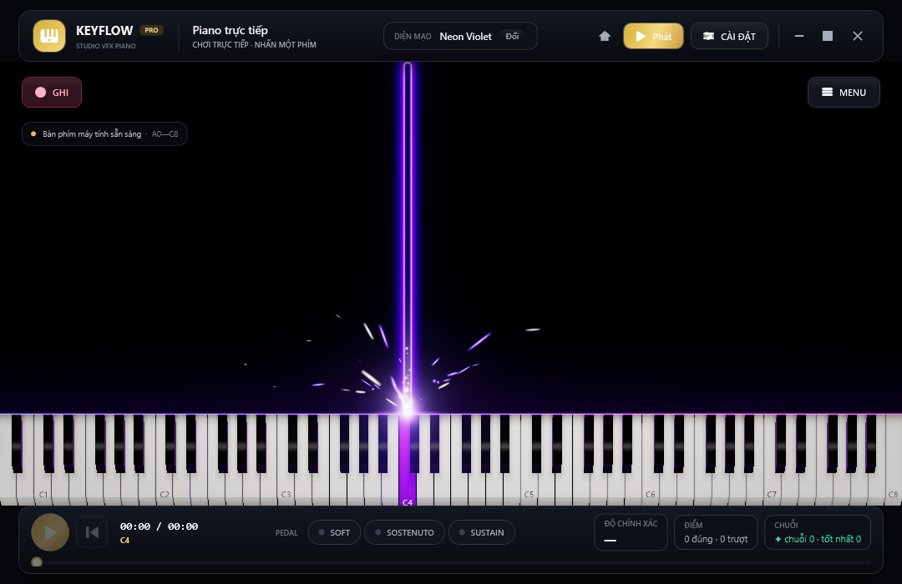
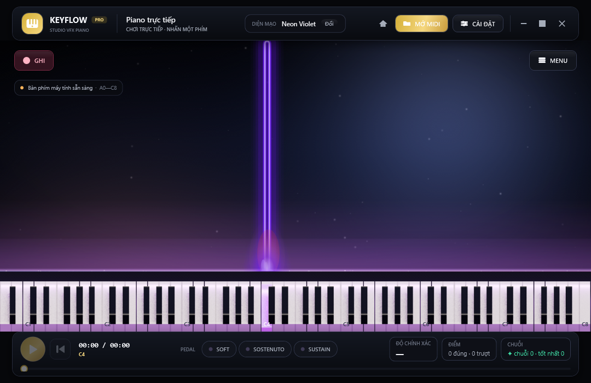
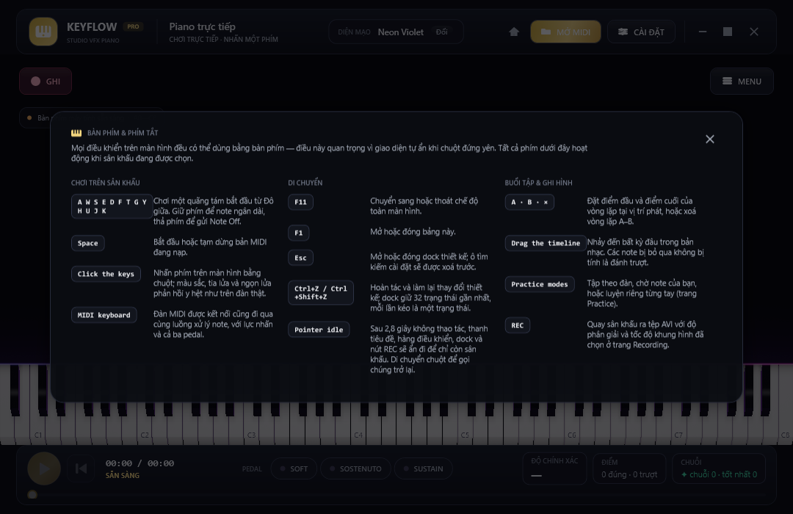
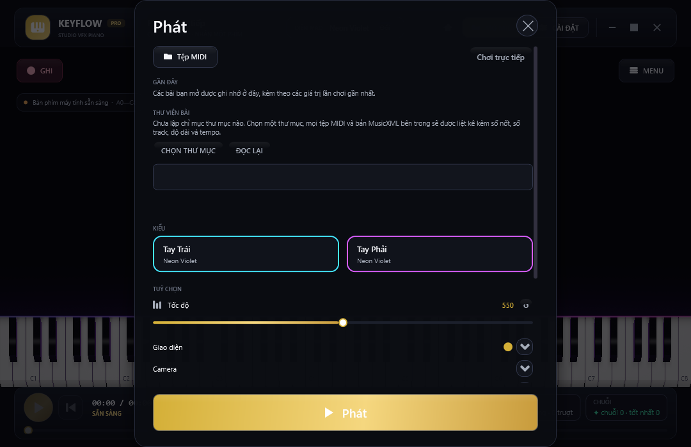
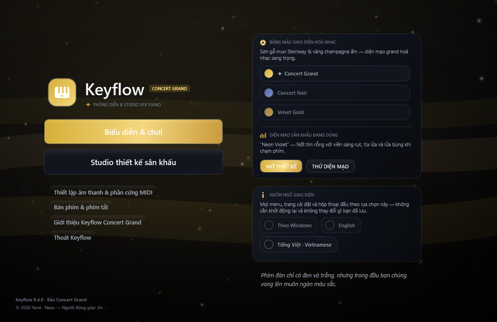
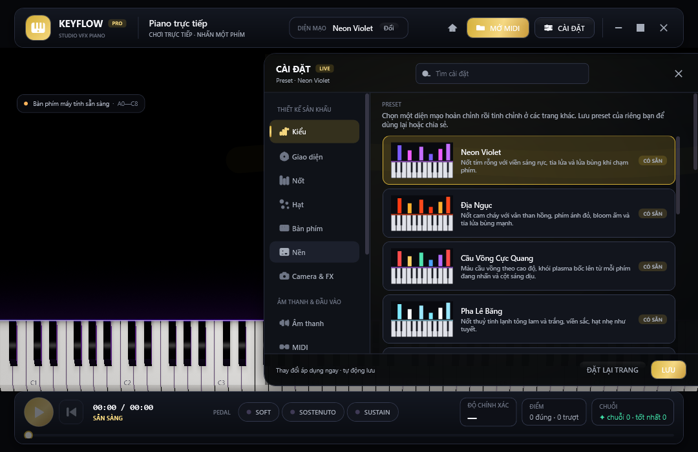
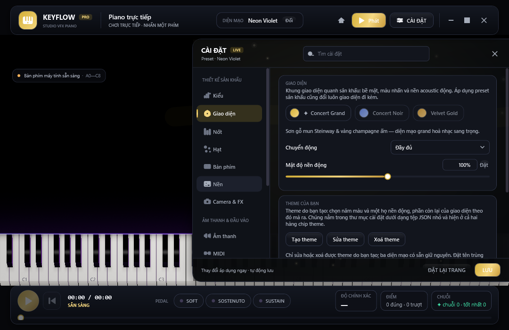
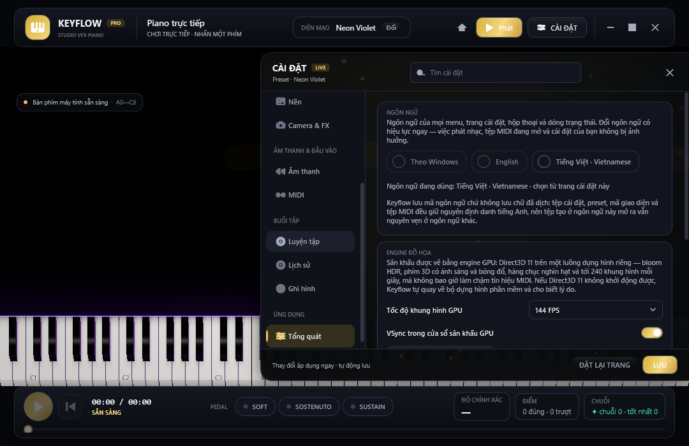

# Keyflow · Piano Performance & Concert VFX Studio

> **English version: [README.en.md](README.en.md)** · Bản dưới đây là bản gốc tiếng Việt. Hai tệp là
> cùng một tài liệu, cùng ảnh (do CI render) và cùng bảng tham số dòng lệnh; `tools/check_sources.py`
> kiểm cả hai nên không bản nào lệch khỏi bản kia.

Keyflow là ứng dụng desktop Windows (C# · WPF · .NET 10) để **chơi đàn, luyện tập và làm video piano theo MIDI** với chất lượng trình diễn hoà nhạc. Giao diện có **hai ngôn ngữ — English và Tiếng Việt** — đổi ngay trong ứng dụng, không cần khởi động lại (xem [Đa ngôn ngữ](#đa-ngôn-ngữ)). Sân khấu mặc định là một hội trường tối: nốt rơi theo thời gian, bàn phím 88 phím đổ bóng bằng shader mô phỏng mô hình Unreal (GGX + softbox + ACES), tia lửa nóng sáng nguội dần theo bức xạ nhiệt, sóng cộng hưởng âm học, lửa tại điểm phím gõ và các lớp không khí (bụi acoustic, cánh hoa, đèn sân khấu) có thể bật riêng.

Ảnh dưới đây do **chính ứng dụng render** trong CI (`--snapshot`) với `--lang=vi`, nằm trong `docs/previews/vi/` và được cập nhật tự động — không phải ảnh dàn dựng (bản tiếng Anh có bộ ảnh riêng ở `docs/previews/en/`):



*Sân khấu live: nốt rơi, đường chạm phát sáng, bàn phím ray-traced và transport dưới cùng.*



*Cùng sân khấu với một ảnh nền do người dùng chọn: ảnh phủ kín khung (crop giữa, không méo tỉ lệ) và bị*
*làm tối ở mức mặc định 30/100 nên nốt vẫn đọc được. Ảnh nền ở đây là `docs/samples/stage-backdrop.png` — repo tự sinh bằng*
*`tools/make_stage_background.py` để ảnh minh hoạ vừa tất định vừa không dính bản quyền của người khác.*

| Bàn phím & phím tắt | Hộp thoại Play |
| --- | --- |
|  |  |

| Menu khởi động (thẻ giao diện có cả chọn ngôn ngữ) | Dock thiết kế (Style) | Dock thiết kế (Theme) |
| --- | --- | --- |
|  |  |  |

> **Ảnh trong README do chính ứng dụng render** trong CI (`--snapshot`). Muốn làm mới sau khi sửa
> giao diện: xem [Tạo lại ảnh giao diện](#tạo-lại-ảnh-giao-diện).

## Mục lục

- [Bắt đầu nhanh](#bắt-đầu-nhanh) · [Yêu cầu hệ thống](#yêu-cầu-hệ-thống)
- [Cài đặt công cụ](#cài-đặt-công-cụ) · [Tải mã nguồn](#tải-mã-nguồn) · [Biên dịch và chạy](#biên-dịch-và-chạy)
- [Thiết lập lần đầu](#thiết-lập-lần-đầu) · [Bắt đầu sử dụng](#bắt-đầu-sử-dụng)
- [Bàn phím & thao tác nhanh](#bàn-phím--thao-tác-nhanh)
- [Chức năng](#chức-năng) · [Đa ngôn ngữ](#đa-ngôn-ngữ) · [Bản đồ giao diện](#bản-đồ-giao-diện) · [Giới hạn hiện tại](#giới-hạn-hiện-tại)
- [Tạo lại ảnh giao diện](#tạo-lại-ảnh-giao-diện) · [Đóng gói và xuất file .exe](#đóng-gói-và-xuất-file-exe)
- [Kiểm thử](#kiểm-thử) · [Tài liệu kỹ thuật](#tài-liệu-kỹ-thuật) · [Cấu trúc chính](#cấu-trúc-chính) · [Giấy phép](#giấy-phép)

## Bắt đầu nhanh

Đã quen với .NET? Toàn bộ quy trình gói gọn trong vài lệnh PowerShell (chi tiết từng bước ở các mục bên dưới):

```powershell
winget install --id Git.Git -e; winget install --id GitHub.GitLFS -e; winget install --id Microsoft.DotNet.SDK.10 -e
git lfs install
git clone https://github.com/lxmtuu/PianoPath.git; cd PianoPath; git lfs pull
dotnet run --project .\PianoPath.csproj -c Release    # biên dịch rồi mở ứng dụng
.\publish.ps1 -Zip                                    # đóng gói publish\win-x64\PianoPath.exe + file ZIP để gửi đi
```

Nếu máy chặn script PowerShell, chạy `Set-ExecutionPolicy -Scope Process Bypass` trước `.\publish.ps1`.

## Yêu cầu hệ thống

| Thành phần | Yêu cầu | Ghi chú |
| --- | --- | --- |
| Hệ điều hành | Windows 10 (khuyến nghị 22H2) hoặc Windows 11, 64-bit | Ứng dụng dùng WPF và WinMM nên chỉ chạy trên Windows. |
| Để **chạy bản đã đóng gói** | Không cần cài gì thêm với bản self-contained; bản framework-dependent cần **.NET 10 Desktop Runtime (x64)** | Xem [Đóng gói và xuất file .exe](#đóng-gói-và-xuất-file-exe). |
| Để **biên dịch từ mã nguồn** | **.NET 10 SDK** (10.0.100 trở lên), **Git** và **Git LFS** | SoundFont `Assets/ConcertGrand.sf2` (~113 MiB) được lưu bằng Git LFS. |
| IDE (tuỳ chọn) | Visual Studio 2026 với workload **.NET desktop development**, hoặc VS Code + extension **C# Dev Kit** | .NET 10 cần Visual Studio 2026 (18.0) trở lên; VS 2022 chỉ mở được dự án khi đã cài .NET 10 SDK và không hỗ trợ đầy đủ. |
| Ổ đĩa | ~1,5 GB cho SDK + ~500 MB cho mã nguồn và bản build | Bản publish self-contained chiếm thêm ~300 MB. |
| Âm thanh | Card âm thanh bất kỳ được Windows nhận (đầu ra `waveOut`) | |
| MIDI (tuỳ chọn) | Đàn/thiết bị MIDI USB được Windows nhận diện | Không có đàn vẫn chơi được bằng bàn phím máy tính hoặc piano ảo. |
| Python (tuỳ chọn) | Python 3.9+ | Chỉ dùng cho `tools/check_sources.py` (kiểm tra tĩnh, không cần .NET SDK). |

## Cài đặt công cụ

Mở **PowerShell** (không cần quyền admin) và cài lần lượt. Nếu đã có sẵn công cụ nào thì bỏ qua bước đó.

1. **Git và Git LFS**

   ```powershell
   winget install --id Git.Git -e
   winget install --id GitHub.GitLFS -e
   ```

   Đóng và mở lại PowerShell rồi kích hoạt LFS một lần cho tài khoản Windows hiện tại:

   ```powershell
   git lfs install
   ```

   Không dùng winget thì tải Git tại <https://git-scm.com/download/win> và Git LFS tại <https://git-lfs.com>.

2. **.NET 10 SDK** (đã bao gồm runtime để chạy ứng dụng)

   ```powershell
   winget install --id Microsoft.DotNet.SDK.10 -e
   ```

   Hoặc tải bộ cài "SDK 10.0.x – Windows x64 Installer" tại <https://dotnet.microsoft.com/download/dotnet/10.0>. Mở lại PowerShell rồi kiểm tra:

   ```powershell
   dotnet --list-sdks      # phải có một dòng 10.0.xxx
   git lfs version         # phải in ra git-lfs/x.y.z
   ```

3. **IDE (tuỳ chọn)**
   - **Visual Studio 2026**: tải Community (miễn phí) tại <https://visualstudio.microsoft.com/>, trong Visual Studio Installer tích workload **.NET desktop development**. Workload này đã kèm .NET 10 SDK.
   - **Visual Studio Code**: cài extension **C# Dev Kit** (Microsoft); extension tự dùng SDK đã cài ở bước 2.

## Tải mã nguồn

```powershell
cd $HOME\source            # hoặc thư mục bất kỳ; tránh đường dẫn có ký tự đặc biệt
git clone https://github.com/lxmtuu/PianoPath.git
cd PianoPath
git lfs pull               # tải SoundFont thật (~113 MiB) nếu clone chưa tự tải
```

Kiểm tra SoundFont đã đúng chưa (phải là 118 398 836 byte ≈ 113 MiB, không phải 134 byte):

```powershell
(Get-Item .\Assets\ConcertGrand.sf2).Length
```

Nếu con số chỉ vài trăm byte thì file mới là **con trỏ LFS**: chạy lại `git lfs install` rồi `git lfs pull`. Ứng dụng vẫn mở được với con trỏ LFS nhưng sẽ báo không nạp được SoundFont; khi đó có thể nạp tạm một tệp `.sf2` khác bằng **LOAD SOUNDFONT** (trang Audio).

Tải ZIP từ GitHub ("Code → Download ZIP") **không** kèm file LFS; hãy dùng `git clone` hoặc tải riêng SoundFont rồi chép vào `Assets\ConcertGrand.sf2`.

## Biên dịch và chạy

### Dòng lệnh (khuyến nghị)

```powershell
dotnet restore .\PianoPath.csproj                        # tải gói (lần đầu)
dotnet build   .\PianoPath.csproj -c Release             # biên dịch → bin\Release\net10.0-windows\PianoPath.exe
dotnet run --project .\PianoPath.csproj -c Release       # biên dịch (nếu cần) và chạy
```

- `dotnet run` không có `-c Release` sẽ dùng cấu hình Debug (`bin\Debug\net10.0-windows\PianoPath.exe`), chậm hơn khi vẽ nhiều hạt.
- Có thể chạy trực tiếp file `.exe` trong thư mục `bin\...`; thư mục `Assets\` (SoundFont, attribution) đã được chép kèm tự động.
- Lần chạy đầu Windows có thể hỏi quyền tường lửa hoặc SmartScreen vì file chưa ký số; chọn *More info → Run anyway*.

### Tham số dòng lệnh

| Tham số | Tác dụng |
| --- | --- |
| `--verify [--verify-log=<file>]` | Chạy bộ kiểm chứng hồi quy rồi thoát (mã thoát `0` = đạt). Xem [Kiểm thử](#kiểm-thử). |
| `--encode-probe=<file.avi>` | Ghi **ba khung** vào một tệp AVI không nén rồi thoát (mã thoát `0` = đã ghi xong, `2` = máy này không ghi được). Đây là **phép thử đường ống mẫu**: AVI không cần bộ mã hoá nào, nên `--verify` chỉ gọi nó khi lượt chạy **không ra được tệp MP4 nào** — và luôn gọi *sau* lượt ghi, không bao giờ trước, để một phép thử có thể treo không chặn mất chính thứ nó định giải thích. |
| `--encode-take=<file.mp4>` | Ghi **một** bản MP4 ngắn 64×48 rồi thoát, in ra từng bước đã làm (mã thoát `0` = đã ghi xong, `2` = máy này không ghi được MP4). Đây là tiến trình con mà `--verify` tự gọi để thử bộ mã hoá: bộ mã hoá là mã gốc, lỗi trong đó có thể làm sập cả tiến trình, nên nếu chạy trong chính lượt kiểm chứng thì sẽ mất luôn kết luận — chạy riêng thì chỉ tốn một dòng SKIP. |
| `--show-settings [--settings-tab=style\|theme\|notes\|particles\|keyboard\|background\|camera\|audio\|midi\|practice\|recording\|general]` | Mở sẵn dock cài đặt ở đúng trang (`general` = trang Ngôn ngữ & ứng dụng). |
| `--snapshot <file.png> [--compact] [--play-preview] [--menu]` | Chụp màn hình rồi thoát (`--compact` = 1080×700, `--play-preview` = nhấn sẵn một nốt, `--menu` = mở menu khởi động). |
| `--play-dialog` / `--shortcuts` | Mở sẵn hộp thoại Play / thẻ phím tắt để chụp ảnh (dùng cùng `--snapshot`). |
| `--lang=<en\|vi>` | Chạy một lần bằng ngôn ngữ chỉ định, **ghi đè** cài đặt đã lưu — dùng để chụp ảnh giao diện tiếng Việt hoặc kiểm bản dịch mà không đụng vào `%LOCALAPPDATA%\Keyflow`. |
| `--background-image=<file.png>` | Vẽ một ảnh cụ thể phía sau bàn phím **chỉ trong lần chạy này**: không bật cờ "đã sửa", không tự lưu, nên `visual-settings.json` giữ nguyên. CI dùng nó để render ảnh minh hoạ tính năng ảnh nền từ ảnh mẫu `docs/samples/stage-backdrop.png` (sinh bởi `tools/make_stage_background.py`) thay vì ảnh chụp của người nào đó. |
| `--settings-dir=<thư mục>` | Đọc/ghi cài đặt và preset người dùng ở thư mục khác (mặc định `%LOCALAPPDATA%\Keyflow`) — hữu ích cho bản portable hoặc khi muốn chụp ảnh từ trạng thái mặc định. Chạy `--verify` luôn tự dùng thư mục tạm nên **không bao giờ ghi đè cài đặt/preset thật của bạn**. |

Ví dụ tạo lại đúng ảnh của README (mười sáu ảnh — mỗi ngôn ngữ một bộ: bản này đọc `docs/previews/vi`, còn
`README.en.md` đọc `docs/previews/en`, `--lang` ghim đúng ngôn ngữ của bộ ảnh):

```powershell
$exe = ".\bin\Release\net10.0-windows\PianoPath.exe"
foreach ($lang in @('en', 'vi')) {
  $set = "docs\previews\$lang"        # mỗi bản README chỉ đọc bộ ảnh của đúng ngôn ngữ đó
  $dir = "$env:TEMP\keyflow-preview-$lang"   # thư mục cài đặt tạm: ảnh chụp luôn là trạng thái chạy lần đầu
  Remove-Item -Recurse -Force $dir -ErrorAction SilentlyContinue   # CI dùng một thư mục tạm riêng cho từng ảnh
  & $exe --snapshot $set\stage-live.png       --compact --play-preview  --lang=$lang --settings-dir="$dir"
  & $exe --snapshot $set\background-image.png --compact --play-preview  --lang=$lang --settings-dir="$dir" --background-image=docs\samples\stage-backdrop.png
  & $exe --snapshot $set\main-menu.png         --compact --menu          --lang=$lang --settings-dir="$dir"
  & $exe --snapshot $set\design-dock.png       --compact --show-settings --lang=$lang --settings-dir="$dir" --settings-tab=style
  & $exe --snapshot $set\theme-dock.png        --compact --show-settings --lang=$lang --settings-dir="$dir" --settings-tab=theme
  & $exe --snapshot $set\play-dialog.png       --compact --play-dialog   --lang=$lang --settings-dir="$dir"
  & $exe --snapshot $set\shortcuts.png         --compact --shortcuts     --lang=$lang --settings-dir="$dir"
  & $exe --snapshot $set\language-dock.png     --compact --show-settings --lang=$lang --settings-dir="$dir" --settings-tab=general
}
```

### Visual Studio 2026

1. **File → Open → Project/Solution**, chọn `PianoPath.csproj` (không có file `.sln`, Visual Studio tự tạo solution tạm).
2. Chọn cấu hình **Release** hoặc **Debug** trên thanh công cụ, nhấn **F5** (chạy kèm debugger) hoặc **Ctrl+F5**.
3. Muốn chạy với tham số (ví dụ `--verify`): **Project → PianoPath Properties → Debug → Open debug launch profiles UI → Command line arguments**.

### Visual Studio Code

1. **File → Open Folder** chọn thư mục `PianoPath`; C# Dev Kit tự nhận `PianoPath.csproj`.
2. Nhấn **F5** → chọn **C#** → **PianoPath**; hoặc dùng terminal tích hợp với các lệnh `dotnet` ở trên.

### Cập nhật phiên bản mới

```powershell
git pull
git lfs pull
dotnet build .\PianoPath.csproj -c Release
```

## Thiết lập lần đầu

1. **Âm thanh**: Keyflow phát qua thiết bị đầu ra mặc định của Windows (`waveOut`). Đổi loa/tai nghe trong *Settings → System → Sound* của Windows trước khi mở ứng dụng.
2. **SoundFont**: grand piano Yamaha đi kèm được nạp tự động khi mở (mất vài giây, nhãn trên trang Audio báo khi xong). Muốn dùng piano khác, mở **SETTINGS → Audio → LOAD SOUNDFONT** và chọn tệp `.sf2`; chọn preset (bank/program) trong danh sách bên dưới. Nút **HALL REVERB** bật/tắt tiếng vang.
3. **Đàn MIDI**: cắm đàn trước khi mở ứng dụng thì Keyflow tự kết nối ngõ vào đầu tiên. Cắm sau thì mở **SETTINGS → MIDI → Refresh devices**. Nhãn thiết bị phía trên bàn phím chuyển sang `MIDI IN · C4` khi nhận Note On. Cùng trang có ngõ ra MIDI (nếu muốn phát qua synth ngoài), metronome và danh sách track.
4. **Giao diện**: chọn preset ở **SETTINGS → Style** (mặc định *Neon Violet*), chọn giao diện hoà nhạc ở **SETTINGS → Theme** (Concert Grand / Concert Noir / Velvet Gold — Concert Grand là mặc định), rồi tinh chỉnh ở các trang Notes / Particles / Keyboard / Background / Camera & FX. Mọi thay đổi áp dụng ngay và tự lưu.
5. **Vị trí lưu cấu hình**: `%LOCALAPPDATA%\Keyflow\visual-settings.json` (cài đặt hiện tại), `%LOCALAPPDATA%\Keyflow\library.json` (danh sách bài mở gần đây kèm giá trị đã dùng cho từng bài), `%LOCALAPPDATA%\Keyflow\history\practice.jsonl` (lịch sử luyện tập) và `%LOCALAPPDATA%\Keyflow\presets\*.json` (preset người dùng) và `%LOCALAPPDATA%\Keyflow\themes\*.json` (theme tự tạo, xem mục Theme tự tạo bên dưới); đổi chỗ bằng `--settings-dir=<thư mục>`. Xoá file `visual-settings.json` hoặc bấm **RESET TO DEFAULT** trong dock để về mặc định; sao chép thư mục `presets` để mang preset sang máy khác (hoặc dùng IMPORT/EXPORT). Id giao diện cũ (`sakura`, `noir`, `velvet`) được tự động chuyển sang id mới khi nạp file cũ.
6. **Ghi hình**: trang **Recording** chọn **Format** — *AVI video*, *PNG sequence (32-bit alpha)* (chuỗi khung PNG có kênh trong suốt để ghép vào Premiere/Resolve/OBS) hoặc *MP4 (H.264 + AAC)* (một tệp đã có luôn tiếng, không phải ghép gì thêm), **Resolution** và **Frame rate**; bấm **REC** ở góc sân khấu, chọn nơi lưu rồi bấm lại để dừng. Với AVI, cài một codec MJPEG (ví dụ gói K-Lite) nếu muốn tệp nhỏ hơn, không bắt buộc.

## Bắt đầu sử dụng

1. Ứng dụng khởi động ở **menu hoà nhạc** (Perform & Play / Stage Design Studio / Audio & MIDI Hardware Setup / Keyboard & Shortcuts / About / Exit). Nút **HOME** trên header quay lại menu bất cứ lúc nào.
2. **Live Play**: nhấn một phím trên piano, bàn phím máy tính hoặc đàn MIDI để chỉ hiện nốt vừa chơi. SoundFont grand Yamaha được nạp tự động khi ứng dụng mở; nốt phím máy tính, piano ảo và MIDI sẽ phát tiếng ngay. Nút **HALL** bật/tắt tiếng vang phòng hoà nhạc.
3. Chọn **OPEN MIDI** để mở bài `.mid`/`.midi` hoặc bản nhạc **MusicXML** (`.musicxml`, `.xml`, `.mxl` — tệp nén đọc qua `META-INF/container.xml`). Với MusicXML, **điểm chia tay đọc từ khuông nhạc** (khuông 1 = tay phải, khuông 2 = tay trái, hoặc mỗi tay một `part`) nên không phải đoán, và giá trị đó được nhớ cho bài đó trong `library.json`. Việc nhấn phím không bắt đầu bài; bấm Play hoặc Space mới chạy các nốt trong MIDI theo playhead. Hộp thoại **Perform & Play** giữ danh sách **RECENT**: các bài đã mở, kèm số nốt, số track, tempo và preset lần trước; bấm một dòng để mở lại đúng điểm chia tay, tốc độ rơi và tempo đã lưu cho bài đó, dấu **×** để quên.
4. Khi bài chạy, nốt đi xuống và chạm đường sáng ngay trên phím đàn. Nhấn phím đàn để chơi cùng và nhận phản hồi đúng/sai.
5. Nếu đã cắm đàn MIDI khi mở ứng dụng, Keyflow tự kết nối ngõ vào đầu tiên tìm thấy. Khi cắm sau, mở **SETTINGS → MIDI → Refresh devices**; ứng dụng tự chọn và kết nối đàn mới. Nhãn xanh phía trên bàn phím đổi thành `MIDI IN · C4` khi nhận Note On. Trong dock cài đặt (nút **SETTINGS** hoặc phím `Esc`) chọn thiết bị vào/ra khác, chế độ tập, tempo, track, metronome và điểm đầu/cuối vòng lặp.

Keyflow đi kèm YDP Grand Piano SF2 từ FreePats, dùng multisample Yamaha Disklavier Pro; preset grand acoustic được chọn sẵn. Engine phát stereo 44.1 kHz, phản hồi nốt nhấn/nhả và ba pedal MIDI, cùng hall reverb có thể bật/tắt. Có thể thay bằng SoundFont `.sf2` riêng. MIDI output là đường âm thanh bổ sung nếu chọn thiết bị MIDI ngoài.

## Bàn phím & thao tác nhanh

Thẻ **F1** trong ứng dụng liệt kê đúng bảng này (ảnh ở đầu README), không cần mở tài liệu:

| Nhóm | Phím / thao tác | Tác dụng |
| --- | --- | --- |
| Chơi nhạc | `A W S E D F T G Y H U J K` | Một quãng tám từ nốt giữa (C4); nhấn giữ để duy trì nốt, thả ra để gửi Note Off. |
| Chơi nhạc | `Space` | Phát/tạm dừng bài MIDI đang mở. |
| Chơi nhạc | Click chuột lên phím đàn | Chơi phím ảo với đầy đủ phản hồi màu, tia lửa, lửa. |
| Chơi nhạc | Đàn MIDI | Velocity, Note On/Off và ba pedal (`CC 64/66/67`) đi vào cùng luồng phản hồi. |
| Điều hướng | `F11` | Bật/tắt toàn màn hình. |
| Điều hướng | `F1` | Mở/đóng thẻ phím tắt. |
| Điều hướng | `Esc` | Mở/đóng dock cài đặt (nếu đang gõ trong ô tìm kiếm, `Esc` xoá nội dung tìm trước; nếu thẻ phím tắt đang mở thì đóng thẻ trước). |
| Điều hướng | `Ctrl+Z` / `Ctrl+Shift+Z` | Hoàn tác / làm lại thay đổi trong bàn thiết kế. Dock giữ **32 trạng thái** gần nhất; một lần kéo slider (hoặc một đợt chỉnh liên tục) tính là **một** bước, và `Ctrl+Z` không giành quyền hoàn tác của ô đang gõ. |
| Điều hướng | Để chuột yên ~2,8 giây | Toàn bộ giao diện (thanh trên/dưới, Menu, REC và cả dock nếu đang mở) tự ẩn, chỉ còn đàn, nền và nốt đang chạy. Di chuyển chuột để hiện lại đúng những gì vừa ẩn. Giao diện không tự ẩn khi đang kéo slider, mở danh sách chọn, mở bảng chọn màu, đang mở thẻ phím tắt, hoặc khi gõ phím trong bảng cài đặt. |
| Phiên làm việc | **A**, **B**, **×** (thanh thời gian) | Đặt/xoá vòng lặp A–B tại playhead. |
| Phiên làm việc | Kéo thanh thời gian | Tua bài; nốt bị bỏ qua không tính là miss. |
| Phiên làm việc | Trang Practice | Follow along, Wait for my note, Right hand only, Left hand only; tempo 50–150%. |
| Phiên làm việc | **REC** | Ghi sân khấu ra AVI, ra thư mục khung PNG 32-bit (có alpha), hoặc ra **MP4 có luôn âm thanh trong tệp**, theo định dạng/độ phân giải/fps đã chọn ở trang Recording. |

## Chức năng

### Sân khấu & hiệu ứng hình ảnh

| Nhóm | Chi tiết |
| --- | --- |
| Nốt | 4 kiểu (Solid / Neon outline / Glass / Fire có vân cháy animation), 5 chế độ màu (gradient theo cao độ với 6 palette hoặc màu đầu–cuối tuỳ chỉnh, theo tay với điểm chia đổi được, theo track MIDI với bảng 8 màu, cầu vồng theo cao độ, cầu vồng theo thời gian), độ rộng, bo góc, độ dài tối thiểu, khe hở, đổ bóng 3D, tên nốt in trên thanh, tint, bloom, độ sáng/dày viền, glow cạnh trước, khúc xạ, tốc độ rơi và **hướng di chuyển** (Down: rơi xuống chạm phím rồi chìm dưới đường chạm; Up: sinh ra tại phím theo tiếng nốt và bốc lên khỏi đỉnh sân khấu — tia lửa, lửa, vòng sóng vẫn bung tại phím), falling FX (7 kiểu vệt + pulse + ghost), hold FX (bar/breath/rung/arc điện), release FX (6 kiểu) và smart modulators (velocity/octave/zone/pedal/tempo/audio). |
| Hạt & lửa | Tia lửa incandescent có physics đầy đủ (gravity, drag, vector field…), wisps plasma bốc lên từ phím đang giữ (mật độ, tốc độ, chiều cao, độ rộng, nhiễu loạn, glow), lửa theo nốt (cường độ, chiều cao, màu ấm hoặc theo nốt, cháy tiếp khi giữ phím rồi tắt dần), vòng sóng va chạm, sóng impact (Ring/Shockwave/Ripple + chớp Flash/Lightning/Plasma theo lực nhấn), 5 kiểu nổ hạt, 5 kiểu morph (xem docs/EFFECTS-REDESIGN.md). |
| Bàn phím | 88 phím vẽ bằng **shader ray-trace**: BRDF GGX/Smith/Schlick, softbox có penumbra thật, contact occlusion trong khe phím, IBL môi trường, đèn màu hắt từ phím đang kêu, tonemap ACES filmic (Off/Fast/Balanced/Cinematic + key light, bóng, occlusion, gloss, rim, emission, exposure, tilt camera). Kiểu Classic / Studio 3D / Glass, chiều cao, độ dài phím đen, nhãn phím, bóng nắp đàn, dải nỉ đỏ, độ lún khi nhấn. Phím của nốt MIDI đang phát cũng sáng, không chỉ phím người chơi nhấn. Bàn phím bake một lần rồi cache, mỗi phím kêu chỉ vẽ lại một tile nhỏ nên giữ được 60 fps. |
| Nền | Màu đặc / ảnh (PNG, JPEG, BMP, GIF, TIFF + làm tối 0–100) / Green screen — thử ngay với ảnh mẫu `docs/samples/stage-backdrop.png` hoặc chạy `--background-image=<file.png>`; aura gradient, sao, guide lanes, vignette, horizon glow, light beam; màu và đường halo, cùng 4 lớp ambient độc lập (Energy/Nature/Light/Cosmic). |
| Camera & FX | Parallax, zoom, khung hình, saturation, contrast, bloom. |
| Lớp phủ camera | Trang **Camera & FX** có thẻ **WEBCAM OVERLAY**: công tắc **Camera overlay** vẽ một camera trực tiếp hoặc một tệp video (chạy lặp) lên sân khấu như một cửa sổ nhỏ — chọn camera trong danh sách máy đang có (**REFRESH CAMERAS** đọc lại), **USE CAMERA** / **CHOOSE VIDEO…** để đổi nguồn, cùng **Corner** (bốn góc), **Size** (15–60% chiều rộng sân khấu), **Opacity**, **Mirror** và **Key tolerance** (0 = tắt key, 100 = rộng nhất) để key màu xanh lá thuần — đúng màu của preset **Green Screen** — nên phông xanh biến mất còn người chơi ở lại. Dòng trạng thái dưới các hàng nói rõ đang mở camera nào, đang chạy tệp nào, hay vì sao không chạy được (máy không có camera, máy không có Media Foundation). Khung hình đọc bằng Media Foundation (`Camera/`) trên luồng riêng và lên sân khấu ở 30 fps nên không chặn vẽ. Đây là **lớp phủ hình**, chưa phải theo dõi bàn tay. |
| Lớp không khí (tuỳ chọn) | Hạt acoustic lơ lửng trong không gian hoà nhạc (số lượng, màu), bật ở **Theme → Acoustic motes**; 4 lớp ambient độc lập (Energy/Nature/Light/Cosmic) ở trang **Background** — sét, mưa, thiên hà, matrix... Mặc định **tắt** để sân khấu sạch. |
| Hiệu năng | Mọi animation (nốt rơi, cánh hoa, backdrop, chuyển panel) chạy trên **cùng một đồng hồ vsync** (`FrameClock`) nên không rung, không vẽ thừa khung hình; đồng hồ tự nhả khi sân khấu đứng yên. Mức chuyển động Off/Calm/Full, tôn trọng thiết lập giảm animation của Windows. |

### Âm thanh, MIDI & luyện tập

| Nhóm | Chi tiết |
| --- | --- |
| SoundFont | Tự nạp grand piano Yamaha đi kèm; cho phép nạp `.sf2` khác, liệt kê bank/program, chọn preset, đa âm và phát PCM stereo 44.1 kHz qua `waveOut`. |
| Reverb | Hall reverb stereo chạy thời gian thực, bật mặc định, có nút bypass độc lập; reverb vẫn vang sau khi nhả phím. |
| Pedal | Ba pedal MIDI tiêu chuẩn: una corda/soft (CC 67, giảm gain và làm dịu âm), sostenuto (CC 66, giữ những nốt đang nhấn khi pedal xuống), sustain/damper (CC 64, giữ tiếng sau khi nhả phím). Nút trên màn hình, pedal MIDI vào SoundFont và MIDI output đều được kết nối; độ dài thanh nốt live chỉ tăng trong lúc phím được giữ, còn pedal chỉ tác động lên tiếng đàn. |
| MIDI vào | Phím máy tính, click/giữ phím ảo và WinMM MIDI input; tự mở MIDI input đầu tiên, giữ lựa chọn sau khi làm mới danh sách, hiển thị tín hiệu/nốt nhận được. |
| MIDI ra | WinMM MIDI output để gửi Note On/Off tới synthesizer hoặc thiết bị MIDI đã chọn. |
| Bài MIDI | Đọc **định dạng 0/1/2** (format 2 là các chuỗi độc lập nên được chạy lần lượt, hết chuỗi này tới chuỗi kia), **độ chia PPQ hoặc SMPTE** (SMPTE là thời gian tuyệt đối: tempo chỉ đổi nhịp của metronome chứ không đổi vị trí nốt), tempo map, nhịp, tên track, thời lượng/velocity nốt (bỏ qua kênh trống 10), solo/mute và đổi màu từng track, tua, tempo, loop A–B, metronome theo tempo map (nhấn mạnh phách đầu ô nhịp). |
| Luyện tập | Follow along, Wait for my note, Right hand only, Left hand only; chờ nốt đúng mới đi tiếp. Tua, đổi chế độ/track hoặc lặp A–B không tính các nốt đã bỏ qua là miss; mỗi vòng lặp A–B được chấm lại từ đầu. |
| Điểm số | Thống kê hit/miss, accuracy, streak và phản hồi đúng thời điểm trên footer. |

### Giao diện, preset & ghi hình

| Nhóm | Chi tiết |
| --- | --- |
| Ba giao diện hoà nhạc | **Concert Grand** (Steinway ebony & vàng champagne — mặc định), **Concert Noir** (obsidian & platinum), **Velvet Gold** (nhung đỏ mahogany & đồng thau). Đổi theme là đổi toàn bộ surface/accent qua `DynamicResource` trong một khung hình, không cần mở lại app; backdrop động (sóng cộng hưởng, quầng cực quang, nhung) đi kèm từng theme. |
| Theme tự tạo | Trang Theme → **USER THEMES**: **CREATE / EDIT / DELETE** mở xưởng theme — đặt tên, chọn họ nền động (Acoustic/Obsidian/Imperial) và **năm màu** (màu nhấn, màu nhấn phụ, phát sáng, bề mặt, hạt sáng); hai mươi token còn lại của giao diện được **suy ra** từ năm màu đó nên không thể tạo ra bảng màu chữ không đọc được. Xưởng có dải xem trước cập nhật ngay khi gõ. Theme lưu thành tệp JSON nhỏ trong `%LOCALAPPDATA%\Keyflow\themes\*.json` (sửa tay được) và hiện cạnh ba theme có sẵn ở cả hai hàng chip. |
| Preset sân khấu | 14 look có sẵn: Neon Violet (mặc định), Inferno, Aurora Rainbow, Ice Crystal, Two Hands, Classic Roll, Green Screen, Sakura Nocturne, Concert Gold, Moonlight Sonata, Galaxy Voyage, Electric Storm, Ocean Depths, Retro Arcade — mỗi preset gợi ý luôn giao diện hợp nhất. Preset người dùng lưu trong `%LOCALAPPDATA%\Keyflow\presets\*.json` với SAVE AS / DELETE / IMPORT / EXPORT; header hiển thị tên preset và dấu `*` khi đã chỉnh sửa. |
| Thư viện theo thư mục | Hộp thoại Play có mục **LIBRARY**: **CHOOSE FOLDER** để lập chỉ mục một thư mục (mỗi tệp MIDI/MusicXML được đọc bằng chính reader của app để lấy số nốt, số track, độ dài, tempo), **RESCAN** đọc lại (chỉ đọc lại tệp đã thay đổi), ô tìm kiếm lọc theo tiêu đề/tên tệp/thẻ, mỗi dòng có nút mở bài, thông tin bài và các **thẻ** (thêm bằng `+ TAG…`, bỏ bằng cách bấm thẻ). Thư mục được **theo dõi** nên thêm/xoá/đổi tệp là danh sách tự cập nhật; chỉ mục và thẻ nằm trong `library-index.json`, tệp hỏng đọc thành thư viện rỗng thay vì lỗi. |
| Bóng luyện tập & biểu đồ | Trang History có **PRACTICE CHART** (mỗi ngày một cột trong 14 ngày gần nhất, cột cao theo độ chính xác của ngày đó, ngày không luyện vẫn nằm trên trục, dòng dưới in số lượt và trung bình của cả cửa sổ) và **GHOST OF THIS SONG** (mỗi chấm là một nốt đã chấm điểm của lượt chơi: ngang theo vị trí trong bài, dọc theo cao độ, xanh = trúng, đỏ = trượt; lượt tốt nhất và lượt mới nhất dùng chung trục nên so được với nhau; bài chưa chơi lần nào thì in lý do thay vì khung rỗng). |
| Preset thumbnail | Mỗi preset trong danh sách Style có thumbnail mini render thật (nền tối, phím trắng/đen, vạch nốt theo palette). |
| Lớp khuông nhạc | **Sheet music** (thẻ LAYERS, mặc định tắt) vẽ khuông đôi phía trên piano roll và chạy theo playhead: mỗi nốt nằm trên khuông mà **điểm chia tay** xếp cho nó, khoá nhạc 𝄞/𝄢 (khi font có glyph, không thì chữ G/F), **hoá biểu suy ra từ chính bài** (tương quan Krumhansl–Kessler trên thời lượng vang của từng cao độ; bài không khớp tông nào thì viết theo C major) nên ký hiệu viết đúng tông đó — F major viết B♭ trên dòng B chứ không phải A♯ trên dòng A — và dấu hoá chỉ hiện khi ô nhịp thật sự cần: nốt đã có trong hoá biểu thì trơn, dấu thăng/giáng giữ đến hết ô nhịp của chính khuông đó, nốt tự nhiên lấy lại bằng dấu hoàn ♮, dòng kẻ phụ khi nốt ra ngoài khuông, vạch nhịp theo lưới phách của chính bài (ô nhịp đậm hơn), vòng sáng quanh nốt đang vang và nốt đã đánh/đánh trượt đổi màu. Nốt ngắn còn được **nối đuôi theo phách** (beaming) như bản khắc nhạc: độ dài một phách lấy từ chính lưới phách của bài, nốt đủ ngắn thì mọc **cờ** (móc đơn/đôi/ba), hai nốt cạnh nhau trong cùng một phách và cùng một tay thì **chung một đuôi nối**, nốt nằm giữa hai nốt đó làm đứt đuôi, và nốt rỗng (nốt trắng trở lên) không bao giờ vào đuôi nối dù nhịp có nhanh. Mỗi tay là một bè, nên **chỗ tay kia im lặng được viết bằng dấu nghỉ** trên khuông của chính tay đó, với hình dấu nghỉ đúng độ dài khoảng lặng (tính theo phách của bài: nốt móc đơn/đôi, nốt đen, nốt trắng, nốt tròn), và khoảng lặng liền mạch chỉ viết **một** dấu nghỉ chứ không phải một dấu cho mỗi nốt tay kia đánh, còn khoảng lặng dài được viết **theo từng ô nhịp**: tay im suốt bốn ô thì ra bốn dấu nghỉ, ô nào im từ đầu tới cuối ô đó là **dấu nghỉ tròn** (đúng cách bản khắc viết một ô nhịp im lặng, bất kể nhịp gì), và phần lẻ ở hai đầu — chỗ tay bắt đầu hoặc thôi đánh giữa ô — giữ hình theo độ dài của chính nó. Toàn bộ phần tính trước của khuông (dấu hoá, đuôi nối, dấu nghỉ — `SheetLayer.Plan`) được **giữ lại giữa các khung hình** và chỉ tính lại khi đổi bài, đổi lưới phách, đổi điểm chia tay hay đổi tông, nên vẽ 60 khung/giây không phải tính lại từ đầu. Nốt bị **vắt qua vạch nhịp** (cùng cao độ, nốt sau bắt đầu đúng chỗ nốt trước dứt) được nối bằng **dấu luyến**: một đường cong nối hai đầu nốt, vẽ **về phía đuôi quay đi** (đuôi lên thì cong xuống dưới), và nốt được luyến **không ghi lại dấu hoá** — dấu hoá đi theo dấu luyến qua cả vạch nhịp, nên nốt sau nó trong ô nhịp mới vẫn được ghi đúng. **Hợp âm được ghép thành một cột nốt**: các nốt cùng lúc trong cùng một tay là **một sự kiện** — một đầu nốt cho mỗi cao độ nhưng **chung một đuôi** (đuôi dài từ đầu nốt xa nhất qua giữa cột, cờ theo nốt ngắn nhất), và đuôi nối đi qua hợp âm như đi qua một nốt. `SheetLayer.Chords`/`Streams` cũng gom bài thành **hai dòng đọc** (mỗi tay một dòng, mỗi sự kiện một nhóm nốt xếp theo cao độ) và đưa vào phần tính trước `Plan` — nền cho cách vẽ đánh dấu theo ngón tay. **Chỗ dòng nhạc đổi tay** cũng được viết ra: nốt của tay này dứt đúng chỗ nốt tay kia bắt đầu (trong cùng khoảng chờ mà dấu luyến cho phép) là **một câu nhạc đổi tay**, nên hai đầu nốt được nối bằng **một đường cong vắt qua khoảng giữa hai khuông** (`SheetLayer.Slurs`/`Slur`) — cong theo hướng dòng nhạc đi để ôm lấy khoảng giữa hai khuông chứ không cắt qua khuông nào. Hai nốt cách nhau **một quãng tám trở lên** là hai bè (bè trầm và giai điệu) chứ không phải đổi tay, và **hợp âm không đổi tay**: một khối nốt là hợp âm mới chứ không phải dòng nhạc đi tiếp. Đây vẫn là lớp đọc nốt chứ chưa phải bản khắc nhạc đầy đủ: mỗi khuông mới có một bè, chưa vẽ nhiều bè trên cùng một khuông hay dấu luyến/articulation đọc từ chính bản nhạc. |
| Nhập bài | **MIDI** (`.mid`, `.midi`) và **MusicXML** (`.musicxml`, `.xml`, `.mxl` — tệp nén đọc qua container): nhạc cụ, số phách trong ô nhịp, tempo map, nhịp đổi giữa bài, hợp âm (`<chord/>`), `backup`/`forward`, tên bè; điểm chia tay của bản nhạc đọc thẳng từ `<staff>` (khuông 2 = tay trái) nên không phải suy luận, và được ghi nhớ theo tệp. |
| Menu & hộp thoại | Menu khởi động kiểu hoà nhạc (theme chip, thẻ "stage look", TRY A LOOK xoay vòng preset) và hộp thoại **Play** trước khi diễn: chọn MIDI File / Live Play, hai card Left/Right Hand viền màu tay, thanh Speed, danh sách lớp OPTIONS (Camera, Background, Notes, Embers, Halo, Flame, Keys, Extras) — mỗi toggle ánh xạ 1‑1 vào setting thật của stage, chevron mở đúng trang dock. |
| Thẻ F1 | Bảng phím tắt trong ứng dụng, chia ba nhóm (Play the stage / Move around / Session & capture). |
| Hoàn tác / làm lại | Mọi thay đổi trong dock đi vào lịch sử 32 bước: `Ctrl+Z` lùi, `Ctrl+Shift+Z` (hoặc `Ctrl+Y`) tiến. Ảnh chụp là JSON của `PianoVisualSettings` nên đi qua đúng `CopyFrom`/`Clamp` như khi bạn tự đặt lại giá trị; đổi preset cũng là một mốc; còn **nhập hồ sơ** thì mở một lịch sử mới — trạng thái vừa nhập là mốc đầu tiên nên `Ctrl+Z` không lùi được qua nó. |
| Hồ sơ cài đặt | **IMPORT/EXPORT PROFILE…** ở trang General gói cả ba thứ vào một tệp `Keyflow.profile.json`: cài đặt sân khấu, ngôn ngữ và giao diện. Kéo‑thả tệp hồ sơ vào cửa sổ là áp dụng; thả tệp `.mid`/`.midi` để mở bài, thả ảnh để đặt nền. Ngôn ngữ không có trong bản build sẽ rơi về tiếng Anh chứ không để giao diện nửa dịch. |
| Trợ năng | Mọi nút chỉ có glyph (loop **A**/**B**/**×**, ↺, các nút cửa sổ, chevron của hộp thoại Play) đều có **tên cho trình đọc màn hình**, lấy từ chính tooltip đã dịch nên đổi ngôn ngữ là đổi theo; các hàng sinh tự động của dock (slider, ô số, combo, swatch màu) cũng được đặt tên theo nhãn của hàng. **Tab** giữ tiêu điểm trong dock (`KeyboardNavigation.TabNavigation="Cycle"`) và đi qua từng trang theo đúng thứ tự các hàng được in; ở cửa sổ nhỏ (1080×700) mọi hàng vẫn nằm trong cột cuộn và mọi điều khiển vẫn nằm trong thẻ của hàng (`VerifyDockAccessibility`), và khi Windows bật **high contrast** thì khung giao diện vẽ bằng chính màu hệ thống (`SystemColors`) còn theme đã chọn vẫn được giữ nguyên trong file cài đặt — Windows báo đổi lúc nào là cửa sổ vẽ lại ngay lúc đó (`SystemParameters.StaticPropertyChanged`). |
| Đa ngôn ngữ | Hai ngôn ngữ đóng gói: **English** và **Tiếng Việt**, chọn ở trang General hoặc bằng chip ngay trên menu khởi động; đổi là toàn bộ nhãn, hộp thoại, thông báo lỗi và menu ngữ cảnh vẽ lại trong khung hình hiện tại. Không có nhãn tiếng Anh lọt sang tiếng Việt: `tools/check_sources.py` chứng minh hai bảng cùng tập khoá và `--verify` đổi ngôn ngữ thật trên cửa sổ đang mở. |
| Ghi âm thanh | Trang Recording có công tắc **Record audio**: bản AVI/chuỗi PNG kèm tệp WAV stereo 16-bit ngay cạnh video (`take.wav` / `audio.wav` trong thư mục khung) để ghép sau, còn bản **MP4 nhận đúng những mẫu đó vào thẳng trong tệp dưới dạng AAC** nên không còn gì phải ghép. Âm thanh lấy từ chính các khối mà engine render (tap này chỉ được gắn trong lúc ghi nên lúc diễn bình thường không tốn gì); dòng thông tin đổi theo thực tế từng máy (**có SoundFont** → nói rõ đường tiếng đi đâu, **không có SoundFont** → nói rõ bản ghi sẽ không có tiếng). Với AVI, nút REC vẫn in ra dòng `ffmpeg -i video.avi -i take.wav -c:v copy -c:a aac take.mp4` để ghép hai tệp. |
| Ghi hình | REC ghi khung hình sân khấu theo độ phân giải (cửa sổ/720p/1080p) và 15–60 fps, canh theo đồng hồ thật: **AVI** một tệp, hoặc **chuỗi PNG 32-bit** vào một thư mục (mỗi khung một tệp `frame-000001.png`, kèm `sequence.json` ghi kích thước/khung hình mỗi giây/số khung và dòng lệnh ffmpeg để dựng lại thành video alpha). Bật **Transparent background** cho chuỗi PNG để sân khấu bỏ các lớp tô đục — nền chụp trong suốt, cây đàn và hiệu ứng vẫn còn (tắt lớp Background nếu chỉ muốn mỗi cây đàn). **Đường tiếng**: bật **Record audio** (mặc định bật, trang Recording) thì REC ghi thêm một tệp **WAV stereo 16-bit 44,1 kHz** cạnh video (trong thư mục khung nếu ghi chuỗi PNG) — đúng những khối PCM mà engine phát ra (hoặc tự render khi máy không có thiết bị ra âm thanh, nên vẫn ghi được đủ độ dài), và hộp thoại sau khi dừng ghi in độ dài cùng **dòng lệnh ffmpeg** ghép thành MP4. **MP4 (H.264 + AAC)** ghi bằng **Media Foundation sink writer** đã có sẵn trong Windows — không thêm thư viện, không cần ffmpeg: khung hình của sân khấu được chuyển sang **NV12** (BT.601) rồi mã hoá H.264 với bitrate tính theo kích thước × fps (sàn 2 Mbps, trần 24 Mbps), còn PCM của engine được mã hoá AAC ngay trong cùng tệp, mỗi mẫu mang đúng mốc thời gian của nó (`Mp4Recorder.FrameTime`/`AudioTime`). Máy không có bộ mã hoá H.264 thì báo rõ bằng câu có mã lỗi thay vì ghi ra tệp hỏng; máy có H.264 nhưng thiếu bộ mã hoá AAC vẫn ghi được **phần hình** và hộp thoại nói rõ vì sao thiếu tiếng. Máy chưa nạp SoundFont thì chỉ ghi hình và dòng thông tin nói rõ. Preset **Green Screen** tô nền xanh lá thuần để key trong OBS. Máy không có codec MJPEG thì ghi RGB không nén và tự dừng khi chạm giới hạn 2 GB của AVI. |

## Đa ngôn ngữ

Giao diện có hai ngôn ngữ đóng gói — **English** và **Tiếng Việt** — và đổi **ngay trong ứng dụng**, không khởi động lại: mọi nhãn, tooltip, hộp thoại, danh sách combo, thẻ phím tắt F1, menu khởi động và cả thông báo lỗi đều vẽ lại trong khung hình hiện tại.

| Ở đâu | Làm gì |
| --- | --- |
| Trang **General** (dock → nhóm APP) | Chọn **English**, **Tiếng Việt** hoặc **Theo Windows**. Ô mô tả bên dưới ghi rõ ngôn ngữ nào đang chạy và nó được chọn từ đâu. |
| **Menu khởi động** | Thẻ *INTERFACE LANGUAGE* với chip chọn nhanh — mở app lần đầu là đổi được ngay, không phải đi tìm trang cài đặt. |
| Dòng lệnh | `--lang=vi` (hoặc `en`) chạy một lần bằng ngôn ngữ chỉ định, **không** ghi vào `visual-settings.json`. CI dùng cờ này để render ảnh tiếng Việt. |
| Tìm kiếm trong dock | Một hàng khớp cả từ tiếng Anh lẫn từ đã dịch: gõ `speed` hoặc `tốc độ` đều ra cùng slider *Fall speed*. Ngoài nhãn, mỗi hàng còn trả lời **từ đồng nghĩa** (`tempo` → *Fall speed*, `fps` → *Frame rate*, `brighter` → các slider độ sáng) và **tên setting** (`NoteFallSpeed` → `fall`+`speed`), nên không phải nhớ đúng chữ trên nhãn. Nhiều từ khoá là phép **giao**: `speed fall` thu hẹp đúng hàng đó. Phần khớp được **tô màu accent** ngay trong nhãn, và ô tìm kiếm tự nhảy sang trang đầu tiên có kết quả. |

Ảnh chụp trang General khi app chạy tiếng Việt — bộ ảnh tiếng Việt của CI, render với `--lang=vi`:



*Toàn bộ điều hướng, nhãn, chú thích và nút bấm đều là tiếng Việt; tên preset `Neon Violet` vẫn giữ nguyên vì đó là id đã lưu.*

Ba điều nguyên tắc:

- **Id không đổi, chỉ caption đổi.** Giá trị trong `visual-settings.json`, tên preset, id theme, tên thiết bị Windows và tên tệp luôn là tiếng Anh — bật tiếng Việt không làm hỏng preset hay file đã lưu, và một preset đem sang máy tiếng Anh vẫn đọc được.
- **Thiếu bản dịch thì in tiếng Anh**, không in ô trống. Khoá lạ không có trong inventory (tên thiết bị, tên tệp người dùng đặt) đi thẳng tới màn hình nguyên văn.
- **Thêm ngôn ngữ = thêm một tệp bảng.** Sao chép `Localization/Strings.English.cs`, dịch phần giá trị, thêm một dòng vào `Languages.All`; renderer, XAML và `visual-settings.json` không phải sửa gì. `tools/check_sources.py` và `--verify` sẽ chứng minh bảng mới dịch đủ mọi khoá của inventory.

Chi tiết kiến trúc, quy ước dịch và checklist thêm ngôn ngữ: [`docs/LOCALIZATION.md`](docs/LOCALIZATION.md).

## Bản đồ giao diện

Dock cài đặt có **13 trang, xếp thành bốn nhóm theo mục đích** — đây là bố cục duy nhất mà cả code, XAML và bộ kiểm thử cùng đọc (xem `Ui/SettingsPages.cs`):

| Nhóm | Trang | Nội dung |
| --- | --- | --- |
| **STAGE DESIGN** | Style | Preset có sẵn/người dùng + 12 công tắc bật nhanh từng lớp của sân khấu + **mã chia sẻ** (nút COPY CODE / APPLY CODE): cả diện mạo gói thành một dòng văn bản để dán vào chat. Preset người dùng lưu kèm **ảnh xem trước 192×112** chụp chính sân khấu, nên bản xuất/nhập hiện đúng diện mạo ở máy khác; preset cũ hoặc không có ảnh thì danh sách tự vẽ miniature từ cài đặt. **Kệ preset cộng đồng** (`presets/` trong repo, nhúng vào bản build) nằm chung danh sách với nhãn COMMUNITY: áp được như mọi preset nhưng không xoá và không ghi đè được. |
| | Theme | Ba giao diện hoà nhạc, mức chuyển động, mật độ backdrop, hạt acoustic, ba nút "quick look". |
| | Notes | Màu (gradient/tay/track/cầu vồng), hình dáng, glow, hướng và tốc độ rơi, hold FX, smart modulators. |
| | Particles | Emitter tia lửa + physics, wisps plasma, lửa, vòng sóng, sóng/chớp impact, vệt rơi + ghost, hiệu ứng nhả. |
| | Keyboard | Kiểu bàn phím, nhãn phím, nỉ đỏ, chiếu sáng và nhóm **RAY-TRACED SHADING**. |
| | Background | Màu/ảnh/green screen, bầu khí quyển, guide lanes, halo, 4 lớp ambient. |
| | Camera & FX | Parallax, zoom, khung hình, saturation, contrast, bloom, **lớp phủ camera** (camera trực tiếp hoặc video + key xanh). |
| **SOUND & INPUT** | Audio | Nạp SoundFont, chọn preset nhạc cụ, hall reverb. |
| | MIDI | Thiết bị vào/ra, danh sách track (solo/mute/màu), metronome. |
| **SESSION** | Practice | Chế độ tập, tempo, vòng lặp A–B, và **tempo luyện tập tự động**: sai liên tiếp quá ngưỡng thì bài chậm dần 5% mỗi bước, chơi đúng liên tiếp 4 nốt thì nhanh lại 2% và không bao giờ vượt 100%. |
| | History | **Lịch sử luyện tập**: từng lượt chơi của bài đang mở (thời điểm, độ chính xác, nốt đúng/sai, chuỗi dài nhất), lượt tốt nhất của bài đó, nút **EXPORT HTML** xuất báo cáo và **CLEAR HISTORY** xoá. |
| | Recording | Độ phân giải, fps, thông tin tệp đầu ra. |
| **APP** | General | **Ngôn ngữ giao diện** (English / Tiếng Việt / theo Windows), theme, mức chuyển động, thư mục cài đặt. |

Phần còn lại của giao diện:

| Khu vực | Nội dung |
| --- | --- |
| Header | Logo + brand, bài đang mở, chip **LOOK** (preset hiện tại + nút Change), HOME, OPEN MIDI, SETTINGS, thu nhỏ/toàn màn hình/thoát. |
| Sân khấu | Nốt, hiệu ứng, bàn phím, badge thiết bị, nút REC, nút MENU. |
| Footer | Play/Pause, quay lại đầu, thời gian + nốt đang chơi, ba pedal, ACCURACY / SCORE / STREAK, thanh tua + progress. |
| Dock cài đặt | Cột điều hướng **bốn nhóm** + ô tìm kiếm lọc mọi trang (tự nhảy sang trang có kết quả; khớp cả từ tiếng Anh lẫn từ đã dịch — gõ `speed` hay `tốc độ` đều ra cùng slider), mỗi thông số có slider + ô nhập số (chấp nhận đơn vị, dấu phẩy, tên nốt như `C4`) + nút reset, hàng phụ thuộc tự ẩn/hiện, SAVE / RESET PAGE, tự lưu sau 0,65 s. |

## Giới hạn hiện tại

- SoundFont mặc định là YDP Grand Piano của FreePats, xây từ multisample Yamaha Disklavier Pro. Xem `Assets/ATTRIBUTION.txt` để biết tác giả, nguồn và giấy phép CC BY 3.0. File SF2 khoảng 113 MiB.
- Âm thanh nội bộ đọc SoundFont 2 (`.sf2`) không nén. `.sf3` chưa được hỗ trợ; một số phần SF2 nâng cao như modulators, bộ lọc nhạc cụ và hiệu ứng reverb/chorus chưa được tái tạo đầy đủ. Âm thanh vì vậy có thể khác các synthesizer SoundFont chuyên dụng, tùy tệp.
- Bài MIDI **định dạng 0/1/2 và cả hai kiểu độ chia (PPQ lẫn SMPTE) đều đọc được**; phần còn thiếu của lớp nhập bài là MusicXML nâng cao (dấu luyến, repeat, nhiều bè ghép phách) — MusicXML cơ bản đã đọc được, kể cả `.mxl`, điểm chia tay lấy từ khuông, và có **lớp khuông nhạc vẽ trên sân khấu** — bật **Sheet music** ở thẻ LAYERS; khuông này đọc nốt theo cao độ, **tự suy ra hoá biểu của bài**, **nối đuôi nốt ngắn theo phách**, **viết dấu nghỉ cho tay đang im lặng**, **nối dấu luyến nốt vắt qua vạch nhịp**, **ghép hợp âm thành một cột nốt chung đuôi** và **nối một đường cong khi dòng nhạc đổi tay giữa hai khuông**); **lịch sử luyện tập** ghi theo từng lượt chơi (thời điểm, độ chính xác, nốt đúng/sai, chuỗi dài nhất), **giữ luôn từng nốt đã chấm điểm** (vị trí trong bài + cao độ + trúng/trượt, tối đa 256 nốt một lượt) nên trang History vẽ được **biểu đồ 14 ngày** và **bóng (ghost) của bài đang mở** — lượt tốt nhất trên, lượt mới nhất dưới, chấm xanh là trúng, chấm đỏ là trượt — và báo cáo HTML có thêm bảng theo ngày. **Thư viện bài** đã có hai phần: danh sách **RECENT** (`library.json`, 12 bài gần nhất kèm metadata) và **thư viện theo thư mục** — chọn một thư mục là mọi tệp MIDI/MusicXML bên trong (tối đa 3 tầng, 500 tệp) được lập chỉ mục kèm số nốt/track/độ dài/tempo, có ô tìm kiếm (khớp tên tệp, tiêu đề và **thẻ**) và **theo dõi thư mục** nên danh sách tự cập nhật khi bạn thêm hay sửa tệp; chỉ mục nằm ở `library-index.json` và chỉ đọc lại tệp nào đã đổi.
- Điểm chia tay mặc định là C4 = MIDI 60 (Notes → Hand split point) và dùng chung cho màu theo tay lẫn chế độ tập từng tay. Bật **Infer hand split from the song** thì khi mở một tệp MIDI, ứng dụng tự chọn điểm chia theo cách các nốt trải trên bàn phím (gom hai cụm theo thời lượng vang, chỉ nhận khi giữa hai tay có **ít nhất 5 semitone trống** (khoảng một quãng bốn) và mỗi tay chiếm ≥10% thời lượng vang, rồi ưu tiên nốt giữa C4 trong khoảng trống), và **ghi nhớ cho riêng bài đó** nên mở lại không đổi; bài chỉ một tay hoặc hai tay chồng lấn thì giữ nguyên điểm bạn chọn.
- MIDI input vật lý cần đàn/thiết bị tương thích được Windows nhận diện. Nếu chưa cắm thiết bị, dùng bàn phím máy tính hoặc piano ảo.
- Dùng WinMM nên phiên bản này dành cho Windows.
- Định dạng **MP4 (H.264 + AAC)** đã có và mang luôn tiếng trong tệp, nhưng cần bộ mã hoá của chính Windows: máy không có H.264 thì không ghi được MP4, còn máy thiếu AAC thì bản ghi chỉ có hình (hộp thoại nói rõ lý do). AVI vẫn là **phần hình**, tiếng nằm ở WAV cạnh đó để ghép bằng ffmpeg; máy không có codec MJPEG thì AVI dùng RGB không nén và dung lượng sẽ tăng nhanh hơn. Chưa ghi **WebM/VP9 trực tiếp** — đã có **chuỗi PNG 32-bit (alpha)** để ghép hậu kỳ, và `sequence.json` gợi ý sẵn lệnh ffmpeg dựng thành WebM alpha.)
- **Lớp phủ camera** đã có (trang **Camera & FX** → **Camera overlay**): camera trực tiếp hoặc tệp video chạy lặp được vẽ lên sân khấu theo bốn góc, có mirror, opacity và key màu xanh lá. Chưa có **theo dõi bàn tay** — không có gì nhận diện ngón tay hay độ cao bàn tay như trong một số video Piano VFX; muốn cảnh kiểu đó thì quay tay trên phông xanh rồi key bằng chính lớp phủ này, hoặc dùng preset Green Screen và ghép trong OBS. Góc nhìn phối cảnh 3D (perspective) chưa hỗ trợ; sân khấu là piano roll phẳng với parallax nhẹ.
- Shader đổ bóng là **software shader** (CPU đa luồng) nên lần bake đầu ở mức Cinematic trên máy yếu có thể tốn vài chục ms; đã có Fast/Off và cache để giảm.

## Tạo lại ảnh giao diện

Ảnh trong README (và trong `docs/previews/vi/`) do ứng dụng render, không phải ảnh dàn dựng.

**Tự động:** mỗi lần push lên `main` hoặc nhánh làm việc (`arena/**`), workflow `build.yml` build xong thì render lại 8 ảnh bằng chính file `PianoPath.exe` vừa vượt qua `--verify` — bảy ảnh chạy với `--lang=en` để caption luôn là tiếng Anh bất kể ngôn ngữ của runner, riêng ảnh *General* chạy với `--lang=vi` để thấy luôn bản dịch tiếng Việt — rồi **commit thẳng vào nhánh** (`Refresh the README previews from CI [skip ci]`). Sửa giao diện xong không cần làm gì thêm — ảnh trong README sẽ đúng theo commit đó. Ảnh cũng được upload thành artifact `keyflow-previews` nếu muốn tải rời:

```powershell
gh run list --workflow build.yml --limit 5          # tìm run mới nhất
gh run download <run-id> -n keyflow-previews -D docs/previews
```

**Thủ công — render tại máy:** chạy các lệnh `--snapshot` ở mục [Tham số dòng lệnh](#tham-số-dòng-lệnh). Ảnh chụp tự tắt chuyển động giao diện để kết quả tất định giữa các máy.

`tools/check_sources.py` sẽ báo lỗi nếu README trỏ tới một ảnh không tồn tại, nên ảnh và tài liệu không thể lệch nhau im lặng.

## Đóng gói và xuất file .exe

Bản build trong `bin\` chỉ chạy trên máy đã cài .NET SDK và gồm nhiều tệp. Để gửi cho người khác hoặc phát hành, hãy **publish**. Có hai kiểu:

| Kiểu | Lệnh nhanh | Kích thước | Máy đích cần gì | Nên dùng khi |
| --- | --- | --- | --- | --- |
| **Self-contained** (khuyến nghị) | `.\publish.ps1` | `PianoPath.exe` ~150–190 MB + SoundFont 113 MiB | Không cần cài gì | Phát hành công khai, máy người dùng không rõ có .NET hay không |
| **Framework-dependent** | `.\publish.ps1 -Mode FrameworkDependent` | `PianoPath.exe` ~1–2 MB + SoundFont 113 MiB | [.NET 10 Desktop Runtime (x64)](https://dotnet.microsoft.com/download/dotnet/10.0) | Nội bộ, nhiều máy đã có .NET, muốn gói nhỏ |

Cả hai kiểu đều xuất **một file `.exe` duy nhất** (`PublishSingleFile`) cùng thư mục `Assets\` chứa SoundFont và tệp attribution đặt cạnh. WPF không hỗ trợ trimming và Native AOT nên các tuỳ chọn đó không được dùng.

### Cách 1 · Script `publish.ps1` (một lệnh)

```powershell
cd PianoPath
Set-ExecutionPolicy -Scope Process Bypass      # chỉ cho phiên PowerShell hiện tại, nếu máy chặn script
.\publish.ps1                                  # self-contained, win-x64 → .\publish\win-x64\PianoPath.exe
.\publish.ps1 -Zip                             # thêm .\publish\Keyflow-<phiên bản>-win-x64.zip để gửi đi
.\publish.ps1 -Mode FrameworkDependent -Zip    # bản nhỏ → .\publish\win-x64-fd\ và ...-win-x64-fd.zip
.\publish.ps1 -Runtime win-arm64               # Windows on ARM (Surface Pro X, Snapdragon X)
.\publish.ps1 -Clean                           # xoá bin/, obj/ và thư mục đích trước khi publish
```

Script kiểm tra phiên bản SDK, **từ chối publish nếu `Assets\ConcertGrand.sf2` vẫn là con trỏ LFS** (tránh phát hành bản không có tiếng đàn; thêm `-AllowLfsPointer` nếu cố ý), chạy `dotnet publish` với các tham số bên dưới rồi in đường dẫn và dung lượng kết quả.

### Cách 2 · Lệnh `dotnet publish` thủ công

```powershell
# Self-contained, một file .exe, không cần cài .NET trên máy đích
dotnet publish .\PianoPath.csproj -c Release -r win-x64 --self-contained true `
  -p:PublishSingleFile=true -p:IncludeNativeLibrariesForSelfExtract=true `
  -p:PublishReadyToRun=true -p:DebugType=None -p:SatelliteResourceLanguages=en `
  -o .\publish\win-x64

# Framework-dependent, một file .exe nhỏ, máy đích cần .NET 10 Desktop Runtime
dotnet publish .\PianoPath.csproj -c Release -r win-x64 --self-contained false `
  -p:PublishSingleFile=true -p:IncludeNativeLibrariesForSelfExtract=true `
  -p:DebugType=None -p:SatelliteResourceLanguages=en `
  -o .\publish\win-x64-fd
```

Ý nghĩa các tham số: `-r win-x64` chọn kiến trúc (thay bằng `win-arm64` cho ARM); `PublishSingleFile` gộp mọi DLL vào một `.exe`; `IncludeNativeLibrariesForSelfExtract` gộp cả DLL native của WPF (bắt buộc cho single-file WPF, chúng được giải nén vào `%TEMP%\.net\PianoPath\` ở lần chạy đầu); `PublishReadyToRun` biên dịch sẵn để khởi động nhanh hơn; `DebugType=None` bỏ file `.pdb`; `SatelliteResourceLanguages=en` bỏ các thư mục ngôn ngữ của WPF.

### Cách 3 · Visual Studio 2026

1. Chuột phải dự án **PianoPath → Publish…**.
2. Chọn hồ sơ có sẵn **win-x64-self-contained** hoặc **win-x64-framework-dependent** (trong `Properties\PublishProfiles\`), bấm **Publish**.
3. Kết quả nằm ở `publish\win-x64\` hoặc `publish\win-x64-fd\` trong thư mục dự án. Hồ sơ đã bật single-file, ReadyToRun và tắt trimming; có thể sửa trong **Show all settings**.

### Kết quả và cách phân phối

```
publish\win-x64\
├── PianoPath.exe              ← file chạy duy nhất
└── Assets\
    ├── ConcertGrand.sf2       ← SoundFont, phải luôn nằm cạnh .exe trong thư mục Assets
    └── ATTRIBUTION.txt        ← ghi công FreePats (CC BY 3.0), giữ kèm khi phân phối
```

- **Gửi dạng ZIP**: nén cả thư mục (`.\publish.ps1 -Zip` hoặc `Compress-Archive -Path .\publish\win-x64\* -DestinationPath Keyflow-win-x64.zip`). Người nhận giải nén rồi chạy `PianoPath.exe`; không được tách `.exe` khỏi thư mục `Assets\`.
- **Bộ cài `.exe` (tuỳ chọn)**: cài [Inno Setup 6.3+](https://jrsoftware.org/isinfo.php), publish bản self-contained rồi chạy `iscc .\installer\Keyflow.iss` (hoặc mở file trong Inno Setup Compiler và nhấn F9). Kết quả: `installer\Output\Keyflow-Setup-<phiên bản>.exe` tạo shortcut Start Menu/Desktop và mục gỡ cài đặt. Đổi phiên bản bằng `iscc /DAppVersion=0.4.0 .\installer\Keyflow.iss`. Bộ cài **tự chọn ngôn ngữ theo Windows** và có cả tiếng Anh lẫn tiếng Việt: bản tiếng Việt là một tệp *một phần* ở `installer\Languages\Vietnamese.isl` (chỉ ghi đè những câu trình cài đặt thật sự hiện, phần còn lại theo `Default.isl`). Chạy `pwsh tools/build_installer.ps1` thay cho lệnh `iscc` tay khi muốn CI kiểm hộ — thêm `-Stub` nếu chưa publish; script dừng ngay khi ISCC cảnh báo bất cứ điều gì ngoài thông báo "câu này còn dùng bản tiếng Anh" của bản dịch một phần.
- **Đổi số phiên bản**: sửa `<Version>` trong `PianoPath.csproj` trước khi publish; script và bộ cài đọc giá trị này.
- **SmartScreen**: file chưa ký số nên Windows hiện "Windows protected your PC" ở lần chạy đầu; chọn *More info → Run anyway*. Muốn bỏ cảnh báo cần chứng chỉ ký mã, ví dụ: `signtool sign /fd SHA256 /tr http://timestamp.digicert.com /td SHA256 /a .\publish\win-x64\PianoPath.exe`.
- **Phần mềm diệt virus** đôi khi quét lâu file single-file self-contained ở lần chạy đầu; đây là hành vi bình thường với các gói .NET tự giải nén.

### Kiểm tra bản đã publish

```powershell
$log = "$env:TEMP\keyflow-verification.log"
$p = Start-Process .\publish\win-x64\PianoPath.exe -ArgumentList "--verify","--verify-log=$log" -PassThru -Wait
Get-Content $log; "Exit code: $($p.ExitCode)"      # 0 = đạt
Start-Process .\publish\win-x64\PianoPath.exe       # chạy thử bình thường
```

Nên thử trên một máy sạch (hoặc máy ảo) chưa cài .NET để chắc bản self-contained chạy được và bản framework-dependent báo đúng thông báo cần cài runtime.

### Phát hành tự động trên GitHub

Hai workflow trong `.github/workflows/`:

| Workflow | Kích hoạt | Nội dung |
| --- | --- | --- |
| `build.yml` | push lên `main`/`arena/**`, mọi pull request | **job `static` trên `ubuntu-latest`** chạy kiểm tra tĩnh (`tools/check_sources.py`, ~10 s) → **job `build` trên `windows-latest`** (chỉ được xếp lịch khi `static` xanh): build Release → chạy `--verify` (**FAIL là đỏ build**) → **biên dịch bộ cài** trên thư mục `publish\win-x64` giả (cảnh báo lạ của ISCC là đỏ build) → render 8 ảnh README, upload artifact `keyflow-previews` và commit ảnh mới vào nhánh đang build (bỏ qua với pull request). |
| `release.yml` | tag `v*` hoặc bấm **Run workflow** | Checkout kèm LFS, publish cả hai kiểu, smoke test bản vừa publish, biên dịch bộ cài `.exe` từ chính thư mục vừa publish, tải hai file ZIP + bộ cài lên artifact và (với tag) đính kèm vào GitHub Release cùng ghi chú phát hành tự động. |

```powershell
git tag v0.4.0
git push origin v0.4.0
```

Mỗi lần chạy `release.yml` tải ~113 MiB từ Git LFS và tính vào hạn mức băng thông LFS của tài khoản, nên chỉ nên chạy khi phát hành. `build.yml` không tải LFS (các mục kiểm thử cần SoundFont sẽ tự động `SKIP`).

### Lỗi thường gặp khi publish

| Hiện tượng | Nguyên nhân / cách xử lý |
| --- | --- |
| `publish.ps1` báo SoundFont chỉ vài trăm byte | Chưa tải LFS: `git lfs install` rồi `git lfs pull`. |
| `NETSDK1045: The current .NET SDK does not support targeting .NET 10.0` | Cài .NET 10 SDK, hoặc SDK cũ đang được ưu tiên bởi `global.json`; kiểm tra `dotnet --list-sdks`. |
| Máy đích báo "To run this application, you must install .NET Desktop Runtime" | Bản framework-dependent; cài .NET 10 Desktop Runtime x64 hoặc dùng bản self-contained. |
| Mở ứng dụng nhưng không có tiếng, trang Audio báo không nạp được SoundFont | Thư mục `Assets\` không nằm cạnh `.exe`, hoặc tệp là con trỏ LFS. |
| Trang Audio báo `NO AUDIO DEVICE` dù SoundFont đã nạp | Windows không mở được thiết bị phát (`waveOut error 2`): máy chưa có card âm thanh, hoặc thiết bị đang bị ứng dụng khác giữ ở chế độ độc quyền. Ứng dụng vẫn chạy đầy đủ, chỉ không phát tiếng. |
| `PublishTrimmed`/`PublishAot` báo lỗi hoặc ứng dụng crash khi mở | WPF không hỗ trợ; bỏ hai tuỳ chọn này. |
| Publish `win-x86` báo lỗi runtime pack | Chỉ dùng `win-x64` hoặc `win-arm64`; các bản 32-bit không được kiểm thử. |

## Kiểm thử

Bộ xác minh tích hợp nằm trong `Diagnostics/VerificationSuite.cs` và chạy ngay bằng chính ứng dụng (cần Windows vì khởi động WPF thật):

```powershell
dotnet run --project .\PianoPath.csproj -- --verify
# tùy chọn: --verify-log=C:\duong-dan\ket-qua.log (mặc định %TEMP%\keyflow-verification.log)
```

Mã thoát `0` là đạt, `1` là có lỗi; nhật ký ghi từng mục PASS/FAIL **ngay khi mục đó được ghi ra** — một tiến trình bị mã gốc làm sập vẫn để lại dòng cuối cùng nói nó đang làm gì. Bộ kiểm thử tạo tệp MIDI, SoundFont SF2 và AVI nhỏ trong thư mục tạm; kiểm tra parser MIDI (đa track, tempo map, lưới phách, tên track, bỏ kênh trống, **nhóm phách theo ô nhịp (`Meter.Of`): nhịp đơn đập theo đơn vị đã ghi (4/4 bốn phách đen, 3/4 ba, 2/2 hai phách trắng, 3/8 ba phách móc) còn nhịp ghép sáu/chín/mười hai đập theo nhóm ba (6/8 = hai phách đen chấm, 9/8 = ba, 12/8 = bốn, 6/4 = hai phách trắng chấm, 7/8 vẫn bảy), lưới của tệp 6/8 đặt đúng phách đen chấm và `BeatsPerBar` theo số phách cảm nhận nên vạch nhịp vẫn rơi đúng mỗi ô**, **định dạng 2 chạy các chuỗi lần lượt với lưới phách nối tiếp**, **độ chia SMPTE đọc tick thành giây tuyệt đối còn lưới phách theo tempo map**, từ chối định dạng lạ và độ chia không dùng được, tệp hỏng), giải mã preset/zone/sample và ngữ nghĩa generator SF2 (instrument ghi đè, preset cộng dồn), loop qua giai đoạn release, giới hạn đa âm, tín hiệu âm thanh và Note Off, sustain/sostenuto/soft, lưu và clamp cấu hình hiệu ứng, preset có sẵn/preset người dùng (lưu, nhập, xuất, xóa, tệp hỏng), **danh mục dock: 13 trang chia 4 nhóm khớp giữa catalogue, XAML và tiêu đề nhóm**, **đổi ngôn ngữ trực tiếp trên cửa sổ đang mở (`VerifyLanguageSwitching`): hai bảng phải cùng tập khoá, nhãn đã dịch phải vẽ lại khi đổi, và ô tìm kiếm dock phải tìm thấy hàng bằng tiếng Việt**, **id giao diện cũ (`sakura`/`noir`/`velvet`) tự chuyển sang id chuẩn khi nạp file lưu**, chip giao diện, lớp hoa anh đào, impact wave/flash, falling/hold/release FX, 4 lớp ambient, smart modulators, 7 combo themes, chế độ màu theo tay/track, hàng phụ thuộc, tìm kiếm, áp preset, **thư viện bài (`VerifySongLibrary`): chỉ mục nằm trong thư mục cài đặt của lượt chạy, mới nhất trước và tối đa 12 bài (hộp thoại Play hiện 5 dòng đầu), mở lại một bài khôi phục điểm chia tay/tốc độ rơi/tempo qua chính các slider rồi ghi lại đúng một dòng, tệp hỏng đọc thành rỗng, bài bị quên hoặc không còn trên đĩa bị loại**, **suy luận chia tay (`VerifyHandSplitInference` + `VerifyHandSplitInferenceOnSong`): gom cụm theo thời lượng vang, đòi khoảng cách tối thiểu một quãng bốn giữa hai tay và ưu tiên nốt giữa, bài một tay, bài chồng lấn hoặc nốt lạ ngắn không kéo được điểm chia, công tắc đưa giá trị suy luận vào đúng slider rồi lưu vào thư viện bài kèm cờ `SplitInferred`, mở lại dùng đúng giá trị đã nhớ (không đo lại)**, **tempo luyện tập tự động (`VerifyPracticeTempo`): mặc định tắt, sai quá ngưỡng thì mỗi bước chậm 5% và dừng ở sàn 50%, đúng liên tiếp 4 nốt thì nhanh lại 2% tới 100%, và một phím sai thật trong lúc bài đang chạy cũng đi đúng đường đó**, **nhập MusicXML (`VerifyMusicXmlImport`): chia divisions + tempo thành giây, **ô nhịp 6/8 đập hai phách đen chấm đúng theo tempo của ô và nốt không bị xê dịch**, hợp âm dùng chung một điểm vào, `backup`/`forward` đưa con trỏ đi đúng, đổi tempo giữa bài dịch mọi nốt phía sau, tên bè và các bè chạy song song, điểm chia tay đọc từ `<staff>` (57 giữa G3 và C4) và từ `part`, không bịa điểm chia khi hai tay chồng lấn hoặc bài một tay, tệp `.mxl` đọc qua `META-INF/container.xml` (và cả khi không có container), nạp từ đĩa qua đúng hàm mà app dùng, và từ chối văn bản không phải XML, phần tử gốc lạ, bản time-wise và tệp không có nốt**, **lớp khuông nhạc (`VerifySheetLayer`): cao độ viết theo ký hiệu khoa học và phím đen nằm trên dòng của chữ cái dưới nó (C4 = bậc 28, B4 = 35, F#4 = 31), điểm chia tay quyết định khuông (nốt giữa C4 nằm dưới khuông treble một dòng kẻ phụ, G2 nằm trên dòng dưới cùng của khuông bass), nốt cao hơn không bao giờ bị viết thấp hơn và mỗi nửa cung chỉ dịch một bậc, dòng kẻ phụ chỉ xuất hiện khi nốt ra khỏi khuông, nốt dài thì rỗng không có đuôi còn nốt ngắn có đuôi quay ra xa giữa khuông, cửa sổ nhìn đặt playhead ở một phần tư chiều rộng, khoá nhạc chọn theo font đang cài, màu nốt theo trạng thái đang vang/đã đánh/đánh trượt, **tông của bài (`MusicKey.Infer`) suy ra từ thời lượng vang của từng cao độ (thang D major ra hai dấu thăng F rồi C, F major ra một dấu giáng B, E♭ major ra ba dấu B–E–A, thang minor lấy hoá biểu của major cách nó ba nửa cung, bài rỗng hay chạy nửa cung giữ C major), vị trí dấu trên khuông (F♯ dòng trên cùng khuông treble, C♯ ở khe thứ ba, khuông bass lặp lại hai bậc thấp hơn), ký hiệu viết theo tông (F major viết B♭ trên dòng B còn C major viết A♯ trên dòng A), dấu hoá theo ô nhịp (nốt trong hoá biểu không có dấu, dấu giữ đến hết ô nhịp, dấu hoàn lấy lại nốt tự nhiên, hai khuông giữ ô nhịp riêng, nốt trước ô nhịp đầu thuộc về khoảng lặng), tông chỉ suy ra **một lần cho mỗi bài** chứ không mỗi khung hình, và **nối đuôi và cờ (`Beams`/`Flags`/`BeatSeconds`): độ dài một phách là khoảng giữa của chính lưới phách (lưới không đo được thì nửa giây), nốt đen không cờ còn móc đơn/đôi/ba một/hai/ba cờ, hai nốt móc trong cùng một phách và cùng một tay chung một đuôi nối có hướng đuôi theo nốt đầu và số đường theo nốt ngắn nhất, bốn nốt móc qua hai phách thành hai đuôi chứ không phải một, và mỗi thứ làm đứt đuôi: nốt đen chen giữa, nốt tay kia, nốt ở phách sau, hợp âm cùng lúc, nốt trắng trong bài chậm; ảnh render cho thấy đuôi nối thật sự nhiều mực hơn hai cờ rời**, **dấu nghỉ (`Rests`/`Rest`/`Bars`): mỗi tay là một bè nên chỗ tay kia im lặng thành một dấu nghỉ trên khuông của tay đó — một bè giai điệu để tay trái nghỉ suốt bấy lâu, hai tay thay phiên nhau thì mỗi khoảng lặng nằm đúng khuông của tay đang nghỉ, một hợp âm rồi tay đó thôi đánh thì dấu nghỉ bắt đầu sau khi hợp âm dứt, khoảng lặng liền mạch chỉ một dấu, và không có nốt nào thì không có dấu nghỉ; **khoảng lặng dài được chia theo vạch nhịp** (`Bars`): im bốn ô một giây ra bốn dấu nghỉ tròn, khoảng lặng bắt đầu giữa ô thì ô đầu và ô cuối là dấu lẻ còn các ô ở giữa là dấu tròn, khoảng lặng nằm gọn trong một ô hay lưới chỉ có một vạch thì giữ nguyên, và plan của một bài 2/4 có tay trái im suốt hai ô cho ra **hai dấu nghỉ tròn** đúng mỗi ô một dấu; hình dấu nghỉ đếm theo phách của bài (nốt móc đôi → nốt móc đơn → nốt đen → nốt trắng → nốt tròn, dài hơn nốt tròn vẫn là nốt tròn, không có phách thì là nốt đen), viết bằng glyph nhạc khi font có và bằng chữ cái đầu khi không; `Plan` gom dấu hoá + đuôi nối + dấu nghỉ thành một lần tính, **được giữ giữa các khung hình** và chỉ dựng lại khi đổi bài/lưới phách/điểm chia tay/tông, và ảnh render với dấu nghỉ bị bỏ khỏi plan ít mực hơn đúng phần dấu nghỉ**, **dấu luyến (`Ties`/`TieUnder`): nốt sau bắt đầu đúng chỗ nốt trước cùng cao độ dứt thì thành một dấu luyến (có khe hở, chồng lấn, khác cao độ, khác tay hay có nốt khác chen giữa thì là nốt mới), chuỗi ba nốt là hai dấu luyến, hợp âm vắt nhịp thì mỗi cao độ một dấu luyến; nốt được luyến **không ghi lại dấu hoá** và dấu hoá đó được ghi nhớ cho phần còn lại của ô nhịp (F♮ luyến sang ô sau vẫn trơn, còn F♯ sau nó vẫn phải có dấu thăng); dấu luyến cong về phía đuôi quay đi, và ảnh render cho thấy đường cong thật sự có mực — bỏ dấu luyến khỏi plan thì mất đúng phần mực đó**, **hợp âm (`Chords`/`Streams`): ba nốt cùng lúc cùng tay là một nhóm còn nốt sau đó là nhóm riêng, hai tay khác nhau thì không cùng nhóm, nốt đơn là nhóm một, dòng đọc của mỗi tay gồm các sự kiện xếp theo cao độ (hai tay đánh cùng lúc vẫn là hai dòng), đuôi nối đi qua hợp âm (hợp âm móc đơn + nốt móc đơn sau nó = một đuôi nối, hai hợp âm trong một phách = một đuôi nối, hợp âm đứng một mình **không** thành đuôi nối), và ảnh render cho thấy cột hợp âm ba đầu nốt chỉ tốn **một** đuôi — đưa plan coi chúng là ba nhóm riêng thì mực tăng lên**, ảnh render cho thấy hoá biểu thật sự đặt mực vào khoảng giữa khoá và nốt**, và chính sân khấu vẽ khuông từ nốt + lưới phách của bài qua công tắc trong dock**, **đường tiếng của bản ghi (`VerifyRecordingAudioTrack`): header WAV 44 byte đúng từng byte theo đặc tả (PCM, 2 kênh, 44,1 kHz), khối lẻ bị bỏ đúng phần nửa khung còn nguyên khung được giữ, im lặng và khối lớn hơn buffer vẫn ghi đủ, hai trường kích thước chỉ biết được lúc đóng tệp được vá lại đúng, mẫu ghi little-endian đúng thứ tự, mở tệp không được và tệp đã đóng đều không ném lỗi, đường dẫn WAV nằm cạnh AVI (hoặc `audio.wav` trong thư mục khung), và **engine tự render đúng 8 khối vào writer** khi không có thiết bị âm thanh rồi thôi render khi gỡ tap**, **lớp phủ camera (`VerifyCameraOverlay` + `VerifyCameraOverlayDock`): vị trí cho cả bốn góc (đúng tỉ lệ khung hình, không cao quá 80% sân khấu, góc lạ rơi về góc dưới‑trái, sân khấu 0×0 ra hình rỗng chứ không âm), khung hình từ camera được lật đúng khi stride âm và khi mirror, mọi pixel ra khỏi `CopyFrame` đều đục, key xanh theo ngưỡng (0 = tắt, 100 = rộng nhất, xám/trắng/xanh dương luôn sống sót vì xanh lá phải trội), hệ số opacity, số camera máy đang có, câu trả lời cho tệp video không tồn tại, và **đọc lại một khung từ chính clip AVI mà app vừa ghi**; phía dock: công tắc + hai combo + ba slider có mặt, chọn góc lưu đúng id tiếng Anh, giá trị ngoài dải bị `Clamp`, khung hình đi qua `PumpCameraFrame` (đỏ vào đỏ ra, xanh vào trong suốt ra) và **sân khấu vẽ nó đúng ô của góc đã chọn, đọc lại từ ảnh render****, **chuỗi PNG có alpha (`VerifyPngSequenceRecorder`): mỗi khung là PNG 8-bit RGBA đúng cỡ bản ghi, alpha giữ nguyên (trong suốt ở ngoài, đục ở trong), khung lặp được ghi đủ số bản, manifest có pattern + dòng ffmpeg, sai kích thước/khung hình mỗi giây/độ lớn khung đều bị từ chối, và một lần chụp thật **mất nền nhưng giữ cây đàn** khi bật Transparent background**, **theme tự tạo (`VerifyUserShellThemes`): năm màu gốc suy ra đủ hai mươi token với bề mặt tối, màu nhấn đủ tương phản và các lớp sáng dần đúng thứ tự, bề mặt ngoài dải đọc được bị kẹp lại, tệp sửa tay bị chữa lành còn tệp hỏng bị bỏ qua, id ổn định theo tên, theme lưu trong thư mục cài đặt **được `ShellThemes.Find` phân giải và áp lên giao diện thật**, cả hai hàng chip đều có nó, đổi thư mục cài đặt thì nó biến mất, và xưởng theme từ chối lưu khi thiếu tên hoặc màu không phải hex**, **kệ preset cộng đồng (`VerifyCommunityPresets`): mỗi tệp trong `presets/` là một preset phong bì đầy đủ — tên đúng mọi khoá của `PianoVisualSettings` và không thừa khoá nào, giá trị đã ở dạng cuối (nạp lần hai không đổi gì), tên không trùng preset có sẵn và không trùng nhau, tệp hỏng hoặc tên lặp bị bỏ qua chứ không xoá cả kệ, danh sách hiện nhãn COMMUNITY, áp kệ thì cả theme đi theo, và tên của kệ bị từ chối khi lưu đè**, **ảnh xem trước trong file preset (`VerifyPresetThumbnails`): sân khấu render thật ở 192×112, preset lưu/xuất mang ảnh theo và đọc lại được, tệp cũ (JSON cài đặt trần) vẫn nạp như preset không ảnh, và một ảnh không phải PNG đúng cỡ bị từ chối thay vì làm hỏng danh sách**, **mã chia sẻ diện mạo (`VerifyPresetShareCodes` + `VerifyPresetSharing`): chuỗi gzip + base64url sau tiền tố phiên bản, đi-về đúng từng giá trị nhưng **bỏ đường dẫn ảnh nền của máy người gửi** (diện mạo dùng ảnh rơi về nền màu), mã bị chat xuống dòng vẫn đọc được, và mã rỗng/lạ/phiên bản khác/quá lớn/hỏng bị từ chối kèm lý do in ngay trong dock mà không đổi cài đặt hiện tại**, **lịch sử luyện tập (`VerifyPracticeHistory`): mỗi lượt chơi một dòng JSON trong `history/practice.jsonl` của thư mục cài đặt, mới nhất trước và có trần, dòng hỏng bị bỏ qua, lượt tốt nhất theo bài, báo cáo HTML (UTF-8 BOM) có bảng lượt chơi lẫn bảng tổng hợp theo bài, và một lượt chơi thật chỉ được ghi đúng một lần khi dừng transport**, **bóng luyện tập và biểu đồ (`VerifyPracticeGhostAndChart`): cột mỗi ngày cao theo độ chính xác của ngày đó (có sàn để ngày luyện ít vẫn thấy được), cửa sổ 14 ngày kết thúc ở hôm nay, ngày không luyện vẫn là một hàng 0 và lượt cũ hơn cửa sổ bị loại khỏi biểu đồ dù tệp vẫn giữ, trung bình của cửa sổ đếm từng nốt một, trục cao độ của bóng là dải nốt của chính lượt chơi (rộng tối thiểu một quãng tám), mỗi nốt nằm đúng chỗ theo vị trí và cao độ, app gom nốt ngay lúc chấm điểm rồi ghi vào lượt chơi khi dừng transport, ghost được quên khi chạy lại bài, giới hạn 256 nốt một lượt và đọc lại nguyên vẹn, và một dòng cũ không có ghost vẫn nạp bình thường**, **thư viện theo thư mục (`VerifySongFolderLibrary`): quét ra đúng các tệp đọc được (bỏ tệp hỏng và tệp không phải bài hát, đi xuống thư mục con), số liệu lấy từ chính tệp, lần quét sau **dùng lại** mục đã có cho tệp không đổi và đọc lại tệp vừa sửa mà **giữ nguyên thẻ**, RESCAN đọc lại tất cả, thẻ được cắt khoảng trắng/viết thường/giới hạn độ dài và tối đa 8 thẻ một bài, tìm kiếm khớp tiêu đề–tên tệp–thẻ và đòi đủ mọi từ, chỉ mục đọc lại được và tệp hỏng thì quên đi, hộp thoại Play in đúng danh sách + lọc theo ô tìm kiếm + hiện thẻ, và watcher báo khi có bài mới thêm vào thư mục**, **thẻ phím tắt F1 mở/đóng được**, **trợ năng (`VerifyAccessibility`): mọi điều khiển chỉ có glyph đều có tên dịch được, Tab không rời khỏi dock, và bảng màu high contrast lấy từ `SystemColors`, tự vẽ lại khi Windows báo đổi, mà không ghi đè theme đã chọn**, **dock ở kích thước thu gọn (`VerifyDockAccessibility`): 13 trang ở 1080×700 vẫn giữ mọi hàng trong cột cuộn và mọi điều khiển trong thẻ của hàng, và Tab đi qua mỗi trang theo đúng thứ tự hàng được in**, ghi AVI frame, **bản ghi MP4 có tiếng (`VerifyMp4Recorder`): bitrate theo kích thước × fps (sàn 2 Mbps, trần 24 Mbps), mốc thời gian từng khung và từng khối âm thanh đúng đơn vị 100 ns (15 khung 15 fps = đúng một giây, 60 khung 60 fps = đúng một giây), khung sân khấu chuyển sang NV12 đúng BT.601 (đen 16, trắng 235, xám trung tính 128, đỏ Y 82/U 90/V 240) và khung sai cỡ bị từ chối, dock có đủ ba định dạng trong ô Format, và **một Một tệp MP4 thật được mã hoá ngay trên máy (64×48, 15 khung + một giây tiếng) rồi kiểm lại bằng hộp `ftyp` đầu tệp — việc mã hoá do **một tiến trình con** làm (`--encode-take`, xem bảng tham số) vì bộ mã hoá là mã gốc có thể làm sập hoặc treo cả tiến trình: chạy riêng thì lượt kiểm chứng vẫn giữ được kết luận, từng dòng của tiến trình con được chép vào nhật ký để biết nó dừng ở đâu, bản ghi nhỏ thế này chỉ tốn dưới một giây ở máy chạy được còn tiến trình con quá một phút thì bị bỏ — và máy không ghi được MP4 thì ghi một dòng SKIP nêu đúng bước cuối cùng nó báo thay vì báo lỗi. Trước khi khung đầu tiên được đưa cho bộ mã hoá, tiến trình con hỏi thẳng bộ ghi MP4 xem máy này có nhận **luồng H.264** hay không (`Mf.EncodeSinkProbe`: mở bộ ghi, đưa đúng mô tả luồng mà bản ghi sẽ dùng rồi dừng, không ghi khung nào) — máy không có bộ mã hoá thì dừng ngay tại đó kèm mã lỗi. Khi lượt chạy **không ra được tệp MP4 nào**, lượt kiểm chứng mới hỏi tiếp câu còn lại bằng **phép thử đường ống** trong một tiến trình con riêng (`Mf.EncodeAviProbe` + `--encode-probe`: ba khung vào một tệp AVI không nén, không cần bộ mã hoá, trần 20 giây) — nó chạy *sau* lượt ghi chứ không bao giờ trước, nên một phép thử có thể treo không chặn mất chính thứ nó định giải thích (một lượt CI đã cho thấy đúng như vậy), và lời đáp của nó tách bạch đường ống mẫu của app với việc ghi tệp của máy, đóng/mở MIDI input thật nếu có, giải mã WinMM `MIM_DATA` tới nốt rơi WPF, MIDI output, tự ẩn/hiện giao diện theo chuột và Esc, độ dài nốt khi giữ phím, chế độ tập, loop, tua, tempo, render WPF và việc sân khấu chạy trên đồng hồ khung hình dùng chung. Chỉ xác nhận được phím đàn vật lý phát sự kiện khi nhấn một phím MIDI thực tế.

Bộ kiểm thử shader có hai mục riêng: `VerifyShaderPipeline` (không cần WPF layout) kiểm tra toán sRGB/ACES/GGX, jitter tất định, **chữ ký cache bake** (slider không liên quan không gây bake lại), bake nền phải opaque và trải sáng thật, cột phím đen phải tối hơn cột ngà, và tile overlay của một phím kêu phải che đúng phím rồi mờ ra; `VerifyShadedStage` bật/tắt `ShadingQuality` trong dock và khẳng định stage thật sự đổi giữa bàn phím vector và bàn phím shader, đồng thời bake được tái sử dụng giữa các khung hình.

### Kiểm tra tĩnh (chạy được trên mọi máy, kể cả không có .NET SDK)

```powershell
python tools/check_sources.py          # cú pháp C#, XML + resource XAML, danh mục dock, theme token, bảng chuỗi, link/ảnh README, bản dịch bộ cài
python tools/shader_preview.py 780 180 0.6   # port Python của shader, xuất ảnh tools/out/ (không commit)
pwsh tools/build_installer.ps1 -Stub   # biên dịch installer\Keyflow.iss trên thư mục publish giả (cần Inno Setup)
```

`check_sources.py` kiểm tra: cân bằng ngoặc/dấu nháy của mọi tệp C#; tính hợp lệ XML và mọi `StaticResource`/`DynamicResource` của XAML; mọi `FindName`/`FindResource` và mọi event handler trong XAML đều tồn tại trong C#; **danh mục trang trong `Ui/SettingsPages.cs` khớp từng tiêu đề, đúng thứ tự và đúng nhãn nhóm với tab strip trong `Ui/MainWindow.xaml`**; **mọi theme token mà `ShellThemeManager` phát ra đều có giá trị mặc định trong `App.xaml`**; **mọi ảnh và liên kết nội bộ trong `README.md` lẫn `README.en.md` đều tồn tại, mỗi bản phải trỏ sang bản kia**, **mọi tham số dòng lệnh mà app đọc đều có trong bảng tham số của cả hai README và ngược lại, mọi tham số/đường dẫn workflow `build.yml` truyền cho `PianoPath.exe` đều thật sự tồn tại**, **bộ cài: mọi câu trong `installer\Languages\Vietnamese.isl` đều có thật trong `Default.isl` của Inno Setup (và đúng phân đoạn `[Messages]`/`[CustomMessages]`), placeholder không rơi mất, tệp có BOM, `[Languages]`/`[LangOptions]` khai báo đúng dạng mà trình biên dịch đòi**, **kệ preset cộng đồng: mỗi tệp trong `presets/` có đủ và đúng mọi khoá của `PianoVisualSettings`, tên tệp khớp `PresetName` và không trùng preset có sẵn, và tệp đã commit vẫn đúng bằng thứ `tools/make_presets.py` sinh ra**, và **ảnh mẫu trong `docs/samples` vẫn khớp với script sinh ra nó**; và **bảng chuỗi**: mọi ngôn ngữ dịch đúng tập khoá của inventory, placeholder và xuống dòng còn nguyên, mọi chuỗi mà mã nguồn in ra (kể cả chuỗi trong XAML có marker, tên trang, theme, preset và thẻ phím tắt) đều là một khoá của inventory. CI chạy script này trước bước build trên Windows.

Nhật ký `--verify` dùng bốn tiền tố: `PASS` (đã kiểm tra và đạt), `FAIL` (có lỗi, mã thoát `1`), `SKIP` (điều kiện môi trường không cho phép kiểm tra) và `NOTE` (thông tin môi trường). Bộ kiểm thử tự bỏ qua thay vì báo lỗi khi máy thiếu phần cứng: nếu `Assets\ConcertGrand.sf2` vẫn là con trỏ Git LFS (clone chưa `git lfs pull`, hoặc CI checkout với `lfs: false`) thì các mục piano đi kèm bị `SKIP` và ứng dụng được xác minh ở chế độ im lặng; nếu Windows không mở được thiết bị âm thanh (`waveOut error 2`) hoặc một cổng MIDI output không mở được, engine vẫn nạp SoundFont và chạy im lặng, kết quả ghi `NOTE` chứ không `FAIL`.

## Tài liệu kỹ thuật

| Tài liệu | Nội dung |
| --- | --- |
| [`README.en.md`](README.en.md) | Bản tiếng Anh của chính tài liệu này: cùng ảnh, cùng bảng tham số dòng lệnh, được `tools/check_sources.py` kiểm song song nên hai bản không thể lệch nhau. |
| `docs/UI-SHADER-REVIEW.md` | Rà soát giao diện và đợt nâng cấp shader đổ bóng kiểu Unreal: mô hình shading, camera, cache bake, cách tự kiểm chứng. |
| `docs/SETTINGS-WIRING-AUDIT.md` | Bảng đối chiếu **mọi** chức năng cài đặt với đoạn code tiêu thụ nó — chứng minh không có setting nào "chết". |
| `docs/LOCALIZATION.md` | Kiến trúc đa ngôn ngữ: khoá là văn bản nguồn, một tệp bảng mỗi ngôn ngữ, nhãn sống, quy ước dịch tiếng Việt, cách thêm ngôn ngữ mới và ba lớp kiểm chứng. |
| `docs/ROADMAP.md` | Hướng cập nhật tiếp theo (P0→P3), khối lượng ước đoán và những việc đã cân nhắc nhưng không làm. |
| `docs/DOCK-NAVIGATION-AUDIT.md` | Đợt rà soát cách sắp xếp chức năng: vì sao dock chia ba nhóm, danh mục trang là nguồn sự thật duy nhất, thẻ phím tắt F1 và đường ảnh README, cùng các kiểm tra tự động giữ chúng không lệch. |

## Cấu trúc chính

- `App.xaml`: theme mặc định và toàn bộ control template (button, switch, slider, combo, textbox, scrollbar, tab điều hướng, danh sách preset) — mọi token màu đọc qua `DynamicResource` nên đổi theme tức thì. `App.xaml.cs`: khởi động, các chế độ `--verify` / `--snapshot` / `--show-settings` / `--play-dialog` / `--shortcuts` / `--lang` / `--background-image`.
- `Ui/`: `MainWindow.xaml` (bố cục header / sân khấu + dock / footer transport / menu hoà nhạc / hộp thoại Play / thẻ phím tắt), `MainWindow.xaml.cs` (điều phối playback, chấm điểm, MIDI, ẩn/hiện giao diện và ghi video), `MainWindow.Settings.cs` (sinh các trang cài đặt, tìm kiếm, preset, danh sách track), `MainWindow.Menu.cs` (menu chính + hộp thoại Play + chip theme), `MainWindow.Shortcuts.cs` (thẻ F1), `SettingsPages.cs` (**danh mục 13 trang + 4 nhóm**, attached property in nhãn nhóm), `MainWindow.Language.cs` (đổi ngôn ngữ trực tiếp, dựng lại các mặt tự ghép văn bản), `DeviceOption.cs` (tách id thiết bị và caption đã dịch), `FrameClock.cs` (đồng hồ khung hình vsync dùng chung), `ChromeMotion.cs` (easing/entrance dùng chung), `ColorPickerWindow.cs`, `TextPromptWindow.cs`.
- `Theme/`: `ShellTheme.cs` (ba giao diện + bảng màu + id cũ + `ShellThemeManager`) và `ChromeBackdrop.cs` (backdrop động cho menu và dock).
- `Stage/SheetLayer.cs`: lớp khuông nhạc — hình học thuần (`Step`, `Place`, `LedgerLines`, `NoteX`, `SignatureStep`, `Beams`/`Flags` cho nối đuôi, `Rests`/`Rest` cho dấu nghỉ, `Ties` cho dấu luyến, `Slurs` cho chỗ dòng nhạc đổi tay, `Chords`/`Streams` cho hợp âm và dòng đọc từng tay) cho vị trí từng nốt và từng dấu hoá trên khuông đôi, phần vẽ chỉ chuyển số đó thành đường/nốt/khoá nhạc/hoá biểu.
- `Stage/MusicKey.cs`: tông của bài — tương quan Krumhansl–Kessler trên thời lượng vang của từng cao độ, hoá biểu mà tông đó ngụ ý, cách viết cao độ theo tông (`Spell`) và kế hoạch dấu hoá của từng ô nhịp.
- `Stage/`: `PianoVisualSettings.cs` (thông số lưu JSON trong LocalAppData, có migration), `VisualPresets.cs` (preset có sẵn + kho preset người dùng; file preset là phong bì `Version/Thumbnail/Settings`, tệp cũ dạng JSON trần vẫn đọc được), `PianoStage.cs` (vẽ nền/vignette/beam, nốt theo 4 kiểu và 5 chế độ màu, tia lửa, wisps, lửa, vòng sóng/shockwave/ripple, chớp impact, vệt rơi, hold bar/arc, hiệu ứng nhả, 4 lớp ambient, cánh hoa, bàn phím vector hoặc shader).
- `Stage/Shading/`: shader đổ bóng kiểu Unreal cho bàn phím — `ShaderMath.cs` (GGX/Smith/Schlick, ACES, sRGB, dither), `PianoShaderScene.cs` (scene + camera + cache key), `PianoKeyboardRenderer.cs` (ray-trace bóng mềm, contact AO, IBL, đèn màu theo nốt, tile overlay).
- `Audio/`: `PianoAudioEngine.cs` (đầu ra PCM `waveOut`, luồng phát và hall reverb, kèm **tap** đưa từng khối render cho bản ghi), `WavWriter.cs` (ghi WAV PCM 16-bit dạng luồng, vá kích thước khi đóng) và `SoundFontSynthesizer.cs` (đọc vùng mẫu `.sf2` theo đặc tả SF2).
- `Camera/`: `MediaFoundation.cs` (khai báo tay đúng phần Media Foundation cần dùng — `mfplat.dll`/`mf.dll`/`mfreadwrite.dll`, kèm ghi chú thứ tự vtable), `CameraFrameReader.cs` (liệt kê camera, mở camera hoặc tệp video thành source reader RGB32, đọc khung trên luồng riêng, mọi lỗi trả về thành câu) và `CameraOverlay.cs` (hình học thuần: vị trí theo góc, lật khung bottom-up/mirror, key xanh theo ngưỡng, hệ số opacity).
- `Midi/`: `Meter.cs` (nhịp đơn đập theo đơn vị đã ghi, nhịp ghép 6/8–12/8 đập theo nhóm ba và trả về số phách của ô nhịp), `MidiFileReader.cs` (Standard MIDI File định dạng 0/1/2, độ chia PPQ hoặc SMPTE → nốt, tempo map, lưới phách, tên track), `MusicXmlReader.cs` (MusicXML/MXL → nốt, lưới phách, tên bè và **điểm chia tay theo khuông nhạc**) và `HandSplit.cs` (suy luận chia tay từ cao độ cho tệp MIDI), `MidiDeviceService.cs` (thiết bị WinMM).
- `Midi/HandSplit.cs`: suy luận điểm chia tay của một bài (hai cụm theo thời lượng vang, chốt giữa C4 khi khoảng trống rộng, bỏ qua bài một tay).
- `Stage/PresetThumbnail.cs`: ảnh xem trước lưu trong file preset (render sân khấu ở 192×112, từ chối mọi thứ không phải PNG đúng cỡ).
- `Stage/VisualPresetShare.cs`: mã chia sẻ diện mạo (gzip + base64url, bỏ đường dẫn ảnh nền, giới hạn kích thước) và `Ui/MainWindow.Sharing.cs` (nút COPY CODE / APPLY CODE ở trang Style).
- `Practice/PracticeHistory.cs`: lịch sử luyện tập (mỗi lượt một dòng JSON kèm danh sách nốt đã chấm điểm, mới nhất trước, lượt tốt nhất theo bài, gom theo ngày cho biểu đồ, báo cáo HTML) và `Ui/MainWindow.History.cs` (trang **History** của dock: bảng lượt chơi, biểu đồ 14 ngày, hai hàng ghost). `Practice/PracticeChart.cs` giữ hình học thuần của biểu đồ và của ghost.
- `Library/SongLibrary.cs`: chỉ mục bài gần đây (`library.json` trong thư mục cài đặt) — mới nhất trước, tối đa 12 bài, khoá theo đường dẫn; `Ui/MainWindow.Library.cs` dựng danh sách RECENT và mục **LIBRARY** (chọn thư mục, tìm kiếm, thẻ) của hộp thoại Play và khôi phục giá trị đã lưu qua các slider.
- `Library/SongFolderIndex.cs` + `Library/SongFolderWatcher.cs`: thư viện theo thư mục — quét tối đa 3 tầng/500 tệp, đọc tệp bằng chính reader của app, cache theo kích thước + giờ sửa (`library-index.json` kèm thẻ), tìm kiếm theo tiêu đề/tên tệp/thẻ, và watcher chỉ báo "có thay đổi" để cửa sổ tự quét lại trên luồng của nó.
- `Video/AviVideoRecorder.cs`: ghi frame AVI bằng Windows Video for Windows.
- `Video/Mp4Recorder.cs`: ghi **MP4 (H.264 + AAC)** bằng Media Foundation sink writer — video từ khung BGRA của sân khấu (chuyển sang NV12 qua `Video/Nv12Frame.cs`), audio từ chính PCM của engine qua giao kèo `Audio/IAudioTrack.cs`; `Camera/MediaFoundation.Encode.cs` giữ phần khai báo COM theo vừa đúng thứ tự vtable.
- `Video/IFrameRecorder.cs`: giao kèo chung của hai bộ ghi (kích thước, khung hình mỗi giây, số khung, dung lượng, `HasAlpha`) để phiên ghi trong `Ui/MainWindow.xaml.cs` không cần biết đang ghi định dạng nào.
- `Video/PngSequenceRecorder.cs`: ghi chuỗi khung PNG 32-bit (`frame-000001.png`) vào một thư mục, kèm `sequence.json` mô tả kích thước/khung hình mỗi giây/số khung và lệnh ffmpeg dựng lại thành video alpha.
- `Diagnostics/VerificationSuite.cs`: bộ kiểm tra hồi quy chạy bằng `--verify`, fixtures tự tạo.
- `presets/`: kệ preset cộng đồng — mỗi tệp là một preset đầy đủ, `tools/make_presets.py` sinh ra và `PianoPath.csproj` nhúng thẳng vào bản build (`Stage/CommunityPresets.cs` đọc), nên thêm một diện mạo mới chỉ là thêm một tệp JSON.
- `tools/`: `check_sources.py` (kiểm tra tĩnh cú pháp/XAML/danh mục dock/theme token/README/bảng tham số dòng lệnh, chạy mọi máy), `make_presets.py` (sinh `presets/*.json` từ giá trị mặc định của `PianoVisualSettings`), `shader_preview.py` (port Python của shader để xem trước, ảnh xuất vào `tools/out/`, không commit) và `make_stage_background.py` (sinh ảnh nền mẫu `docs/samples/stage-backdrop.png`), `inno_messages.py` (sinh danh sách tên câu hợp lệ của Inno Setup — `installer/Languages/messages.txt`) và `build_installer.ps1` (biên dịch bộ cài, dùng chung cho cả hai workflow).
- `Localization/`: `Localizer.cs` (ngôn ngữ, bảng tra, nhãn sống, marker XAML) và `Strings.English.cs` / `Strings.Vietnamese.cs` (inventory + bản dịch; thêm ngôn ngữ = thêm một tệp như vậy).
- `docs/previews/`: ảnh giao diện do ứng dụng render trong CI — `vi/` cho bản README này, `en/` cho `README.en.md`; cả hai do workflow sở hữu, không nên tay nộp ảnh khác vào.
- `docs/samples/`: ảnh nền mẫu mà repo tự sinh (`tools/make_stage_background.py`), dùng cho ảnh chụp tính năng ảnh nền và để mọi người thử tính năng này mà không cần tìm ảnh trên mạng.
- `publish.ps1`: script publish/đóng gói (self-contained hoặc framework-dependent, ZIP); `Properties/PublishProfiles/*.pubxml`: hồ sơ Publish cho Visual Studio; `installer/Keyflow.iss`: script Inno Setup tạo bộ cài; `installer/Languages/`: bản dịch tiếng Việt dạng tệp một phần (`Vietnamese.isl`) cùng danh sách tên câu hợp lệ (`messages.txt`).
- `.github/workflows/`: `build.yml` (job `static` trên Ubuntu chạy kiểm tra tĩnh, rồi job `build` trên Windows: build Release, `--verify`, render ảnh README) và `release.yml` (publish + đính kèm ZIP vào GitHub Release khi đẩy tag `v*`).

## Giấy phép

Mã nguồn phát hành theo giấy phép MIT (xem `LICENSE`). SoundFont đi kèm thuộc FreePats, giấy phép CC BY 3.0 (xem `Assets/ATTRIBUTION.txt`).

Bản quyền thuộc về tác giả **Yami** và **Neyu**; **Jin** là người đóng góp cho dự án.
